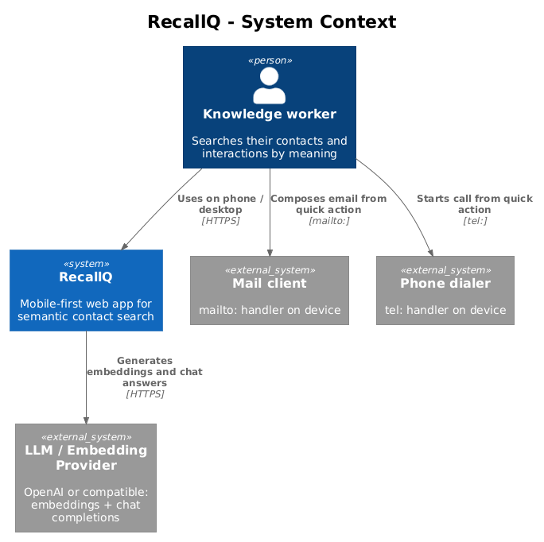
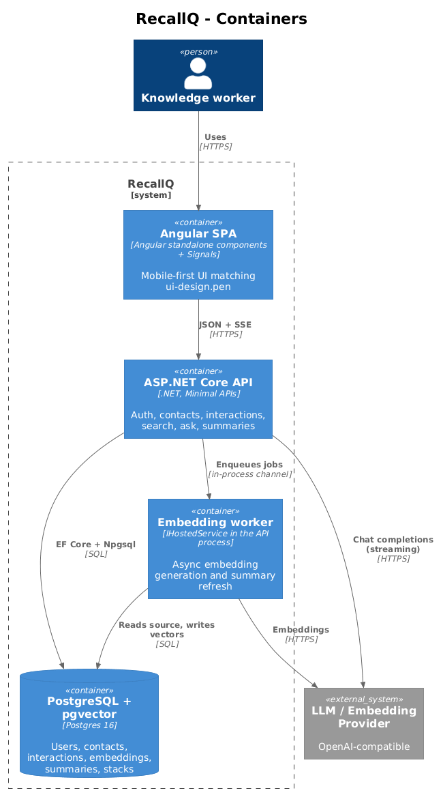

# RecallQ — Detailed Designs Index

RecallQ is a mobile-first web app for semantic (vector) search over contacts and the interactions a user has had with them. Source of truth for requirements: [`docs/specs/L1.md`](../specs/L1.md) and [`docs/specs/L2.md`](../specs/L2.md). UI source of truth: [`docs/ui-design.pen`](../ui-design.pen).

## Architecture at a glance

- **Backend**: single ASP.NET Core Web API project. Minimal API endpoints. EF Core + Npgsql + `pgvector`. No repositories, no CQRS, no MediatR, no microservices.
- **Frontend**: Angular with standalone components and Signals. Native `HttpClient`. No NgRx.
- **Embeddings**: generated asynchronously by a background worker hosted in the same API process.
- **LLM / embedding provider**: abstracted behind a single interface with a default OpenAI implementation.

### System context

### System containers

## Reading order

Features are numbered in the order they shall be implemented. Each feature is a small, vertically sliced unit — frontend + backend + tests — so it can be built through ATDD without the rest of the system existing.

| # | Feature | L1 traceability | Status |
|---|---------|-----------------|--------|
| 01 | [Architecture skeleton](01-architecture-skeleton/README.md) | L1-017, L1-012 | Draft |
| 02 | [User authentication](02-user-authentication/README.md) | L1-001, L1-013 | Draft |
| 03 | [Create contact](03-create-contact/README.md) | L1-002, L1-018 | Draft |
| 04 | [List contacts](04-list-contacts/README.md) | L1-002 | Draft |
| 05 | [Log interaction](05-log-interaction/README.md) | L1-003 | Draft |
| 06 | [Contact detail view](06-contact-detail-view/README.md) | L1-009 | Draft |
| 07 | [Embedding pipeline](07-embedding-pipeline/README.md) | L1-018, L1-014 | Draft |
| 08 | [Vector search API](08-vector-search-api/README.md) | L1-004, L1-014 | Draft |
| 09 | [Search results UI](09-search-results-ui/README.md) | L1-004, L1-012 | Draft |
| 10 | [Search sort and pagination](10-search-sort-pagination/README.md) | L1-004, L1-014 | Draft |
| 11 | [Ask mode streaming](11-ask-mode-streaming/README.md) | L1-005, L1-014 | Draft |
| 12 | [Ask citations](12-ask-citations/README.md) | L1-005 | Draft |
| 13 | [Ask follow-ups](13-ask-followups/README.md) | L1-005 | Draft |
| 14 | [Relationship summary](14-relationship-summary/README.md) | L1-008 | Draft |
| 15 | [Smart Stacks](15-smart-stacks/README.md) | L1-006 | Draft |
| 16 | [Proactive suggestion](16-proactive-suggestion/README.md) | L1-007 | Draft |
| 17 | [Quick actions: Message and Call](17-quick-actions-message-call/README.md) | L1-010 | Draft |
| 18 | [Quick action: Intro draft](18-quick-action-intro-draft/README.md) | L1-010 | Draft |
| 19 | [Quick action: Ask AI from contact](19-quick-action-ask-from-contact/README.md) | L1-010 | Draft |
| 20 | [CSV bulk import](20-csv-bulk-import/README.md) | L1-018 | Draft |
| 21 | [Responsive shell](21-responsive-shell/README.md) | L1-011 | Draft |
| 22 | [Security hardening](22-security-hardening/README.md) | L1-013 | Draft |
| 23 | [Observability](23-observability/README.md) | L1-016 | Draft |
| 24 | [Accessibility](24-accessibility/README.md) | L1-015 | Draft |
| 25 | [Remember me](25-remember-me/README.md) | L1-001 | Draft |
| 26 | [Forgot password request](26-forgot-password-request/README.md) | L1-001 | Draft |
| 27 | [Reset password](27-reset-password/README.md) | L1-001 | Draft |

## Conventions used across designs

**Radically simple layering.** Each endpoint handler queries `DbContext` directly. A handler that needs an LLM call or an embedding call takes `IChatClient` / `IEmbeddingClient` via parameter injection. There is no service layer, no repository, no mapper library.

**One file, one feature.** Endpoints are grouped by feature in files like `Endpoints/ContactsEndpoints.cs`, `Endpoints/SearchEndpoints.cs`, etc. Each file exposes one `MapXxx(app)` static method called from `Program.cs`.

**Owner-scoped everything.** Every EF Core query for user-owned data goes through a global query filter on `OwnerUserId = CurrentUser.Id`. The current user is resolved from the authenticated principal and exposed as a scoped `ICurrentUser` service.

**Tests live next to the feature.** Backend acceptance tests (xUnit + WebApplicationFactory + Testcontainers for PostgreSQL+pgvector) live under `backend/RecallQ.AcceptanceTests/{FeatureName}Tests.cs`. Frontend acceptance tests (Playwright) live under `e2e/{feature-name}.spec.ts`. Every test carries a `// Traces to: L2-XXX` header.

**Pen-to-code component parity.** Each `.pen` reusable component maps to exactly one Angular component under `src/app/ui/`. Token names in CSS custom properties mirror the `.pen` variable names (`--surface-primary`, `--accent-gradient-start`, …).
