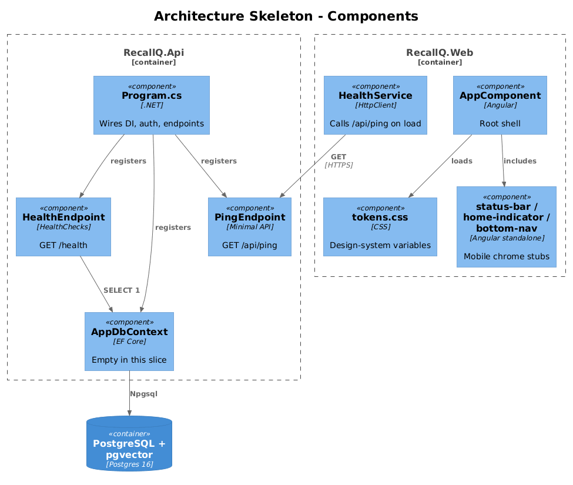
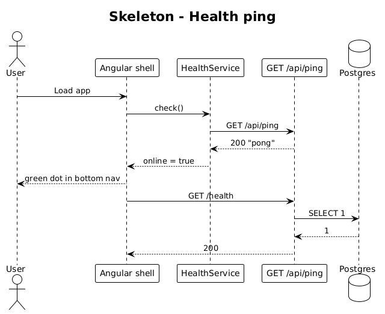

# 01 — Architecture Skeleton — Detailed Design

## 1. Overview

Establishes the **radically simple** project skeleton that every later slice builds on: one ASP.NET Core Web API project, one Angular app, one PostgreSQL database with `pgvector`. Ships a single `GET /api/ping` endpoint, a `SELECT 1` health check against the database, a design-token CSS file, and a mobile shell frame (safe-area insets, status bar, home indicator) matching the chrome components in `ui-design.pen`.

No authentication, no domain model, no UI screens — just the rails.

**Actors:** developer (CI), user (loads the shell).

**In scope:** solution layout, tokens file, health endpoint, empty Angular shell matching the mobile canvas dimensions.

**Out of scope:** everything else.

## 2. Architecture

### 2.1 Component layout



The backend is **one project**: `RecallQ.Api` (net9.0 or current LTS). `Program.cs` wires:

- `AddDbContext<AppDbContext>` with `UseNpgsql(...).UseVector()`
- `AddAuthentication`/`AddAuthorization` (stub — populated by slice 02)
- `MapGet("/api/ping", () => "pong")`
- `MapHealthChecks("/health")` running `SELECT 1`

The frontend is **one Angular workspace** created with `ng new` and standalone by default:

```
src/
  app/
    app.component.ts                (root shell)
    tokens.css                      (CSS custom properties mirroring ui-design.pen)
    ui/
      status-bar/                   (stub matching kauhQ)
      home-indicator/               (stub matching JRdjy)
      bottom-nav/                   (stub matching f4T0y)
```

There is no `src/app/core`, no `src/app/shared`, no `src/app/features` folder tree. Modules collapse to a handful of standalone components.

## 3. Component details

### 3.1 `Program.cs`
- **Responsibility**: application entry; one file, top-to-bottom.
- **Dependencies**: `AppDbContext`, built-in logging, built-in configuration.
- **Size bound**: ≤ 120 lines including using statements. Anything longer signals a slice has outgrown minimal-API style and should be split into an `Endpoints/XxxEndpoints.cs` file.

### 3.2 `AppDbContext`
- **Responsibility**: EF Core context. Registers `pgvector` via `options.UseVector()`. Contains only `DbSet<T>`s actually used by the current slice — so in this slice it is empty and exists only so migrations work.
- **Migrations folder**: `RecallQ.Api/Migrations/`.

### 3.3 `tokens.css`
- **Responsibility**: the **single** source of color, typography, radius, spacing tokens.
- **Variables**: `--surface-primary`, `--surface-secondary`, `--surface-elevated`, `--foreground-primary`, `--foreground-secondary`, `--foreground-muted`, `--border-subtle`, `--border-strong`, `--accent-primary`, `--accent-secondary`, `--accent-tertiary`, `--success`, `--accent-gradient-start`, `--accent-gradient-mid`, `--accent-gradient-end`, `--radius-md`, `--radius-lg`, `--radius-full`.
- **Values**: sourced verbatim from `ui-design.pen` variables.

### 3.4 Mobile shell chrome
- `status-bar`, `home-indicator`, `bottom-nav` Angular components. In this slice they are empty styled boxes at the dimensions from `ui-design.pen` — later slices populate them.

## 4. Key workflow

### 4.1 Health check



1. Browser loads the Angular app → sees the shell.
2. Angular `HealthService` calls `GET /api/ping` on startup.
3. Minimal API returns `"pong"` with 200.
4. A green dot is shown in the bottom nav matching the `$success` token.

## 5. API contract

| Method | Path | Auth | Response |
|---|---|---|---|
| GET | `/api/ping` | none | `200 text/plain "pong"` |
| GET | `/health` | none | `200` if DB reachable, else `503` |

## 6. Data model

None in this slice. `AppDbContext` is an empty shell.

## 7. Security considerations

- HTTPS redirection and HSTS headers are configured in `Program.cs`.
- No data endpoints exist yet, so no auth is needed.
- The `/api/ping` endpoint is intentionally unauthenticated so CI smoke tests can hit it.

## 8. Test plan (ATDD)

| # | Test | Traces to |
|---|------|-----------|
| 1 | `Ping_returns_pong` (xUnit + `WebApplicationFactory`) — asserts `200 OK` and body `pong` | L1-017 |
| 2 | `Health_returns_200_when_db_is_up` (xUnit + Testcontainers pgvector) | L1-017 |
| 3 | `App_shell_renders_at_390x844` (Playwright) — screenshots the root route at viewport 390×844 and asserts it matches the status-bar + bottom-nav layout within 4px | L1-011, L1-012 |
| 4 | `Tokens_file_contains_all_required_variables` (Jest/unit) — reads `tokens.css` and asserts the 14 custom properties listed in §3.3 are defined | L2-047 |

Every test file begins with a `// Traces to: L2-XXX` header.

## 9. Open questions

- **.NET version**: default to .NET 9 unless the hosting target dictates otherwise.
- **Angular version**: default to the current stable (19+). Confirm with the team before starting.
- **Postgres hosting**: Testcontainers for tests; managed Postgres (RDS / Supabase / Neon) in production — defer hosting decision until slice 20 (import) is exercised at scale.
