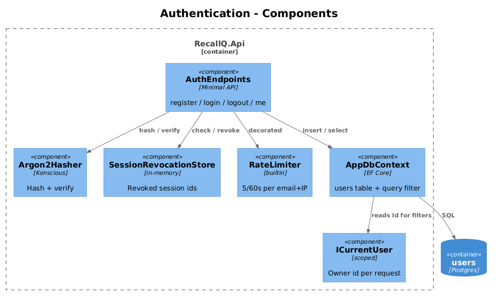
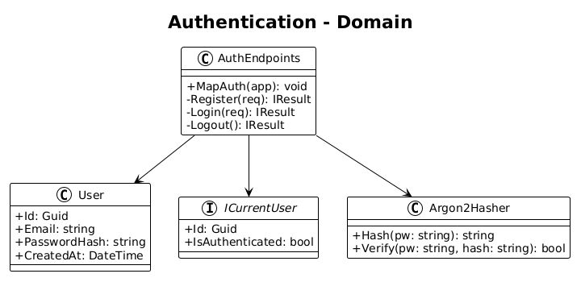
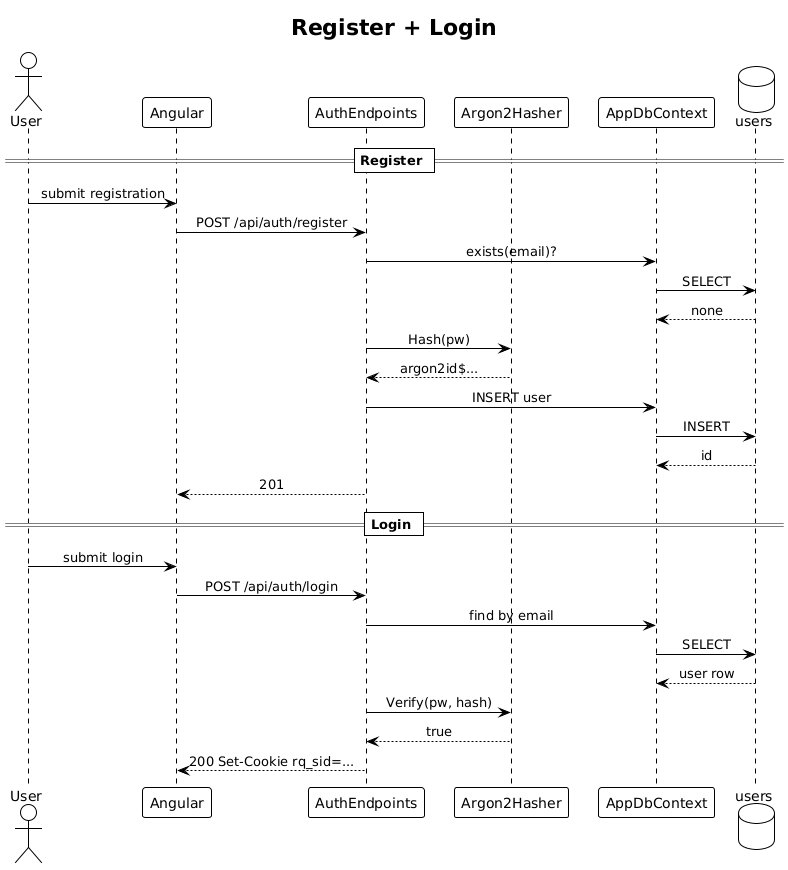

# 02 — User Authentication — Detailed Design

## 1. Overview

Implements registration, login, logout, and an authenticated principal that every later slice relies on. Uses **HttpOnly secure cookies** with a signed session id. No JWT, no refresh tokens, no OAuth — radically simple. All data endpoints from slice 03 onward require authentication through `RequireAuthorization()`.

**Actors:** anonymous user (register/login), authenticated user (logout).

**In scope:** email/password sign-up, login, logout, session cookie, password hashing, rate limiting on auth endpoints.

**Out of scope:** password reset, MFA, SSO, email verification (deferred).

**L2 traces:** L2-001, L2-002, L2-003, L2-004, L2-052, L2-055.

## 2. Architecture

### 2.1 Component layout



One file: `Endpoints/AuthEndpoints.cs`, exposing `MapAuth(WebApplication app)`. Inside it: `register`, `login`, `logout`, `me` (returns current user id).

### 2.2 Data model



One new table: `users`. No separate `sessions` table — sessions are expressed through the auth cookie. Server-side revocation uses a small in-memory `ConcurrentDictionary<Guid, DateTime>` of `revoked_until`; a restart clears it (acceptable because sessions are also signed with a per-deploy key and rotated on revocation).

## 3. Component details

### 3.1 `AuthEndpoints.cs`
- **Responsibility**: POST `/api/auth/register`, `/api/auth/login`, `/api/auth/logout`, GET `/api/auth/me`.
- **Password hashing**: `Konscious.Security.Cryptography.Argon2id` with parameters `{ Iterations=3, MemorySize=65536, Parallelism=1 }`. Hash is stored as `$argon2id$v=19$m=65536,t=3,p=1$salt$hash`.
- **Login rate limit**: fixed-window 5 attempts / 60s per (email, IP) via built-in `AddRateLimiter`.
- **Session cookie**: name `rq_sid`, HttpOnly, Secure, SameSite=Strict, path `/api`, max-age 14 days.

### 3.2 `ICurrentUser`
- **Interface**:
  ```csharp
  public interface ICurrentUser
  {
      Guid Id { get; }
      bool IsAuthenticated { get; }
  }
  ```
- **Implementation**: resolves from `HttpContext.User.FindFirst("sub")`. Registered scoped.

### 3.3 Global query filter wiring
- **`AppDbContext.OnModelCreating`** adds `.HasQueryFilter(x => x.OwnerUserId == currentUser.Id)` on every owned entity introduced from slice 03 onward. `ICurrentUser` is injected into the context.

## 4. Key workflow

### 4.1 Register and login



1. User POSTs `/api/auth/register` with `{ email, password }`.
2. Server validates (email format, password rules), checks uniqueness, hashes with Argon2id, inserts row, **does not** auto-login.
3. User POSTs `/api/auth/login`. Server looks up by email, verifies hash, and, on success, issues the signed cookie.
4. Subsequent requests include the cookie; `ICurrentUser.Id` is populated from the `sub` claim.
5. POST `/api/auth/logout` revokes the session id server-side and clears the cookie.

## 5. API contract

| Method | Path | Body | Responses |
|---|---|---|---|
| POST | `/api/auth/register` | `{ email, password }` | `201`, `400`, `409` |
| POST | `/api/auth/login` | `{ email, password }` | `200` + `Set-Cookie`, `401`, `429` |
| POST | `/api/auth/logout` | — | `204` |
| GET | `/api/auth/me` | — | `200 { id, email }` or `401` |

Errors return `{ "error": "..."} ` only; never the missing field list with values in it.

## 6. Security considerations

- Passwords stored as Argon2id only — see L2-052.
- Generic login error message — see L2-002 AC 2/3.
- Rate limit on login (5/60s/email+IP) — see L2-002 AC 4 and L2-055.
- CSRF: because cookies are SameSite=Strict, no explicit CSRF token is required for same-site usage. If cross-origin API use is later added, switch to double-submit cookie.

## 7. Test plan (ATDD)

| # | Test | Traces to |
|---|------|-----------|
| 1 | `Register_creates_user` | L2-001 |
| 2 | `Register_with_duplicate_email_returns_409` | L2-001 |
| 3 | `Login_with_valid_credentials_sets_cookie` | L2-002 |
| 4 | `Login_with_wrong_password_returns_401_generic` | L2-002 |
| 5 | `Login_with_unknown_email_returns_same_401` | L2-002 |
| 6 | `Sixth_failed_login_returns_429` | L2-002, L2-055 |
| 7 | `Protected_endpoint_without_cookie_returns_401` | L2-003 |
| 8 | `Logout_revokes_cookie_and_subsequent_me_returns_401` | L2-004 |
| 9 | `Password_hash_is_argon2id_and_not_logged` (log capture) | L2-052 |

## 8. Open questions

- **Email verification**: defer to a later slice; L2 doesn't require it in v1.
- **Key rotation**: the cookie signing key is stored in env. Rotation policy to be defined in slice 22 (security hardening).
