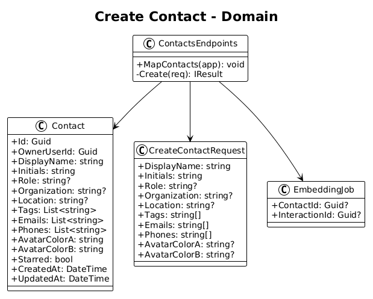
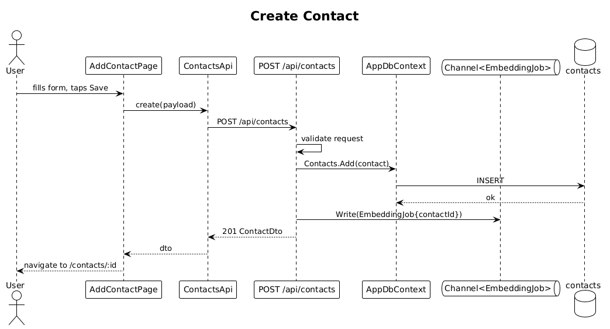

# 03 — Create Contact — Detailed Design

## 1. Overview

The first slice that writes domain data. Introduces the `contacts` table, the `POST /api/contacts` endpoint, and the **Add Contact** form. Creating a contact also enqueues an embedding job (worker built in slice 07; until then the queue is a `Channel<EmbeddingJob>` drained by a stub worker that just writes an `embedding_pending` marker).

**Actors:** authenticated user.

**In scope:** contact fields from L2-005 (displayName, initials, role, organization, location, tags, emails, phones, starred, avatarColorA/B), POST endpoint with validation, Add Contact Angular form.

**Out of scope:** list, detail, update, delete (separate slices).

**L2 traces:** L2-005, L2-076.

## 2. Architecture

### 2.1 Data model



### 2.2 Workflow



## 3. Component details

### 3.1 `Endpoints/ContactsEndpoints.cs`
- **Method**: `MapContacts(app)` called from `Program.cs`.
- **Handler**: `POST /api/contacts` takes `CreateContactRequest`, validates, constructs a `Contact`, calls `ctx.Contacts.Add`, `ctx.SaveChangesAsync`, enqueues an `EmbeddingJob(contactId)` via an injected `Channel<EmbeddingJob>.Writer`, returns `201 Created` with location header.
- **Validation**: done inline with guard clauses. `displayName` 1–120 chars, `initials` 1–3 chars, `emails` and `phones` at most 10 entries each, `tags` at most 20 entries.

### 3.2 `Contact` entity
```csharp
public class Contact
{
    public Guid Id { get; set; }
    public Guid OwnerUserId { get; set; }
    public string DisplayName { get; set; } = default!;
    public string Initials { get; set; } = default!;
    public string? Role { get; set; }
    public string? Organization { get; set; }
    public string? Location { get; set; }
    public List<string> Tags { get; set; } = new();
    public List<string> Emails { get; set; } = new();
    public List<string> Phones { get; set; } = new();
    public string AvatarColorA { get; set; } = "#7C3AFF";
    public string AvatarColorB { get; set; } = "#FF5EE7";
    public bool Starred { get; set; }
    public DateTime CreatedAt { get; set; }
    public DateTime UpdatedAt { get; set; }
}
```

EF Core configuration: `Tags`, `Emails`, `Phones` stored as `text[]` (Npgsql array columns). Global query filter: `OwnerUserId == _currentUser.Id`.

### 3.3 `AddContactPage` (Angular)
- **Route**: `/contacts/new`.
- **Components used**: `SearchBar` (repurposed as input), `ButtonPrimary`, `ButtonGhost`, `TagChip` (for tag entry visualization).
- **Form**: reactive form with one `<rq-form-field>` per attribute. Submit calls `ContactsApi.create(payload)` which uses `HttpClient.post<ContactDto>('/api/contacts', payload)`.
- **Success**: navigates to `/contacts/:id` (slice 06) and shows a toast `Contact added`.

### 3.4 Avatar gradient selection
- When `AvatarColorA`/`B` are not provided by the form, the server picks a deterministic pair from a palette sampled from `ui-design.pen` gradients (`#7C3AFF→#FF5EE7`, `#4BE8FF→#7C3AFF`, `#3DFFB3→#4BE8FF`, `#FFB23D→#FF5EE7`) using `contactId.GetHashCode() % palette.Length`.

## 4. API contract

| Method | Path | Auth | Body | Responses |
|---|---|---|---|---|
| POST | `/api/contacts` | cookie | `CreateContactRequest` | `201 ContactDto`, `400`, `401` |

```json
// CreateContactRequest
{
  "displayName": "Sarah Mitchell",
  "initials": "SM",
  "role": "VP Product",
  "organization": "Stripe",
  "location": "SF Bay",
  "tags": ["Investor", "Series B", "SF Bay"],
  "emails": ["sarah@stripe.com"],
  "phones": ["+1-415-555-0101"],
  "avatarColorA": "#7C3AFF",
  "avatarColorB": "#FF5EE7"
}
```

## 5. UI fidelity

The Add Contact form renders inside a mobile frame matching `1. Vector Search Home`'s safe-area chrome. At XS (<576px), fields stack vertically at the content column width (342px). Tag entry uses the `Tag Chip` component from `ui-design.pen` (id `yTxyN`) for rendered chips.

## 6. Security considerations

- Endpoint is protected by `RequireAuthorization()`.
- `OwnerUserId` is never read from the request body — it is set server-side to `_currentUser.Id`.
- Inputs are length-capped; tag/email/phone arrays are size-capped to prevent storage-abuse.

## 7. Test plan (ATDD)

| # | Test | Traces to |
|---|------|-----------|
| 1 | `Create_contact_returns_201_and_persists_row` | L2-005 |
| 2 | `Create_contact_missing_displayName_returns_400` | L2-005 |
| 3 | `Create_contact_over_120_chars_displayName_returns_400` | L2-005 |
| 4 | `Create_contact_enqueues_embedding_job` | L2-005, L2-078 |
| 5 | `Create_contact_without_auth_returns_401` | L2-003 |
| 6 | `Add_contact_form_submits_and_redirects_to_detail` (Playwright) | L2-005, L2-076 |
| 7 | `Owner_isolation_create_does_not_leak_to_other_user` | L2-056 |

## 8. Open questions

- Avatar image upload: deferred. For now all avatars are initials-on-gradient.
- Phone number normalization: stored as the user typed it; normalization (E.164) deferred to a later slice.
