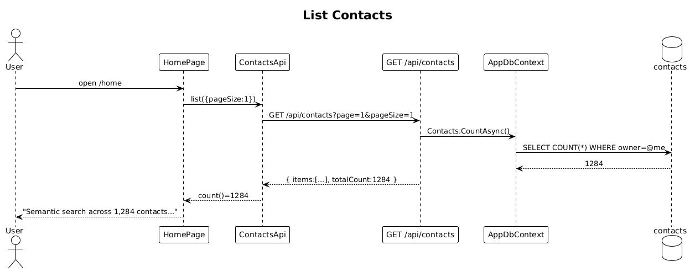

# 04 — List Contacts — Detailed Design

## 1. Overview

Returns the authenticated user's contacts, paginated. Powers the Home hero subtitle count (`Semantic search across {N} contacts …`) and, eventually, alphabetical browse and stack-filtered lists.

**Actors:** authenticated user.

**In scope:** `GET /api/contacts` with pagination and sort; Home hero count wiring.

**Out of scope:** stack filtering (slice 15), search (slices 08–10).

**L2 traces:** L2-009, L2-081 (count rendering).

## 2. Architecture

### 2.1 Workflow



## 3. Component details

### 3.1 `Endpoints/ContactsEndpoints.cs` — `GET /api/contacts`
- **Query params**: `page` (default 1), `pageSize` (default 50, max 200), `sort` (`recent` default, `name`).
- **Logic**:
  ```csharp
  var q = ctx.Contacts.AsNoTracking();
  q = sort switch {
      "name" => q.OrderBy(c => c.DisplayName),
      _      => q.OrderByDescending(c => c.UpdatedAt),
  };
  var total = await q.CountAsync();
  var items = await q.Skip((page-1)*pageSize).Take(pageSize).ToListAsync();
  return Results.Ok(new PagedResult<ContactDto>(items.Select(Map), total, page, pageSize));
  ```
- Owner scoping is enforced by the global query filter; no manual `.Where`.

### 3.2 `ContactsApi.count$` on the frontend
- **Signal**: `count = signal(0)`. On home page init: `contactsApi.list({ pageSize: 1 }).subscribe(r => count.set(r.totalCount))`.
- **Template** reads `{{ count() }}` into the hero subtitle string (`Semantic search across {{count()}} contacts and {{interactionsCount()}} interactions.` matching `iLRLS` in `ui-design.pen`).

## 4. API contract

| Method | Path | Query | Response |
|---|---|---|---|
| GET | `/api/contacts` | `page, pageSize, sort` | `200 PagedResult<ContactDto>` |

```json
{
  "items": [ { "id": "...", "displayName": "Sarah Mitchell", "initials": "SM", "role": "VP Product", "organization": "Stripe", "starred": true } ],
  "totalCount": 1284,
  "page": 1,
  "pageSize": 50,
  "nextPage": 2
}
```

## 5. UI fidelity

- Home hero subtitle count is **live**: the Angular Signal triggers a re-render when `count()` changes.
- When `count() === 0`, the subtitle reads `Add your first contact to start searching.` (explicit zero-state from L2-020).

## 6. Test plan (ATDD)

| # | Test | Traces to |
|---|------|-----------|
| 1 | `List_returns_paged_results_with_totalCount` | L2-009 |
| 2 | `List_with_sort_name_returns_alphabetical` | L2-009 |
| 3 | `List_with_no_contacts_returns_200_empty` | L2-009 |
| 4 | `Home_hero_subtitle_displays_live_count` (Playwright) | L2-081 |
| 5 | `List_only_returns_caller_contacts_not_other_users` | L2-056 |

## 7. Open questions

- Cursor-based pagination vs offset: offset is fine at expected sizes (≤100k). Revisit if stacks require jumps beyond page 200.
