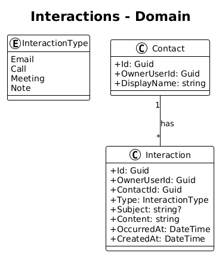
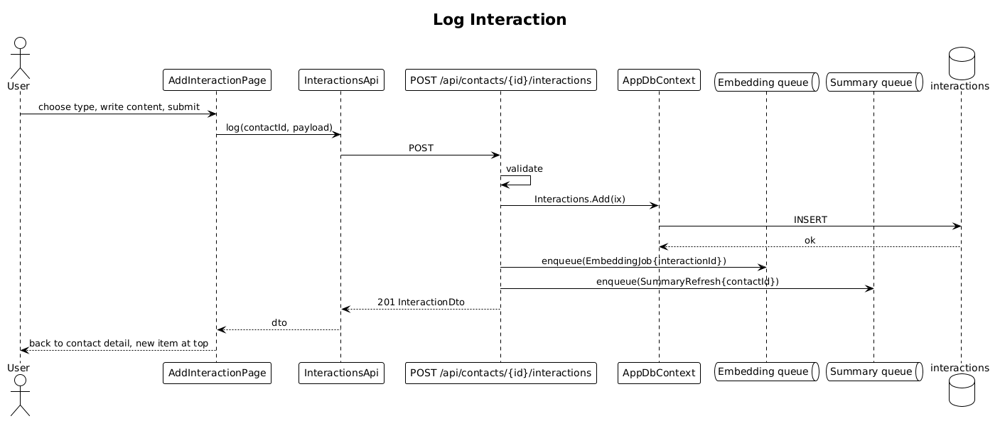

# 05 — Log Interaction — Detailed Design

## 1. Overview

Introduces the `interactions` table and allows an owner to log an interaction against a contact. An interaction has a `type` (`email`/`call`/`meeting`/`note`), `occurredAt`, optional `subject`, and free-text `content`. Posting an interaction enqueues an embedding job and a relationship-summary refresh (the latter no-ops until slice 14).

**Actors:** authenticated user.

**L2 traces:** L2-010, L2-011, L2-012, L2-013.

## 2. Architecture

### 2.1 Data model



### 2.2 Workflow



## 3. Component details

### 3.1 `Interaction` entity
```csharp
public class Interaction
{
    public Guid Id { get; set; }
    public Guid OwnerUserId { get; set; }
    public Guid ContactId { get; set; }
    public InteractionType Type { get; set; }   // enum backed by string
    public string? Subject { get; set; }
    public string Content { get; set; } = default!;
    public DateTime OccurredAt { get; set; }
    public DateTime CreatedAt { get; set; }
}

public enum InteractionType { Email, Call, Meeting, Note }
```

Npgsql is configured to map `InteractionType` to a native Postgres enum `interaction_type` for compact storage.

### 3.2 `Endpoints/InteractionsEndpoints.cs`
- `POST /api/contacts/{contactId}/interactions` — validates, inserts, enqueues embedding + summary-refresh.
- `PATCH /api/interactions/{id}` — owner-only, re-enqueues embedding.
- `DELETE /api/interactions/{id}` — owner-only, cascades to embedding row.

### 3.3 `AddInteractionPage` (Angular)
- **Route**: `/contacts/:id/interactions/new`.
- **Type selector**: 4 pill buttons using the `Ix Email` / `Ix Call` / `Ix Meeting` / `Ix Note` components from `ui-design.pen`.
- **When**: datetime picker, defaulting to `now`.
- **Content**: multi-line textarea, max 8000 chars, character counter below.

## 4. API contract

| Method | Path | Body | Response |
|---|---|---|---|
| POST | `/api/contacts/{contactId}/interactions` | `{type, occurredAt, subject?, content}` | `201 InteractionDto` |
| PATCH | `/api/interactions/{id}` | partial | `200 InteractionDto` |
| DELETE | `/api/interactions/{id}` | — | `204` |

## 5. UI fidelity

- Timeline item rendering uses the matching interaction component from `ui-design.pen`. Short time display rules per L2-012:
  - 0–6 days → `{n}d`
  - within this week → `Mon`/`Tue`/…
  - previous week → `last wk`
  - within 31 days → `{n}w ago`
  - otherwise → `MMM d`

## 6. Test plan (ATDD)

| # | Test | Traces to |
|---|------|-----------|
| 1 | `Log_interaction_persists_and_returns_201` | L2-010 |
| 2 | `Log_interaction_invalid_type_returns_400` | L2-010 |
| 3 | `Log_interaction_content_over_8000_returns_400` | L2-010 |
| 4 | `Log_interaction_enqueues_embedding_job` | L2-078 |
| 5 | `Patch_interaction_re_enqueues_embedding` | L2-013 |
| 6 | `Delete_interaction_removes_embedding_row` | L2-013 |
| 7 | `Non_owner_cannot_patch_or_delete_returns_404` | L2-056 |
| 8 | `Add_interaction_form_renders_pill_selector_matching_design` (Playwright) | L2-010 |

## 7. Open questions

- Should we capture direction (inbound/outbound) for emails and calls? Deferred — can be added as a column later without migrating data.
