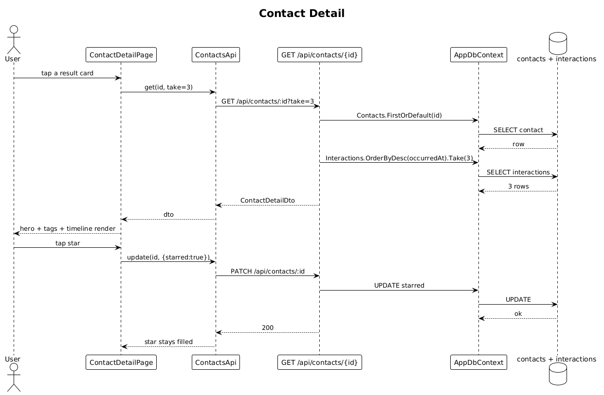

# 06 — Contact Detail View — Detailed Design

## 1. Overview

Implements screen `3. Contact Detail` from `ui-design.pen`: gradient hero, back/star/more top bar, avatar, name + role, tag chips, **and** the Recent Activity timeline. Excludes the Relationship Summary card (slice 14) and the four quick-action tiles (slices 17–19) which appear as placeholders at this stage.

**L2 traces:** L2-006, L2-011, L2-034, L2-035, L2-036, L2-083.

## 2. Architecture

### 2.1 Workflow



## 3. Component details

### 3.1 `GET /api/contacts/{id}`
Returns `ContactDetailDto`:
```json
{
  "id": "...", "displayName": "Sarah Mitchell", "initials": "SM",
  "role": "VP Product", "organization": "Stripe",
  "tags": ["Investor", "Series B", "SF Bay"],
  "location": "SF Bay", "starred": true,
  "avatarColorA": "#7C3AFF", "avatarColorB": "#FF5EE7",
  "interactionCount": 24,
  "recentInteractions": [
    { "id": "...", "type": "call", "subject": "Quarterly sync", "contentPreview": "…", "occurredAt": "2026-04-21T14:00:00Z" }
  ]
}
```
`recentInteractions` is the 3 most recent at XS, 6 at MD+ (query param `take` defaulting to 3).

### 3.2 `ContactDetailPage` (Angular)
- **Route**: `/contacts/:id`.
- **Structure** (matches `3. Contact Detail` frame):
  - `HeroSection` — gradient background, `StatusBar`, top bar with back/star/more, avatar, name/role, tag chips.
  - `ActionRow` placeholder — 4 empty action tiles labelled `Message`/`Call`/`Intro`/`Ask AI`. Real handlers land in slices 17–19.
  - `RelationshipSummaryPlaceholder` — empty card. Real content in slice 14.
  - `TimelineSection` — list of `TimelineItem` components, one per interaction. See-all affordance reads `See all N` where `N = interactionCount` (matching `SudXW` in the design).
- **Back button**: uses Angular Router's `location.back()` to preserve query state when coming from search (slice 09).

### 3.3 `TimelineItem`
- Shows the corresponding `Ix {Type}` component icon + subject + 1-line content preview + relative time short-form (see L2-012).

### 3.4 Star toggle
- `PATCH /api/contacts/{id}` with `{ starred: true|false }` — optimistic UI: star icon flips immediately, rolls back on error.

## 4. API contract

| Method | Path | Query | Response |
|---|---|---|---|
| GET | `/api/contacts/{id}` | `take` | `200 ContactDetailDto`, `404` |
| PATCH | `/api/contacts/{id}` | — | `200 ContactDto` |

## 5. UI fidelity

- Hero gradient matches `cNcxs` (`heroBg`) in the pen.
- Avatar at 96×96 inside the hero, gradient fill from the contact's colors, bordered with `#FFFFFF44` 3px stroke — matches `yK4Ig`.
- Star filled color: `#FFB23D` (the gold in the design).

## 6. Security considerations

- Owner scope via global query filter. Cross-user GET returns 404, not 403.

## 7. Test plan (ATDD)

| # | Test | Traces to |
|---|------|-----------|
| 1 | `Get_contact_by_id_returns_detail_dto_with_recent_interactions` | L2-006, L2-011 |
| 2 | `Get_contact_owned_by_another_user_returns_404` | L2-006 |
| 3 | `Detail_hero_shows_name_role_org_tags` (Playwright) | L2-034 |
| 4 | `Timeline_shows_3_items_at_XS_with_see_all_count` (Playwright) | L2-035, L2-011 |
| 5 | `Back_button_restores_prior_search_state` (Playwright) | L2-036 |
| 6 | `Star_toggle_persists_and_renders_filled_icon` (Playwright) | L2-083 |

## 8. Open questions

- Timeline beyond "See all": the full timeline screen is a separate, simpler slice (not called out in specs). Defer to after slice 14 so the summary is present.
