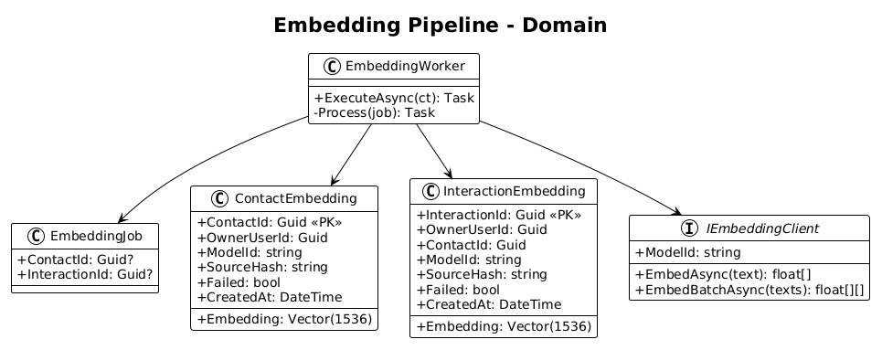
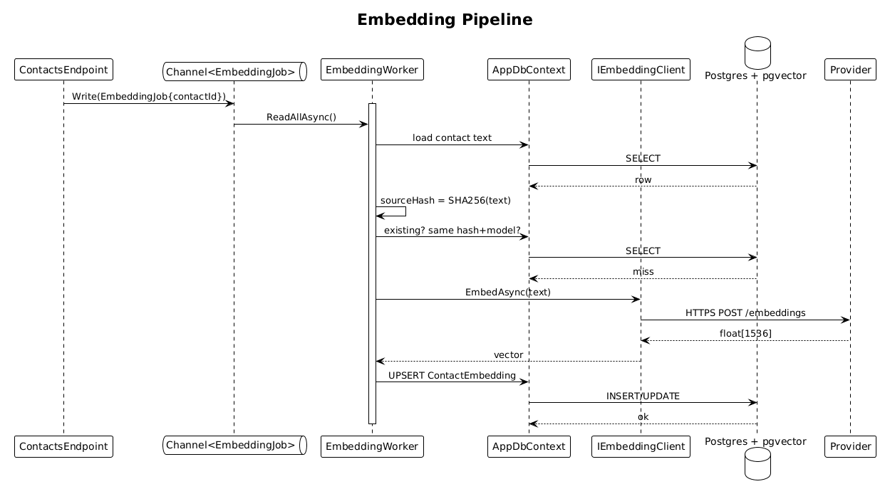

# 07 — Embedding Pipeline — Detailed Design

## 1. Overview

Introduces the asynchronous, in-process worker that turns contact and interaction text into vectors and stores them in `pgvector` columns. This slice is the dependency that unlocks search (slice 08) and all downstream AI features.

The pipeline is a **`Channel<EmbeddingJob>`** (written to by the endpoint handlers in slices 03 & 05) drained by a single `IHostedService`. That's it — no RabbitMQ, no Hangfire, no database job queue.

**L2 traces:** L2-078, L2-079, L2-080, L2-073.

## 2. Architecture

### 2.1 Data model



### 2.2 Workflow



## 3. Component details

### 3.1 `Channel<EmbeddingJob>`
- **Registration**: `services.AddSingleton(Channel.CreateBounded<EmbeddingJob>(new BoundedChannelOptions(10_000) { FullMode = BoundedChannelFullMode.Wait }))`.
- **Producers**: endpoint handlers inject `ChannelWriter<EmbeddingJob>`.
- **Consumer**: `EmbeddingWorker : BackgroundService` injects `ChannelReader<EmbeddingJob>`.

### 3.2 `EmbeddingWorker`
- **Loop**:
  ```csharp
  await foreach (var job in _reader.ReadAllAsync(stoppingToken)) {
      using var scope = _scopeFactory.CreateScope();
      var ctx = scope.ServiceProvider.GetRequiredService<AppDbContext>();
      var client = scope.ServiceProvider.GetRequiredService<IEmbeddingClient>();
      await Process(job, ctx, client, stoppingToken);
  }
  ```
- **`Process`**:
  1. Build `sourceText` (see §3.3) and `sourceHash = SHA256(sourceText)`.
  2. If an existing embedding row for this owner+source has the same `modelId` and `sourceHash`, skip (idempotency).
  3. Call `client.EmbedAsync(sourceText)` → float[1536].
  4. Upsert into `contact_embeddings` or `interaction_embeddings`.
- **Retries**: Polly with 3 attempts, exponential backoff 1s/2s/4s. On final failure, mark `embedding_failed=true`.

### 3.3 `sourceText` composition
- **Contact**: `"{DisplayName}\n{Role} · {Organization}\nTags: {tags joined}\nLocation: {Location}"`.
- **Interaction**: `"{type}: {subject}\n{content}"`. Subject omitted when null.

### 3.4 `IEmbeddingClient`
```csharp
public interface IEmbeddingClient {
    string ModelId { get; }
    Task<float[]> EmbedAsync(string text, CancellationToken ct);
    Task<IReadOnlyList<float[]>> EmbedBatchAsync(IEnumerable<string> texts, CancellationToken ct);
}
```
Default implementation: `OpenAIEmbeddingClient` using `text-embedding-3-small` (1536 dims). Reads API key from config, uses `HttpClient` via typed-client registration.

### 3.5 Entities
```csharp
public class ContactEmbedding {
    public Guid ContactId { get; set; }   // PK = ContactId
    public Guid OwnerUserId { get; set; }
    public string ModelId { get; set; } = default!;
    public string SourceHash { get; set; } = default!;
    public Vector Embedding { get; set; } = default!;     // pgvector 1536
    public DateTime CreatedAt { get; set; }
    public bool Failed { get; set; }
}

public class InteractionEmbedding { /* mirrors structure, PK=InteractionId */ }
```

Indexes: `CREATE INDEX ON contact_embeddings USING hnsw (embedding vector_cosine_ops)` and likewise for interaction embeddings.

### 3.6 Backfill admin endpoint
- `POST /api/admin/embeddings/backfill` (requires admin claim in L1 spec — for v1 gate on a per-deploy env flag `ADMIN_ENABLED=true`).
- Streams over contacts/interactions in `OwnerUserId` groups, enqueues jobs in batches of 500 to the channel.

## 4. API contract

| Method | Path | Who | Response |
|---|---|---|---|
| POST | `/api/admin/embeddings/backfill` | admin | `202 Accepted` |

No public API. Producers are internal code in the existing slices.

## 5. Security considerations

- `sourceText` is **never logged**. Only job id + contact/interaction id + duration + status are logged.
- Retry backoff bounded; a poison-pill job caps at 3 attempts to protect the provider rate limit.
- Provider API key loaded from env only.

## 6. Test plan (ATDD)

| # | Test | Traces to |
|---|------|-----------|
| 1 | `Creating_contact_produces_an_embedding_row_within_30s` (integration with a FakeEmbeddingClient that returns deterministic vectors) | L2-078 |
| 2 | `Re_embedding_same_contact_text_is_idempotent_no_new_row` | L2-078 |
| 3 | `Transient_failure_retries_3_times_then_marks_failed` | L2-078 |
| 4 | `Backfill_resumes_without_duplicates_after_interruption` | L2-079 |
| 5 | `Source_text_never_appears_in_logs` | L2-071 |

FakeEmbeddingClient is injected via WebApplicationFactory. It returns `float[1536]` filled with `hash(text) / int.MaxValue` per index — deterministic without calling any external service.

## 7. Open questions

- **Dimension choice**: 1536 from `text-embedding-3-small` is cheap and adequate. If a higher-quality 3072-dim model becomes cost-effective, switch via config — backfill (criterion 4) handles migration.
- **Worker scale-out**: one in-process worker is fine for expected load. If needed, raise parallelism by draining the channel with `Parallel.ForEachAsync`.
