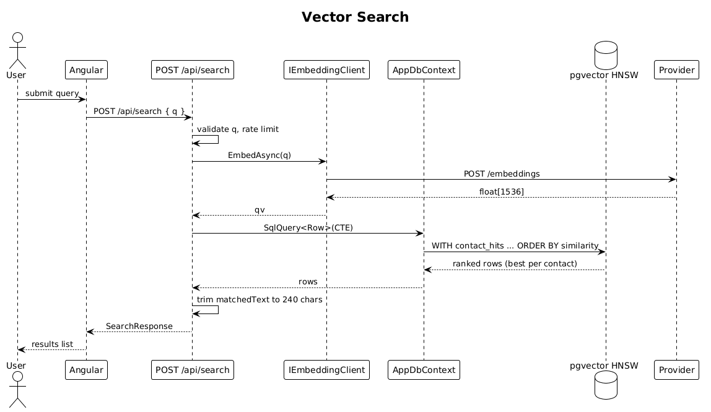
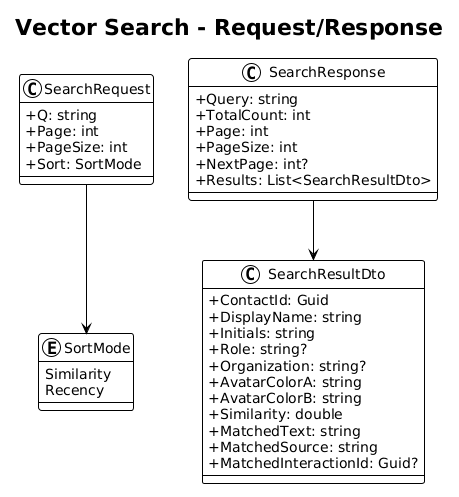

# 08 — Vector Search API — Detailed Design

## 1. Overview

Implements `POST /api/search` — the core feature of RecallQ. Accepts a natural-language `q`, embeds it via `IEmbeddingClient`, runs an HNSW cosine-similarity search against both `contact_embeddings` and `interaction_embeddings`, and returns a contact-collapsed ranked list with best-match source text.

This slice ships the API only — the UI is slice 09.

**L2 traces:** L2-014, L2-015, L2-016, L2-019, L2-020, L2-059, L2-063.

## 2. Architecture

### 2.1 Workflow



### 2.2 Request/Response shape



## 3. Component details

### 3.1 `Endpoints/SearchEndpoints.cs`
- Single handler for `POST /api/search`.
- Body: `{ "q": string, "page": int=1, "pageSize": int=50, "sort": "similarity"|"recency" }`.
- Steps:
  1. Validate `q` non-empty, ≤ 500 chars.
  2. `var qv = await embeddings.EmbedAsync(q, ct);`
  3. Execute the SQL below (raw SQL via `ctx.Database.SqlQuery<Row>(...)`).
  4. Map to `SearchResultDto`, truncate `matchedText` to 240 chars on word boundary.
  5. Return `200 SearchResponse`.

### 3.2 The one SQL query
```sql
WITH contact_hits AS (
    SELECT c.id AS contact_id,
           1 - (ce.embedding <=> @qv) AS similarity,
           c.display_name || coalesce(' — ' || c.role, '') AS matched_text,
           'contact' AS matched_source,
           NULL::uuid AS interaction_id,
           c.updated_at AS recency
    FROM contacts c
    JOIN contact_embeddings ce ON ce.contact_id = c.id
    WHERE c.owner_user_id = @me
),
interaction_hits AS (
    SELECT i.contact_id,
           1 - (ie.embedding <=> @qv) AS similarity,
           substring(i.content, 1, 500) AS matched_text,
           'interaction' AS matched_source,
           i.id AS interaction_id,
           i.occurred_at AS recency
    FROM interactions i
    JOIN interaction_embeddings ie ON ie.interaction_id = i.id
    WHERE i.owner_user_id = @me
),
all_hits AS (
    SELECT * FROM contact_hits
    UNION ALL
    SELECT * FROM interaction_hits
),
best_per_contact AS (
    SELECT DISTINCT ON (contact_id) *
    FROM all_hits
    ORDER BY contact_id, similarity DESC
)
SELECT * FROM best_per_contact
ORDER BY {similarity|recency} DESC
LIMIT @pageSize OFFSET @offset;
```

HNSW indexes (from slice 07) mean the `<=>` comparison is O(log N) per row. For the expected dataset (≤100k contacts, ≤1M interactions), the whole query returns in well under 400ms at p95 — see L2-059.

### 3.3 `matchedText` trimming
- Longer than 240 chars → find last space before index 240 and append `…`.
- Never split inside an emoji grapheme — use `StringInfo.SubstringByTextElements` or avoid trim-in-middle of multi-byte sequence.

### 3.4 Rate limiting
- 60 requests / minute / user (L2-055). Implemented with `AddRateLimiter` policy `"search"` attached to the endpoint via `RequireRateLimiting("search")`.

## 4. API contract

| Method | Path | Body | Response |
|---|---|---|---|
| POST | `/api/search` | `{ q, page?, pageSize?, sort? }` | `200 SearchResponse`, `400`, `401`, `429` |

```json
// SearchResponse
{
  "query": "investors who liked AI tools",
  "totalCount": 24,
  "page": 1,
  "pageSize": 50,
  "nextPage": null,
  "results": [
    {
      "contactId": "…",
      "displayName": "Sarah Mitchell",
      "initials": "SM",
      "role": "VP Product",
      "organization": "Stripe",
      "avatarColorA": "#7C3AFF", "avatarColorB": "#FF5EE7",
      "similarity": 0.96,
      "matchedText": "Meeting notes mention LangChain adoption, AI evals, and curiosity about vector DBs …",
      "matchedSource": "interaction",
      "matchedInteractionId": "…"
    }
  ]
}
```

## 5. Security considerations

- `q` is not logged verbatim — only `queryLength` and `queryHash`. See L2-071.
- Owner scope is enforced in the SQL WHERE clauses in addition to global query filters.
- Request body size capped at 4KB at the host level.

## 6. Test plan (ATDD)

| # | Test | Traces to |
|---|------|-----------|
| 1 | `Search_returns_ranked_results_with_scores` (seeded fixture with deterministic FakeEmbeddingClient) | L2-014 |
| 2 | `Search_collapses_multiple_interaction_hits_to_best_per_contact` | L2-015 |
| 3 | `Search_picks_interaction_over_contact_when_higher_similarity` | L2-015 |
| 4 | `Search_empty_q_returns_400` | L2-020 |
| 5 | `Search_with_no_data_returns_200_empty_array` | L2-020 |
| 6 | `Search_respects_pageSize_and_returns_nextPage` | L2-019 |
| 7 | `Search_p95_under_400ms_at_100k_contacts` (benchmark test, run in CI nightly) | L2-059 |
| 8 | `Search_rate_limited_at_61_per_minute_returns_429` | L2-055 |
| 9 | `Search_query_is_not_written_to_logs` (log capture) | L2-071 |

## 7. Open questions

- **Threshold cutoff**: do we return every result or drop `similarity < 0.5`? Start with no threshold; add a cutoff later if UX demands cleaner "no results" behavior.
