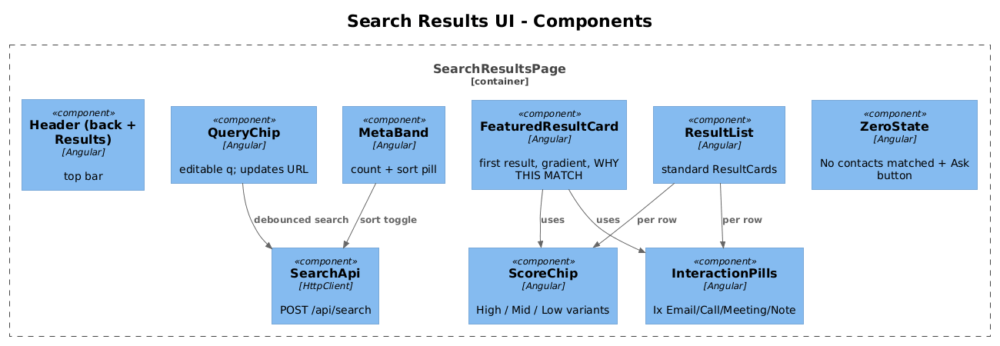

# 09 — Search Results UI — Detailed Design

## 1. Overview

Implements screen `2. Search Results` from `ui-design.pen`: header with back + "Results", query chip (editable), `{N} contacts matched` meta, a **featured result card** (larger, gradient-bordered, with "WHY THIS MATCH" block and similarity score pill), followed by a list of standard result cards.

**L2 traces:** L2-016, L2-017, L2-082.

## 2. Architecture

### 2.1 Components



## 3. Component details

### 3.1 `SearchResultsPage` (Angular)
- **Route**: `/search?q=…`.
- **Signals**:
  ```ts
  q        = signal<string>('');
  results  = signal<SearchResultDto[]>([]);
  total    = signal<number>(0);
  loading  = signal<boolean>(false);
  sort     = signal<'similarity' | 'recency'>('similarity');
  ```
- On `q` / `sort` change, `effect()` calls `searchApi.search({q, sort})` with a 250ms debounce.

### 3.2 `FeaturedResultCard`
- Used for `results()[0]`. Renders:
  - Top row: gradient avatar (56×56) + name row with score chip + role/org.
  - `WHY THIS MATCH` block (matching `GMFxy` / `fcWhy`): violet-tinted fill `#7C3AFF14`, stroke `#7C3AFF2A`, inside a `lightning` icon, the `WHY THIS MATCH` uppercase mono label, the score chip, and the `matchedText` body.
  - Pills row at the bottom: up to three `Ix {Type}` components computed from the contact's last three distinct-type interactions.
- Corner radius `20`, elevation shadow matching the design's `Zqt3I` shadow (`blur 48, color #7C3AFF33, offset 0/16, spread -12`).

### 3.3 `ResultCard` (standard)
- Used for every result after the featured one. Smaller avatar (44×44), simpler layout, matching `resCard2`/`resCard3`.

### 3.4 Score chip component
- `<rq-score [value]="0.96"></rq-score>`.
- Internal logic picks one of three variants:
  - `>= 0.90` → `Score High` visual (`#7C3AFF` tint)
  - `>= 0.70` → `Score Mid` visual (cyan/violet gradient border)
  - else → `Score Low` (`#FFB23D` tint)
- Displays the numeric value as `.toFixed(2)`.

### 3.5 Query chip
- Editable: tap opens an inline text field. Submitting updates the URL `?q=`, which re-runs the search via `effect()`.

### 3.6 Zero-state
- When `total() === 0`, render a zero-state panel with a `sparkle` icon, headline `No contacts matched`, subtitle `Try a different phrase or ask RecallQ.`, and a `ButtonPrimary` `Open Ask mode` (opens slice 11).

## 4. UI fidelity

- Pixel-level targets (all from `ui-design.pen`, frame `mwj97`):
  - Page padding: 24px horizontal.
  - Query chip: `cornerRadius: 14`, fill `$surface-secondary`, stroke `#7C3AFF55`.
  - Meta band: `{N} contacts matched` left, sort pill right.
  - Featured card width 342, card gap 14 on the content column.
- Infinite scroll, virtualization, and sort handling are implemented in slice 10.

## 5. Test plan (ATDD)

| # | Test | Traces to |
|---|------|-----------|
| 1 | `Results_page_renders_featured_card_for_first_result` (Playwright) | L2-082 |
| 2 | `Results_page_renders_standard_cards_for_the_rest` (Playwright) | L2-082 |
| 3 | `Score_chip_uses_High_variant_at_0.96` | L2-017 |
| 4 | `Score_chip_uses_Mid_variant_at_0.87` | L2-017 |
| 5 | `Score_chip_uses_Low_variant_at_0.62` | L2-017 |
| 6 | `Matched_text_truncated_to_240_chars_on_word_boundary` | L2-016 |
| 7 | `Zero_results_renders_zero_state_and_Ask_button` | L2-020, L2-082 |
| 8 | `Query_chip_edit_updates_url_and_re_runs_search` (Playwright) | L2-014 |

## 6. Open questions

- Should tapping a pill (e.g., `12 emails`) filter the timeline to that type? Not required by L2 — defer.
