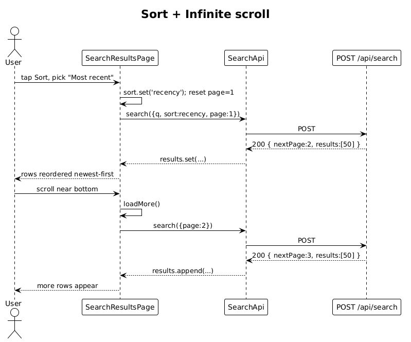

# 10 — Search Sort and Pagination — Detailed Design

## 1. Overview

Adds **sort by similarity / recency**, **cursor-style infinite scroll**, and **DOM virtualization** to the search results surface. Backend already supports `page`/`pageSize`/`sort` (slice 08); this slice wires the UI behaviors and the HNSW `ORDER BY recency` branch exercise.

**L2 traces:** L2-018, L2-019, L2-062.

## 2. Architecture

### 2.1 Workflow



## 3. Component details

### 3.1 Sort toggle (`sortBtn` in the design)
- Tapping opens a small popover with `Similarity` (default) and `Most recent`.
- Changing the value updates the `sort` signal; an `effect()` re-runs the search with `page=1`.

### 3.2 Infinite scroll + virtualization
- The results list uses Angular CDK's `*cdkVirtualFor` inside `<cdk-virtual-scroll-viewport>` with item size 118px (featured card: 220px — handled by `itemSize` strategy that accepts heterogenous heights).
- When the viewport scrolls within **200px** of the bottom and `nextPage != null && !loading`, the page auto-increments and results append.
- DOM cap: at most 80 card subtrees are present at once (CDK handles this). Verified in L2-062 AC 1.

### 3.3 `SearchApi.search()` behavior
```ts
search(req: SearchRequest): Observable<SearchResponse> {
  return this.http.post<SearchResponse>('/api/search', req);
}
```
The page accumulates pages:
```ts
const resp = await firstValueFrom(api.search({q, sort, page: nextPage()}));
results.update(prev => page() === 1 ? resp.results : [...prev, ...resp.results]);
nextPage.set(resp.nextPage ?? null);
total.set(resp.totalCount);
```

### 3.4 Sort change resets pagination
- On `sort` change, `nextPage` is reset to 1 and `results` is cleared before the first fetch returns — the user sees a small skeleton loader, not stale rows.

## 4. API contract

Unchanged from slice 08; this slice simply exercises `sort=recency` and `nextPage`.

## 5. Test plan (ATDD)

| # | Test | Traces to |
|---|------|-----------|
| 1 | `Default_sort_is_similarity` | L2-018 |
| 2 | `Toggle_sort_to_recency_reorders_by_interaction_occurredAt` (seeded dataset) | L2-018 |
| 3 | `Sort_toggle_preserves_contacts_matched_count` | L2-018 |
| 4 | `Scrolling_to_bottom_loads_next_page_and_appends` (Playwright) | L2-019 |
| 5 | `DOM_contains_at_most_80_cards_with_1000_results` (Playwright + DOM query count) | L2-062 |
| 6 | `Changing_sort_resets_to_page_1` (Playwright) | L2-018 |

## 6. Open questions

- **Cursor vs offset**: offset + `nextPage` is simple enough. If sort-by-recency causes row shift during infinite scroll, switch to `after=occurredAt+id` cursor — not required in v1.
