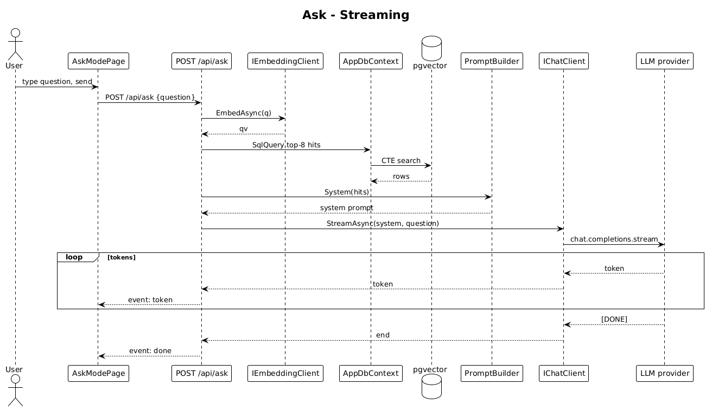

# 11 — Ask Mode Streaming — Detailed Design

## 1. Overview

Implements screen `4. AI Ask Mode` from `ui-design.pen` and the streaming `POST /api/ask` endpoint. The user types a natural-language question. The server:
1. Embeds the question.
2. Retrieves the top-K contacts (same SQL as search).
3. Composes a prompt with retrieved context.
4. Streams the assistant response back as **Server-Sent Events (SSE)**.

Citations (slice 12) and follow-ups (slice 13) are separate slices; this slice ships plain streaming answer with a trailing `event: done`.

**L2 traces:** L2-021, L2-022, L2-025, L2-061, L2-084.

## 2. Architecture

### 2.1 Workflow



## 3. Component details

### 3.1 `Endpoints/AskEndpoints.cs`
- `POST /api/ask` with body `{ question: string, sessionId?: string }`.
- Rate limited at 20/min/user (L2-055).
- Handler:
  ```csharp
  var qv = await embeddings.EmbedAsync(req.question, ct);
  var topK = await ctx.Database.SqlQuery<HitRow>(/* same CTE as search */).Take(8).ToListAsync(ct);
  var system = PromptBuilder.System(topK);
  Response.Headers["Content-Type"] = "text/event-stream";
  Response.Headers["Cache-Control"] = "no-cache";
  await foreach (var token in chat.StreamAsync(system, req.question, ct)) {
      await Response.WriteAsync($"event: token\ndata: {JsonSerializer.Serialize(token)}\n\n", ct);
      await Response.Body.FlushAsync(ct);
  }
  await Response.WriteAsync("event: done\ndata: {}\n\n", ct);
  ```

### 3.2 `IChatClient`
```csharp
public interface IChatClient {
    string ModelId { get; }
    IAsyncEnumerable<string> StreamAsync(string system, string user, CancellationToken ct);
}
```
Default implementation uses the OpenAI Chat Completions streaming API with `gpt-4o-mini` or equivalent. The implementation converts the streamed chunks to plain token strings.

### 3.3 `AskModePage` (Angular)
- **Route**: `/ask`.
- **Signals**:
  ```ts
  conversation = signal<Message[]>([]);
  streaming    = signal<boolean>(false);
  input        = signal<string>('');
  ```
- **Submit**:
  ```ts
  async submit() {
    if (!input().trim()) return;
    const user: Message = { role: 'user', text: input() };
    conversation.update(c => [...c, user]);
    const assistant: Message = { role: 'assistant', text: '' };
    conversation.update(c => [...c, assistant]);
    streaming.set(true);

    const es = new EventSource('/api/ask?...'); // or fetch+ReadableStream for POST body
    es.addEventListener('token', (e) => {
      const t = JSON.parse((e as MessageEvent).data) as string;
      conversation.update(c => {
        const last = c[c.length - 1];
        return [...c.slice(0, -1), { ...last, text: last.text + t }];
      });
    });
    es.addEventListener('done', () => { es.close(); streaming.set(false); });
  }
  ```
  - Because SSE's `EventSource` only supports GET, the client uses `fetch('/api/ask', {method:'POST', body})` and reads `response.body.getReader()` manually — still an SSE wire format, just not via `EventSource`.
- **Input bar** — mirrors `tUHxK` / `inputBar` from the pen (plus button, input field, mic button, gradient send).
- **Bubbles** — user bubble right-aligned with gradient fill; assistant bubble left-aligned with `$surface-secondary`.

### 3.4 `PromptBuilder`
- Static, pure method: `System(hits)` returns a `system` prompt like:
  ```
  You are RecallQ, an assistant that answers questions about the user's personal network.
  Only use the following context. If the answer isn't supported by it, say so.
  
  CONTEXT:
  - Sarah Mitchell (VP Product · Stripe): Meeting notes mention LangChain adoption…
  - Alex Chen (CTO · Anthropic): "loved the retrieval eval harness we shipped"
  - …
  
  Keep answers under 120 words. Start with the direct answer.
  ```

## 4. API contract

| Method | Path | Body | Response |
|---|---|---|---|
| POST | `/api/ask` | `{ question, sessionId? }` | SSE stream of `event: token` and `event: done` |

Errors (before streaming starts): `400`, `401`, `429`.

## 5. UI fidelity

- Assistant avatar is a 32×32 gradient circle with a `sparkle` icon matching `QE8Fh` in the pen.
- Streaming status (`indexing 8,921 interactions`) in the top bar is wired to a live count from slice 04.
- At XS, the input bar remains visible above the on-screen keyboard — uses the `env(safe-area-inset-bottom)` CSS trick and a `viewportinset` polyfill where needed.

## 6. Security considerations

- `question` is rate-limited and length-capped (500 chars).
- `question` is **not logged verbatim** (L2-071). Only tokens-in/out and latency are recorded.
- The LLM context only contains the authenticated user's own data.

## 7. Test plan (ATDD)

| # | Test | Traces to |
|---|------|-----------|
| 1 | `Ask_streams_tokens_from_fake_chat_client` (FakeChatClient emits `['Based ', 'on ', 'your ', 'network…']`) | L2-022 |
| 2 | `Ask_first_token_within_1500ms_p95` | L2-061 |
| 3 | `Ask_rate_limited_at_21_per_minute` | L2-055 |
| 4 | `Ask_question_not_in_logs` | L2-071 |
| 5 | `Send_button_disabled_when_input_empty` (Playwright) | L2-021 |
| 6 | `User_bubble_right_aligned_gradient_background` (Playwright) | L2-084 |
| 7 | `Input_bar_remains_visible_above_keyboard_on_mobile` (Playwright device emulation) | L2-084 |
| 8 | `Conversation_retained_on_navigation_within_session` (Playwright) | L2-025 |

## 8. Open questions

- **Server-to-client format**: SSE vs HTTP chunked JSON lines — SSE chosen for simplicity; if corporate proxies buffer event-stream responses, switch to `application/x-ndjson`.
- **Model choice**: default to `gpt-4o-mini` for latency; escalate to a larger model only for documented cases.
