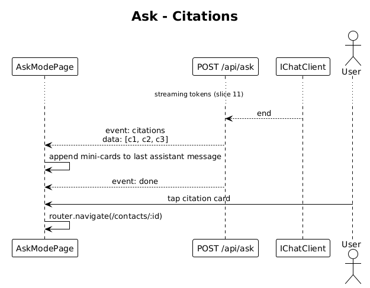

# 12 — Ask Citations — Detailed Design

## 1. Overview

Extends slice 11 by emitting a trailing `event: citations` containing the contacts the assistant grounded its answer on, and rendering them as tappable mini-cards inside the assistant bubble.

**L2 traces:** L2-023.

## 2. Architecture

### 2.1 Workflow



## 3. Component details

### 3.1 Server
- `AskEndpoints` already computes `topK` (slice 11). After streaming `event: token` finishes and before `event: done`, it emits:
  ```
  event: citations
  data: [{"contactId":"...","displayName":"Sarah Mitchell","initials":"SM","role":"VP Product","organization":"Stripe","avatarColorA":"#7C3AFF","avatarColorB":"#FF5EE7","similarity":0.96}, ...]
  ```
- Only the top 3 citations are sent (matching the 3 mini-cards in the design).
- The server does **not** re-rank based on tokens used; it reuses the pre-answer retrieval hits, which is radically simpler and works well for the single-turn answers the UI supports.

### 3.2 Client — `CitationCard`
- Mini-card matching `mini1`/`mini2`/`mini3` in `ui-design.pen` (`RZb87`, `9qiUY`, `bLNk8`): 32×32 gradient avatar, 2-line body (name on line 1, role on line 2), score chip on the right.
- Wrapper: violet-bordered for the top card (`#7C3AFF44`) to match the design's emphasis on the #1 match.
- Tapping navigates to `/contacts/:id`.

### 3.3 Client — conversation model update
Message shape extends:
```ts
interface Message {
  role: 'user' | 'assistant';
  text: string;
  citations?: CitationDto[];
}
```
When the `citations` event arrives, the last assistant message is mutated via `signal.update`.

## 4. Security considerations

- Citations never include interaction `content` — only the contact summary. The assistant's rendered text may quote interaction snippets; that's already authorized context for the owner.

## 5. Test plan (ATDD)

| # | Test | Traces to |
|---|------|-----------|
| 1 | `Ask_emits_citations_event_with_up_to_3_contacts` | L2-023 |
| 2 | `Citation_with_score_0.96_renders_high_tier` (Playwright) | L2-023, L2-017 |
| 3 | `Tapping_citation_navigates_to_contact_detail` (Playwright) | L2-023 |
| 4 | `Assistant_bubble_with_no_hits_omits_citations` | L2-023 |

## 6. Open questions

- **Inline vs trailing citations**: later iteration could attach citations to token spans (like ChatGPT's [1][2]). Not required by L2 — defer.
