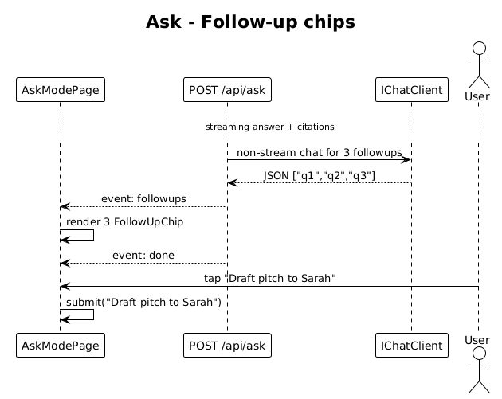

# 13 — Ask Follow-ups — Detailed Design

## 1. Overview

After an answer completes, render up to 3 follow-up suggestion chips under a `FOLLOW-UP` label (matching `followHead`/`followRow1`/`followRow2` in `ui-design.pen`). Tapping a chip submits its text as the next user question.

Follow-ups are generated by a second, cheaper LLM call once the answer is fully streamed.

**L2 traces:** L2-024.

## 2. Architecture

### 2.1 Workflow



## 3. Component details

### 3.1 Server — second LLM call
- After `event: done`, the server issues a small non-streamed chat call:
  ```
  system: "Suggest 3 short follow-up questions (<=6 words each) the user might ask next. Output a JSON array of strings. Do not include reasoning."
  user:   "Answer context: {the assistant's just-delivered answer, truncated to 400 chars}"
  ```
- Response is parsed with `JsonSerializer.Deserialize<string[]>`; on parse failure, the server emits **zero** follow-ups (never crashes the stream).
- Emitted as a final SSE event:
  ```
  event: followups
  data: ["Who's warm at a16z?", "Draft pitch to Sarah", "Investors I owe a reply"]
  ```

### 3.2 Client — `FollowUpChip`
- Pill component matching `fu1`/`fu2`/`fu3` (`CLlz8`, `aUuOW`, `SPQjG` in the pen): `cornerRadius: 999`, fill `$surface-elevated`, stroke `$border-subtle` (except the top chip which uses `#4BE8FF55` accent stroke to draw the eye).
- Layout: wraps to two rows at XS.
- Tapping emits `(selected)` event → parent page submits as the next user question.

### 3.3 Fewer than 3 follow-ups
- When the server emits 0–2 suggestions, only those chips render — no placeholder chips (L2-024 AC 3).

## 4. Security / cost considerations

- The follow-up call adds one short prompt per answer. Budgeted at ≤60 tokens in and ≤40 tokens out. At `gpt-4o-mini` pricing this is negligible.
- Failures are silently swallowed (no chips). The follow-up call never blocks the primary answer.

## 5. Test plan (ATDD)

| # | Test | Traces to |
|---|------|-----------|
| 1 | `Followups_event_rendered_as_chips` (Playwright with FakeChatClient returning `["a","b","c"]`) | L2-024 |
| 2 | `Tap_chip_submits_its_text_as_next_question` (Playwright) | L2-024 |
| 3 | `Two_suggestions_render_as_two_chips_no_placeholders` (Playwright) | L2-024 |
| 4 | `Invalid_JSON_follow_up_response_yields_zero_chips_no_crash` | L2-024 |

## 6. Open questions

- **Click or tap feedback**: on desktop, add a hover state using `$surface-elevated` → `$surface-secondary`. Not mandated by L2.
