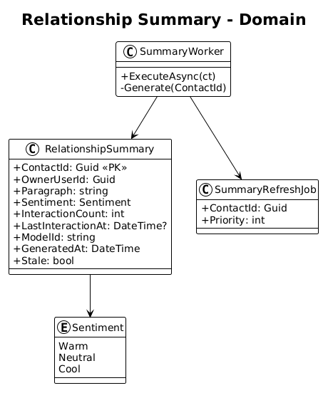
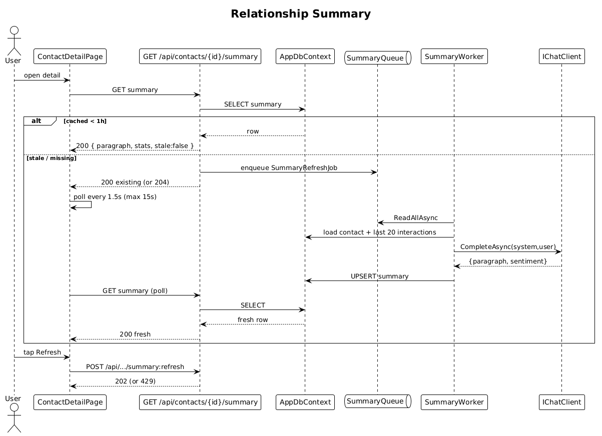

# 14 — Relationship Summary — Detailed Design

## 1. Overview

Adds the `RELATIONSHIP SUMMARY` card to the contact detail screen: an AI-generated paragraph plus a stat band containing **Interactions count**, **Sentiment** tier, and **Since last** time. Summaries are cached for 1 hour per contact, can be refreshed manually (rate-limited to once/60s), and are auto-invalidated when a new interaction is logged.

**L2 traces:** L2-031, L2-032, L2-033.

## 2. Architecture

### 2.1 Data model



### 2.2 Workflow



## 3. Component details

### 3.1 `RelationshipSummary` entity
```csharp
public class RelationshipSummary {
    public Guid ContactId { get; set; }        // PK
    public Guid OwnerUserId { get; set; }
    public string Paragraph { get; set; } = default!;
    public Sentiment Sentiment { get; set; }    // Warm | Neutral | Cool
    public int InteractionCount { get; set; }
    public DateTime? LastInteractionAt { get; set; }
    public string ModelId { get; set; } = default!;
    public DateTime GeneratedAt { get; set; }
    public bool Stale { get; set; }
}
```

### 3.2 Endpoints
- `GET /api/contacts/{id}/summary` — returns cached summary if fresh (`GeneratedAt > now-1h` and no pending `SummaryRefresh` job); otherwise enqueues a job and returns the last summary with `stale=true` (or a placeholder if none exists).
- `POST /api/contacts/{id}/summary:refresh` — rate-limited to once/60s/contact/user. Enqueues a priority refresh and returns `202 Accepted`. When the job completes, the UI polls or uses SSE to pick up the new content (MVP: poll on a 1.5s cadence for up to 15 seconds after tap).

### 3.3 `SummaryWorker`
- Drains the `Channel<SummaryRefreshJob>` fed from slices 05, 13-style background tasks, and manual refresh.
- For each job:
  1. Load the contact and its last 20 interactions (reverse-chrono).
  2. Build a compact prompt with contact meta and the truncated interactions.
  3. Call `IChatClient.CompleteAsync(system, user)` (non-streamed, JSON schema response).
     ```json
     { "paragraph": "…", "sentiment": "Warm" }
     ```
  4. Compute `interactionCount` and `lastInteractionAt` from DB.
  5. UPSERT the summary row.

### 3.4 Stat band on the client
- Matches `statBand` / `7W1AO` in the pen: three vertical blocks with Geist Mono big number and `$foreground-muted` label.
- **Since last** formatting: `{n} days` if ≥1, `{n} hours` if <1 day, `<1 hour` otherwise.

### 3.5 Auto-invalidation
- Slice 05 already enqueues `SummaryRefreshJob` on every interaction create/update/delete. This slice only has to wire the worker side; no change to slice 05.

## 4. API contract

| Method | Path | Body | Response |
|---|---|---|---|
| GET | `/api/contacts/{id}/summary` | — | `200 RelationshipSummaryDto` or `204 No Content` when none exists |
| POST | `/api/contacts/{id}/summary:refresh` | — | `202`, `429` |

## 5. Security / cost considerations

- Summary regeneration is rate-limited (L2-032 AC 1). On thrash (user tapping refresh repeatedly), the second call returns `429`.
- The LLM prompt contains only this user's contact and interaction text — no cross-user leakage (L2-056).
- Interaction content lengths are capped at 400 chars per item before being included in the prompt, to keep the LLM cost bounded.

## 6. Test plan (ATDD)

| # | Test | Traces to |
|---|------|-----------|
| 1 | `Get_summary_for_contact_with_interactions_returns_paragraph_and_stats` | L2-031 |
| 2 | `Get_summary_for_contact_with_no_interactions_returns_not_enough_data_state` | L2-031 |
| 3 | `Refresh_summary_twice_within_60s_returns_429_on_second` | L2-032 |
| 4 | `Cached_summary_within_1h_does_not_call_LLM` (count FakeChatClient invocations) | L2-032 |
| 5 | `New_interaction_invalidates_summary_and_regenerates` (integration) | L2-033 |
| 6 | `Stat_band_renders_Warm_sentiment_green` (Playwright) | L2-031 |

## 7. Open questions

- **Sentiment classes**: three tiers (Warm/Neutral/Cool) is simple and matches the design's single `Warm` example. If more granularity is needed, extend the enum — but keep the color mapping consistent with tokens.
