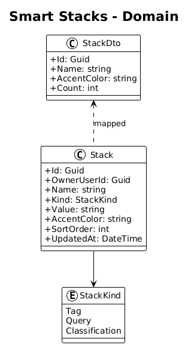
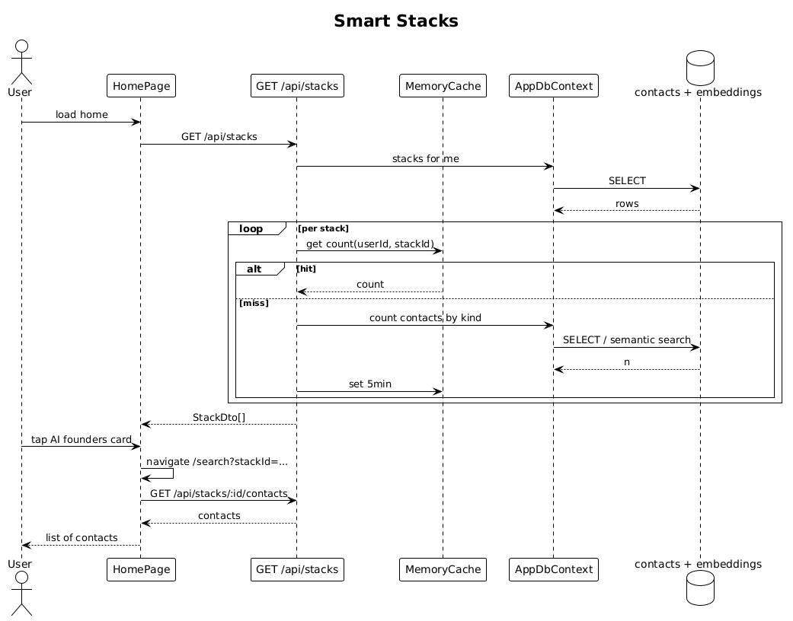

# 15 — Smart Stacks — Detailed Design

## 1. Overview

Renders the **Smart stacks** row on the home screen (`stacksRow` / `e8zNf` in `ui-design.pen`): a horizontally-scrollable list of curated contact groupings, each a card with a count and a label (e.g., `27 AI founders`, `14 Intros owed`, `9 Close friends`). Tapping a card opens a filtered search results page.

Stacks are defined per user by:
- A **tag** predicate (e.g., `tag:investor`), or
- A **saved semantic query** (e.g., `"AI founders"`), or
- An **AI classification** defined at creation (e.g., `intros_owed`).

**L2 traces:** L2-026, L2-027, L2-028.

## 2. Architecture

### 2.1 Data model



### 2.2 Workflow



## 3. Component details

### 3.1 `Stack` entity
```csharp
public class Stack {
    public Guid Id { get; set; }
    public Guid OwnerUserId { get; set; }
    public string Name { get; set; } = default!;     // "AI founders"
    public StackKind Kind { get; set; }               // Tag | Query | Classification
    public string Value { get; set; } = default!;     // "Investor" or "AI founders" or "intros_owed"
    public string AccentColor { get; set; } = "#7C3AFF";
    public int SortOrder { get; set; }
    public DateTime UpdatedAt { get; set; }
}

public enum StackKind { Tag, Query, Classification }
```

Default seed on registration: three stacks, each `Kind.Query`, with the names from the design (`AI founders`, `Intros owed`, `Close friends`) and matching accent colors (`#7C3AFF`, `#4BE8FF`, `#FF5EE7`).

### 3.2 Endpoint — `GET /api/stacks`
Returns the user's stacks with their **current counts**, computed lazily:

```csharp
var stacks = await ctx.Stacks.OrderBy(s => s.SortOrder).ToListAsync(ct);
var results = new List<StackDto>();
foreach (var s in stacks) {
    var count = s.Kind switch {
        StackKind.Tag            => await ctx.Contacts.CountAsync(c => c.Tags.Contains(s.Value), ct),
        StackKind.Query          => await SemanticCount(s.Value, ct),
        StackKind.Classification => await ClassificationCount(s.Value, ct),
    };
    results.Add(new StackDto(s.Id, s.Name, s.AccentColor, count));
}
```

Counts for `Kind.Query` run the same search SQL as slice 08 and COUNT-distinct the contacts with similarity >= 0.7. The result is cached for 5 minutes per user per stack id (in-memory `MemoryCache`).

### 3.3 Endpoint — `GET /api/stacks/{id}/contacts`
Returns the filtered contacts for a stack, ordered by:
- **Tag stack**: alphabetic
- **Query stack**: similarity to the saved query
- **Classification stack**: opinionated per-classification ordering (e.g., `intros_owed` by `last_interaction_at` ASC).

### 3.4 `StackCard` (Angular)
- Matches `stk1`/`stk2`/`stk3` in `ui-design.pen` (id `rU65c`, `RSANG`, `0cl04`):
  - `cornerRadius: 18`, fill `$surface-secondary`, stroke in the stack's accent color at 40% alpha.
  - Top row: 28×28 icon square filled with accent color at 33% alpha + big Geist Mono count on the right.
  - Bottom row: label in Geist semibold 14.
- Width at XS: 160px for cards 1/2, 140px for card 3 (design matches these sizes literally — follow them for fidelity).

### 3.5 Stack filtered list
- Tapping a card navigates to `/search?stackId={id}`. The search page detects `stackId`, hides the free-text input, and shows a chip with the stack's name as the pseudo-query. Results are fetched from `/api/stacks/{id}/contacts`.

## 4. API contract

| Method | Path | Response |
|---|---|---|
| GET | `/api/stacks` | `200 StackDto[]` |
| GET | `/api/stacks/{id}/contacts` | `200 PagedResult<ContactDto>` |

## 5. Test plan (ATDD)

| # | Test | Traces to |
|---|------|-----------|
| 1 | `New_user_gets_three_default_stacks` | L2-026 |
| 2 | `Stack_with_zero_count_is_hidden` | L2-026 |
| 3 | `Tag_stack_count_reflects_current_tag_membership` | L2-028 |
| 4 | `Adding_contact_matching_query_stack_increases_count_after_cache_expires` | L2-028 |
| 5 | `Tapping_stack_card_opens_filtered_search_with_stack_name_chip` (Playwright) | L2-027 |
| 6 | `User_A_stacks_not_visible_to_user_B` | L2-056 |

## 6. Open questions

- **Cache TTL**: 5 minutes is a simple default. If counts appear stale in demo scenarios, drop to 60s. Redis is out of scope — stick with `MemoryCache`.
- **Stack management UI**: creating/renaming/reordering stacks is not in v1 per the L2s. Defer.
