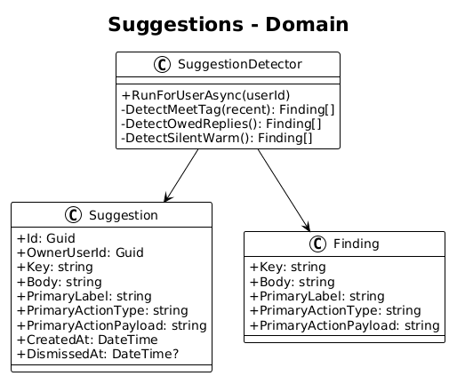
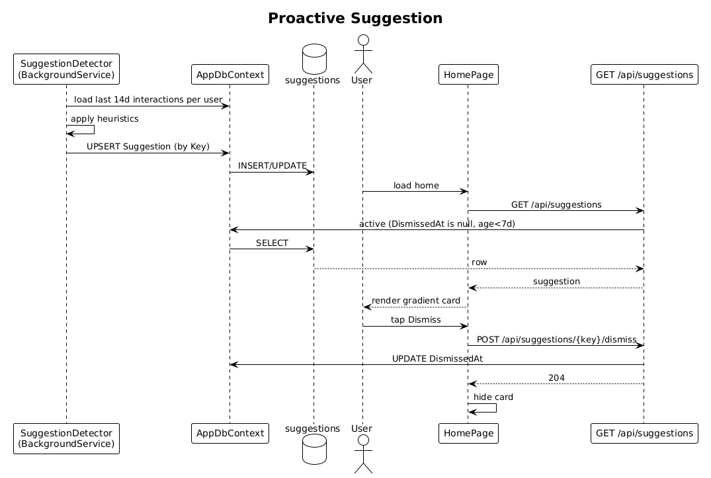

# 16 — Proactive Suggestion — Detailed Design

## 1. Overview

Renders the gradient-filled **AI SUGGESTION** card on the home screen (`Cm94Y` in `ui-design.pen`) with a body like `You met 3 AI founders last week — shall I find similar investors?`, a primary pill action, and a `Dismiss` ghost action. Suggestions are recomputed once a day per user and persisted in `suggestions`. Dismissed suggestions are suppressed for 7 days.

**L2 traces:** L2-029, L2-030.

## 2. Architecture

### 2.1 Data model



### 2.2 Workflow



## 3. Component details

### 3.1 `Suggestion` entity
```csharp
public class Suggestion {
    public Guid Id { get; set; }
    public Guid OwnerUserId { get; set; }
    public string Key { get; set; } = default!;       // deterministic: "met-N-{tag}-last-week"
    public string Body { get; set; } = default!;      // the sentence
    public string PrimaryLabel { get; set; } = default!;      // "Show me"
    public string PrimaryActionType { get; set; } = default!; // "search" | "ask"
    public string PrimaryActionPayload { get; set; } = default!; // the query
    public DateTime CreatedAt { get; set; }
    public DateTime? DismissedAt { get; set; }
}
```
Key `Key` includes the shape of the finding so identical findings produce the same key across days — enabling 7-day dismissal (L2-030 AC 1).

### 3.2 `SuggestionDetector` (runs daily per user)
- A single `IHostedService` runs at 03:00 user-local time (or UTC for v1) and, for each user:
  1. Scans the last 14 days of interactions grouped by `type × tag-bag`.
  2. Applies a few cheap heuristics:
     - **meet-N-{tag}-last-week** — user had ≥3 meetings with contacts sharing a tag.
     - **owed-replies** — ≥5 inbound emails unanswered > 3 days.
     - **silent-warm-contacts** — ≥5 `Warm` sentiment contacts with no interaction in >30 days.
  3. Creates `Suggestion` rows for keys not already active (non-dismissed < 7d old).

No LLM call — this is a radically simple rule set. Only a later slice might consider an LLM-based suggestion generator.

### 3.3 Endpoints
- `GET /api/suggestions` — returns up to 1 active suggestion (the most recently created, undismissed).
- `POST /api/suggestions/{key}/dismiss` — sets `DismissedAt = now` on the active suggestion with that key.

### 3.4 `SuggestionCard` (Angular)
- Renders `ai suggestion` / `Cm94Y` exactly: gradient fill `#7C3AFF → #BF40FF → #FF5EE7` at 135°, cornerRadius 20, 32px outer blur shadow with purple tint.
- `AI SUGGESTION` uppercase mono label + pulsing dot + body text + two actions (`Show me` gradient-to-white primary, `Dismiss` translucent secondary).
- On primary tap: navigate by `PrimaryActionType` (`search` → `/search?q=...`, `ask` → `/ask` with seeded input).

## 4. API contract

| Method | Path | Response |
|---|---|---|
| GET | `/api/suggestions` | `200 SuggestionDto | null` |
| POST | `/api/suggestions/{key}/dismiss` | `204` |

## 5. Test plan (ATDD)

| # | Test | Traces to |
|---|------|-----------|
| 1 | `Suggestion_detector_emits_meet_N_suggestion_when_threshold_met` | L2-029 |
| 2 | `No_qualifying_signal_yields_no_suggestion` (home hides card) | L2-029 |
| 3 | `Primary_action_of_meet_N_opens_search_with_implied_query` (Playwright) | L2-029 |
| 4 | `Dismissing_suggestion_suppresses_for_7_days_for_same_key` | L2-030 |
| 5 | `Different_key_suggestion_still_eligible_after_dismiss` | L2-030 |
| 6 | `Suggestion_card_matches_design_gradient_and_layout` (Playwright screenshot) | L2-029, L2-051 |

## 6. Open questions

- **When to run the detector**: daily at a fixed time is simple. If users want fresher suggestions, change to `on-demand at first GET /api/suggestions of the day` — trivially swappable.
