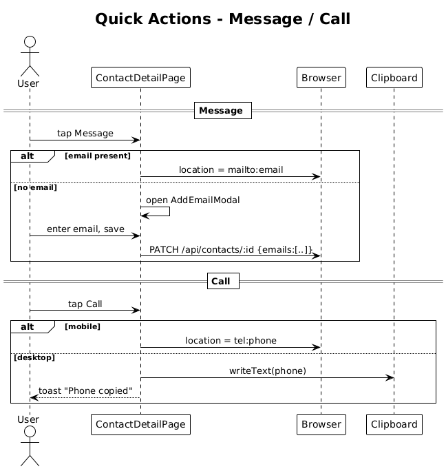

# 17 — Quick Actions: Message and Call — Detailed Design

## 1. Overview

Implements the first two of the four tiles in the contact-detail action row: **Message** (`mailto:` or "add email" prompt) and **Call** (`tel:` on mobile or clipboard copy on desktop). The remaining two (Intro, Ask AI) are slices 18 and 19.

**L2 traces:** L2-037, L2-038.

## 2. Architecture

### 2.1 Workflow

## 3. Component details

### 3.1 `MessageButton`
- Tile component matching `aMsg` / `NQkMx` (cornerRadius 16, fill `$surface-elevated`, cyan paper-plane icon, `Message` label).
- Disabled state when `contact.emails.length === 0` — dimmed and tappable to open an **Add email** modal (`ContactEmailsModal`).
- When enabled, tapping calls `window.location.href = 'mailto:' + contact.emails[0]`.

### 3.2 `CallButton`
- Tile matching `aCall` / `Dc9kr` (green phone icon, `Call` label).
- Resolves the action based on `matchMedia('(max-width: 768px)').matches`:
  - **Mobile** → `window.location.href = 'tel:' + contact.phones[0]`.
  - **Desktop** → `navigator.clipboard.writeText(contact.phones[0])` and show a toast `Phone copied`.
- Disabled/unavailable state when `phones` is empty — opens an **Add phone** modal.

### 3.3 Add-email / Add-phone modals
- Simple reactive form modal. Submission calls `PATCH /api/contacts/{id}` with the added array.
- On save, the tile re-enables and the user's original tap intent is NOT repeated automatically — the user taps again to proceed.

### 3.4 Optional outbound-draft capture
Per L2-037 AC 3 (optional): after `mailto:` launches, show an in-app toast `Log this email? [Yes] [No]`. On yes, prompt for subject and content, then `POST /api/contacts/{id}/interactions` with `{type:"email"}` — already supported by slice 05. This is purely a UX nicety; the click itself is already useful without it.

## 4. API contract

No new endpoints. Uses `PATCH /api/contacts/{id}` (from slice 06) and `POST /api/contacts/{id}/interactions` (from slice 05).

## 5. Accessibility

- Tile buttons are `<button>` elements with an `aria-label` (e.g., `Email Sarah Mitchell`, `Call Sarah Mitchell`).
- When disabled (no email/phone), the button is not disabled at the HTML level — it's still focusable and announces `No email on file. Tap to add.` as its `aria-label`.

## 6. Test plan (ATDD)

| # | Test | Traces to |
|---|------|-----------|
| 1 | `Message_tile_with_email_opens_mailto` (Playwright — observes location change) | L2-037 |
| 2 | `Message_tile_without_email_opens_add_email_modal` (Playwright) | L2-037 |
| 3 | `Call_tile_on_mobile_opens_tel` (Playwright device emulation) | L2-038 |
| 4 | `Call_tile_on_desktop_copies_phone_and_toasts` (Playwright) | L2-038 |
| 5 | `Disabled_tile_has_aria_label_about_adding_missing_field` (axe check) | L2-066 |

## 7. Open questions

- **Provider integrations** (Gmail / Google Voice) are explicitly out of scope for v1. `mailto:` / `tel:` is radically simple and works on every device.
