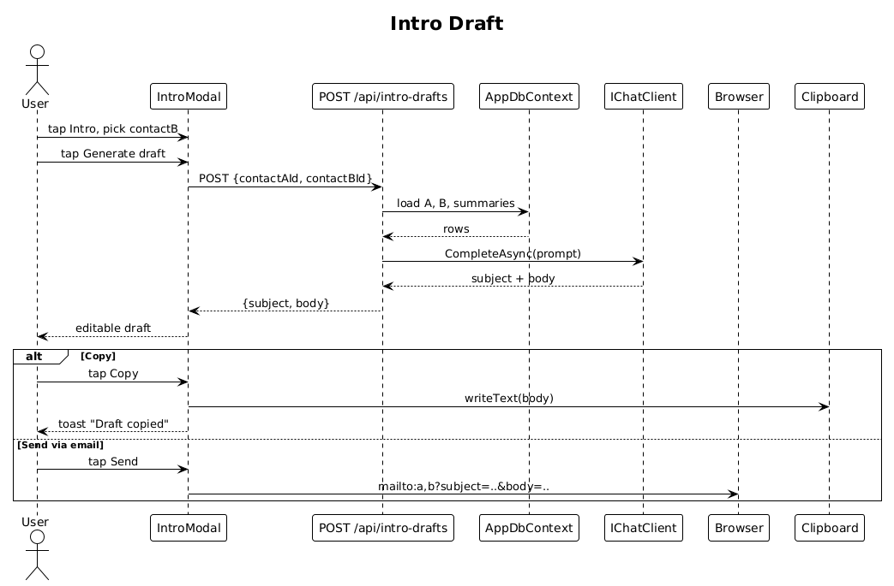

# 18 — Quick Action: Intro Draft — Detailed Design

## 1. Overview

Implements the **Intro** tile: the user picks a second party from their contacts, the backend drafts an intro email via the LLM, and the user can Copy to clipboard or Send via `mailto:` with both parties in `To:`.

**L2 traces:** L2-039.

## 2. Architecture

### 2.1 Workflow



## 3. Component details

### 3.1 `IntroModal` (Angular)
- Triggered by tapping the `Intro` tile on contact detail.
- Layout: a modal with
  - The current contact's name shown in a locked row at the top.
  - A second-contact picker (search-as-you-type over the user's contacts, results come from `GET /api/contacts?search=...`).
  - A `Generate draft` primary button.
  - After generation: the draft body (editable `<textarea>`), and two actions — `Copy`, `Send via email`.

### 3.2 Endpoint — `POST /api/intro-drafts`
- Body: `{ contactAId: Guid, contactBId: Guid }`.
- Handler:
  1. Load both contacts (owner-scoped).
  2. Load each contact's `RelationshipSummary.Paragraph` if present.
  3. Build an LLM prompt asking for a short, friendly intro (3–5 sentences), no greeting boilerplate, ending with `[your-name]` signature line.
  4. Call `IChatClient.CompleteAsync(...)` non-streaming.
  5. Return `{ subject, body }`.

### 3.3 Actions on the draft
- **Copy** — `navigator.clipboard.writeText(body)` + toast `Draft copied`.
- **Send via email** —
  ```
  mailto:a@example.com,b@example.com?subject=<encoded>&body=<encoded>
  ```
  Hits a URL-length limit (~2000 chars) on some browsers — server returns a `body` truncated to ≤1500 chars if larger.

## 4. API contract

| Method | Path | Body | Response |
|---|---|---|---|
| POST | `/api/intro-drafts` | `{ contactAId, contactBId }` | `200 { subject, body }`, `400`, `404`, `429` |

## 5. Cost control

- Rate-limited to 20/min/user.
- Prompt is capped at ~400 tokens in. Output capped at ~200 tokens.

## 6. Test plan (ATDD)

| # | Test | Traces to |
|---|------|-----------|
| 1 | `Generate_intro_returns_subject_and_body` (FakeChatClient) | L2-039 |
| 2 | `Copy_draft_to_clipboard_and_toasts` (Playwright) | L2-039 |
| 3 | `Send_via_email_opens_mailto_with_both_parties` (Playwright) | L2-039 |
| 4 | `Invalid_contactB_id_returns_404` | L2-039 |
| 5 | `Intro_rate_limited_at_21_per_minute` | L2-055 |

## 7. Open questions

- **Personalization**: should drafts include the user's own role/title as part of the signature? For v1, emit `[your-name]` as a literal placeholder; a future slice can add a `UserProfile` with signature settings.
