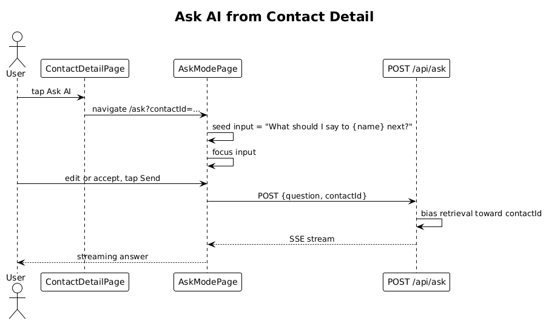

# 19 — Quick Action: Ask AI From Contact — Detailed Design

## 1. Overview

Implements the fourth action tile — the gradient-filled **Ask AI** (`aAsk` / `9GU3V` in `ui-design.pen`). Tapping it opens Ask mode pre-seeded with a contact-scoped prompt (e.g., `What should I say to Sarah Mitchell next?`).

**L2 traces:** L2-040.

## 2. Architecture

### 2.1 Workflow



## 3. Component details

### 3.1 `AskButton` (on contact detail)
- Tile matches `aAsk` in the pen: gradient fill `#7C3AFF → #BF40FF` at 135°, white `sparkle` icon and `Ask AI` label.
- Tapping navigates to `/ask?contactId={id}`.

### 3.2 `AskModePage` enhancement
- On page init, if `contactId` query param is present:
  1. Fetch the contact's `displayName` (from slice 06's detail endpoint, or a cached `/api/contacts?ids=...`).
  2. Populate the `input` signal with `What should I say to ${displayName} next?`.
  3. Focus the input.
- The user can edit the seed text before tapping send. L2-040 AC 2 mandates that the submitted text is whatever the user has at submission, not the seed.
- The outgoing `/api/ask` request includes `{ question, contactId }` so the server can bias retrieval toward that contact.

### 3.3 Endpoint change (tiny)
- `POST /api/ask` — existing handler gets one new optional field in the body:
  ```json
  { "question": "...", "contactId": "..." }
  ```
- When `contactId` is present, the retrieval SQL `UNION`s the specified contact's embeddings first so that contact always appears in the context, followed by the normal top-K.

## 4. API contract

Unchanged path; request body adds `contactId?: Guid`.

## 5. Test plan (ATDD)

| # | Test | Traces to |
|---|------|-----------|
| 1 | `Ask_tile_navigates_with_contactId_query_param` (Playwright) | L2-040 |
| 2 | `Ask_page_seeds_input_with_contact_name` (Playwright) | L2-040 |
| 3 | `Edited_seed_is_submitted_not_the_original` | L2-040 |
| 4 | `Ask_request_with_contactId_includes_that_contact_in_context` (integration, assert prompt text) | L2-040 |

## 6. Open questions

- **Seed text template**: `What should I say to {name} next?` is one option. Alternatives (`Summarize my relationship with {name}`, `Draft a follow-up to {name}`) could rotate. For v1 pick one and ship.
