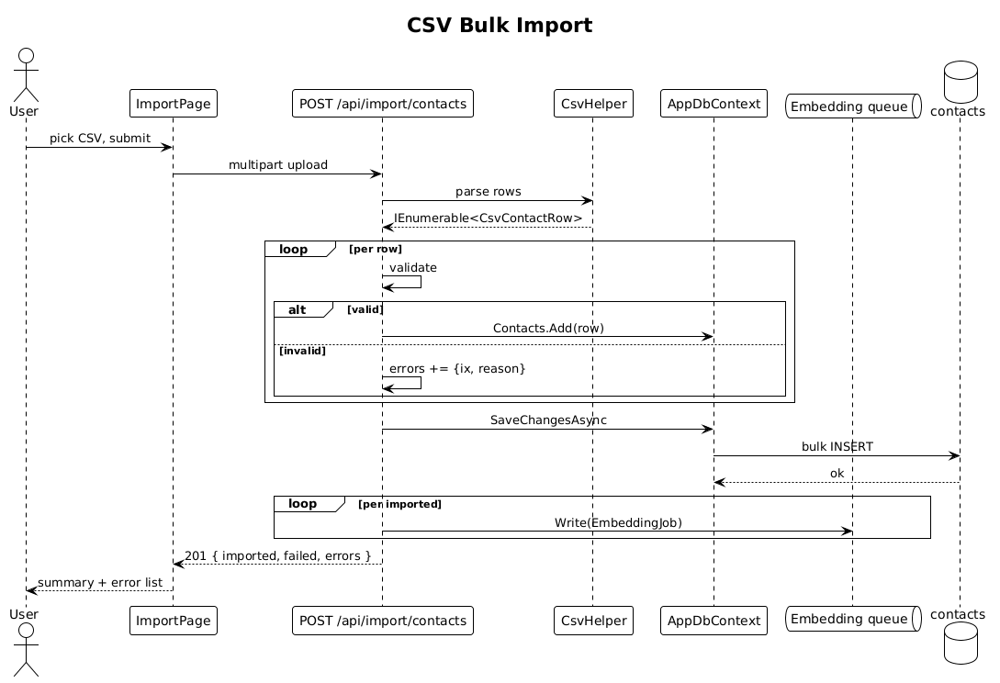

# 20 — CSV Bulk Import — Detailed Design

## 1. Overview

Lets a user seed their contacts from a CSV. The server parses the upload, validates row by row, inserts valid rows, and enqueues embedding jobs for all of them. The UI is a simple single-page flow: upload file → server returns `{imported, failed, errors[]}` → display.

**L2 traces:** L2-077.

## 2. Architecture

### 2.1 Workflow



## 3. Component details

### 3.1 Endpoint — `POST /api/import/contacts`
- Accepts `multipart/form-data` with a single `file` part.
- Body size limit: 10 MB (enough for ~50k rows with typical widths).
- Implementation:
  ```csharp
  using var reader = new StreamReader(file.OpenReadStream());
  using var csv = new CsvReader(reader, new CsvConfiguration(CultureInfo.InvariantCulture) {
      HasHeaderRecord = true, MissingFieldFound = null, HeaderValidated = null
  });
  var rows = csv.GetRecords<CsvContactRow>();
  var errors = new List<RowError>();
  var contacts = new List<Contact>();
  foreach (var (row, ix) in rows.Select((r,i) => (r,i+1))) {
      if (string.IsNullOrWhiteSpace(row.DisplayName)) { errors.Add(new RowError(ix, "displayName required")); continue; }
      contacts.Add(Map(row));
  }
  ctx.Contacts.AddRange(contacts);
  await ctx.SaveChangesAsync(ct);
  foreach (var c in contacts) embeddingQueue.Writer.TryWrite(new EmbeddingJob(ContactId: c.Id));
  return Results.Created("/api/contacts", new { imported = contacts.Count, failed = errors.Count, errors });
  ```

### 3.2 CSV shape
```
displayName,role,organization,emails,phones,tags,location
Sarah Mitchell,VP Product,Stripe,sarah@stripe.com,+1-415-555-0101,Investor;Series B;SF Bay,SF Bay
```
- Semicolon separates multi-value fields per L2-077.
- Row width capped at 2048 chars; longer rows are skipped and reported.

### 3.3 Initials derivation
- If the CSV doesn't include initials, derive from the first letters of up to two whitespace-split tokens: `"Sarah Mitchell" → "SM"`. Fallback for one-word names: first two letters, uppercased.

### 3.4 UI page
- Route `/import`. Drop-zone + `Upload CSV` button. After submission, show a small summary card with `✓ imported N` and `× failed M — see details` accordion listing each `rowNumber: reason`.

## 4. API contract

| Method | Path | Body | Response |
|---|---|---|---|
| POST | `/api/import/contacts` | `multipart/form-data file=…` | `201 { imported, failed, errors }`, `400`, `413` |

## 5. Security considerations

- File size + row count caps (10 MB / 100k rows) prevent OOM and DB abuse.
- CSV formula injection: for now the server stores fields as raw text; the frontend renders via Angular's default text binding (no `innerHTML`) so CSV formulas (`=HYPERLINK(...)`) never execute.
- CSV upload is owner-scoped — rows are created with `OwnerUserId = currentUser.Id`.

## 6. Test plan (ATDD)

| # | Test | Traces to |
|---|------|-----------|
| 1 | `Import_500_row_valid_csv_creates_500_contacts_and_enqueues_embeddings` | L2-077 |
| 2 | `Import_csv_with_invalid_rows_reports_per_row_errors_and_skips` | L2-077 |
| 3 | `Import_over_10MB_returns_413` | L2-077 |
| 4 | `Import_creates_contacts_scoped_to_caller_only` | L2-056 |
| 5 | `After_import_completes_search_returns_imported_contacts` (integration, waits for embeddings) | L2-077, L2-078 |

## 7. Open questions

- **Duplicate detection**: dedupe by `(displayName, organization)`? v1 imports every row; let the user review and delete duplicates after. A "merge tool" is a later slice if it becomes a real need.
