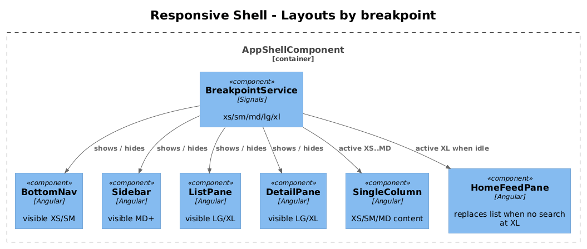

# 21 — Responsive Shell — Detailed Design

## 1. Overview

Adapts every screen built in slices 01–20 to SM, MD, LG, and XL viewports. The existing mobile design (XS) is the baseline; larger breakpoints add horizontal space, replace the mobile bottom nav with a sidebar at MD+, and introduce a list-detail two-pane at LG and three-pane at XL.

**L2 traces:** L2-041 → L2-046.

## 2. Architecture

### 2.1 Layout shells



## 3. Component details

### 3.1 Breakpoint tokens
Add to `tokens.css`:
```css
:root {
  --bp-sm:  576px;
  --bp-md:  768px;
  --bp-lg:  992px;
  --bp-xl: 1200px;
}
```

Angular exposes a `BreakpointService` using `matchMedia`:
```ts
@Injectable({providedIn:'root'})
export class BreakpointService {
  xs = signal(true);
  sm = signal(false);
  md = signal(false);
  lg = signal(false);
  xl = signal(false);
  constructor() {
    this.bind('(min-width: 576px)', this.sm);
    this.bind('(min-width: 768px)', this.md);
    this.bind('(min-width: 992px)', this.lg);
    this.bind('(min-width: 1200px)', this.xl);
  }
  private bind(query: string, sig: WritableSignal<boolean>) {
    const mq = window.matchMedia(query);
    sig.set(mq.matches);
    mq.addEventListener('change', e => sig.set(e.matches));
  }
}
```

### 3.2 Shell layouts
- **XS / SM**: existing mobile layout. `BottomNav` visible. Content column: XS 342px, SM centered with max-width 560px.
- **MD**: hide `BottomNav`, show left `Sidebar` (nav + Smart Stacks preview). Single content column, max-width 720px.
- **LG**: Sidebar + two-pane: list (420px) + detail (fill).
- **XL**: Sidebar + list + detail, with a `HomeFeedPane` replacing the list when no search is active.

All shells are the same component `AppShellComponent` with CSS Grid template areas that change based on signals from `BreakpointService`:
```css
.shell { display: grid; gap: 0; }
:host-context(.bp-xs), :host-context(.bp-sm) { grid-template: "content" 1fr / 1fr; }
:host-context(.bp-md)                         { grid-template: "nav content" / 240px 1fr; }
:host-context(.bp-lg)                         { grid-template: "nav list detail" / 240px 420px 1fr; }
:host-context(.bp-xl)                         { grid-template: "nav list detail" / 280px 480px 1fr; }
```

### 3.3 State preservation across breakpoint changes
- All page state lives in signals in route-scoped services. Since resize doesn't unmount the router outlet in the shell, state persists automatically.
- The query input keeps its value; the Ask conversation keeps its messages.

### 3.4 Contact detail & list co-presence (LG/XL)
- At LG+, `SearchResultsPage` is split into `ResultsListPane` + `ContactDetailPane`. Selecting a result updates the route to `/search/:contactId` and the right pane shows the detail view. Navigation with the browser back button follows the same history order as XS where the screens are separate pages.

## 4. UI fidelity

- Hero heading font sizes:
  - XS: 34px
  - SM: ≥38px
  - MD+: 44px
- Smart Stacks row:
  - XS/SM: horizontal scroll
  - MD+: grid with at least 3 cards visible without scrolling

## 5. Test plan (ATDD)

| # | Test | Traces to |
|---|------|-----------|
| 1 | `XS_390x844_home_matches_mobile_design_within_4px` (Playwright pixel-compare) | L2-041 |
| 2 | `SM_at_640px_shows_centered_column_max_560` (Playwright) | L2-042 |
| 3 | `MD_at_820px_hides_bottom_nav_shows_sidebar` (Playwright) | L2-043 |
| 4 | `LG_at_1100px_shows_two_pane_list_and_detail` (Playwright) | L2-044 |
| 5 | `XL_at_1440px_shows_three_pane_sidebar_list_detail` (Playwright) | L2-045 |
| 6 | `Resizing_XS_to_LG_preserves_search_query_and_conversation` (Playwright) | L2-046 |
| 7 | `Touch_targets_at_least_44x44_at_XS` (axe + scripted assertion) | L2-041 |

## 6. Open questions

- **Tablet landscape**: covered by LG/XL. No dedicated layout for iPad-portrait — MD handles it.
