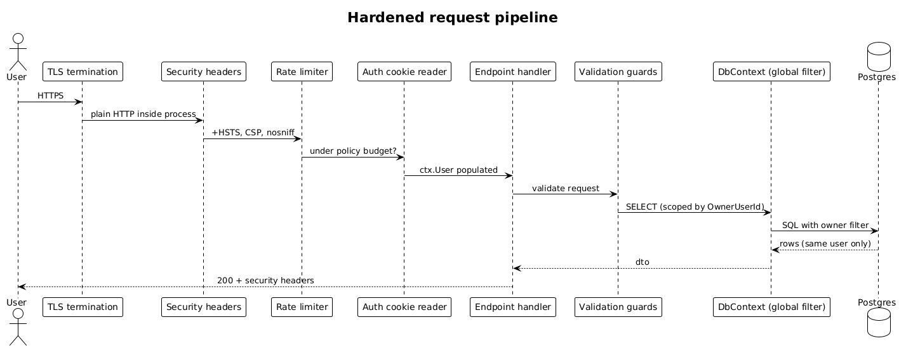

# 22 — Security Hardening — Detailed Design

## 1. Overview

Cross-cutting slice that locks down the surface area built by slices 01–20. Wires rate limiting, security headers, CSRF-equivalent protections (SameSite cookies), request-size caps, and secret loading. This slice is mostly configuration and middleware — no new domain entities.

**L2 traces:** L2-052, L2-053, L2-054, L2-055, L2-056, L2-057, L2-058.

## 2. Architecture

### 2.1 Request pipeline



## 3. Component details

### 3.1 Rate limiter policies
```csharp
services.AddRateLimiter(o => {
    o.AddPolicy("login",   ctx => FixedWindowLimiter(key: $"login:{ctx.Ip()}:{EmailOf(ctx)}", 5, 60s));
    o.AddPolicy("search",  ctx => SlidingWindowLimiter(key: $"search:{ctx.UserId()}", 60, 60s));
    o.AddPolicy("ask",     ctx => SlidingWindowLimiter(key: $"ask:{ctx.UserId()}", 20, 60s));
    o.AddPolicy("summary", ctx => FixedWindowLimiter(key: $"summary:{ctx.UserId()}:{ctx.ContactId()}", 1, 60s));
});
```

### 3.2 Security headers middleware
```csharp
app.Use(async (ctx, next) => {
    ctx.Response.Headers["Strict-Transport-Security"] = "max-age=31536000; includeSubDomains";
    ctx.Response.Headers["X-Content-Type-Options"] = "nosniff";
    ctx.Response.Headers["Referrer-Policy"] = "same-origin";
    ctx.Response.Headers["Content-Security-Policy"] = Csp.Build();
    await next();
});
```
CSP: `default-src 'self'; connect-src 'self' https://api.openai.com; img-src 'self' data:; style-src 'self' 'unsafe-inline'; font-src 'self'; frame-ancestors 'none'`.

### 3.3 Global query filter (data isolation)
EF Core `OnModelCreating` — for every owned entity:
```csharp
modelBuilder.Entity<Contact>().HasQueryFilter(c => c.OwnerUserId == _currentUser.Id);
modelBuilder.Entity<Interaction>().HasQueryFilter(i => i.OwnerUserId == _currentUser.Id);
// …and the rest
```
This is **the** protection against cross-user leakage. Every endpoint uses EF Core; no raw SQL bypasses it without an explicit `owner_user_id = @userId` clause (search SQL in slice 08 has this).

### 3.4 Input validation
- Minimal-API endpoints use inline guards: `if (string.IsNullOrWhiteSpace(req.DisplayName) || req.DisplayName.Length > 120) return Results.BadRequest(...)`.
- No `FluentValidation` library. Each endpoint validates its own request in ≤15 lines.

### 3.5 Secrets
- Configuration: `appsettings.json` holds non-secret defaults; secrets come from environment variables (`RECALLQ_POSTGRES_CONN`, `RECALLQ_LLM_API_KEY`, `RECALLQ_COOKIE_SIGNING_KEY`).
- `Program.cs` calls `options.Validate(ValidateOnStart=true)` on each `IOptions<T>` binding; missing keys cause fail-fast.

### 3.6 XSS prevention on the client
- All rendered content goes through Angular's default text binding (`{{ }}`) — no `innerHTML`, no `bypassSecurityTrustHtml`.
- Markdown rendering (for assistant answers, if ever added) would need an explicit sanitizer — not in v1.

### 3.7 Body size limits
- Kestrel `MaxRequestBodySize = 10 MB` at the host level; endpoints that expect small bodies set a per-endpoint smaller cap via `[RequestSizeLimit]` or minimal-API filter.

## 4. Test plan (ATDD)

| # | Test | Traces to |
|---|------|-----------|
| 1 | `Login_6th_attempt_per_email_ip_in_60s_returns_429` | L2-055, L2-002 |
| 2 | `Search_61st_per_minute_returns_429` | L2-055 |
| 3 | `Ask_21st_per_minute_returns_429` | L2-055 |
| 4 | `Summary_refresh_twice_in_60s_returns_429` | L2-032 |
| 5 | `HSTS_and_CSP_headers_present_on_every_response` | L2-057 |
| 6 | `Cross_user_contact_get_returns_404_not_403` | L2-056 |
| 7 | `CSV_with_script_payload_persisted_raw_rendered_escaped` | L2-053 |
| 8 | `Missing_RECALLQ_LLM_API_KEY_fails_fast_at_startup` | L2-058 |
| 9 | `No_password_hash_in_response_bodies_or_logs` (log capture) | L2-052 |
| 10 | `Bearer_token_in_query_string_rejected_400_security_logged` | L2-054 |

## 5. Open questions

- **WAF**: none in v1. If the app is exposed to the public internet, add a host-level WAF (Cloudflare / AWS) as a deployment concern, not a code concern.
- **Cookie signing key rotation**: monthly rotation with a 24-hour overlap window. Implementation is a `KeyRing` of two keys — verify with any, sign with the newest. Defer to a later ops-focused slice.
