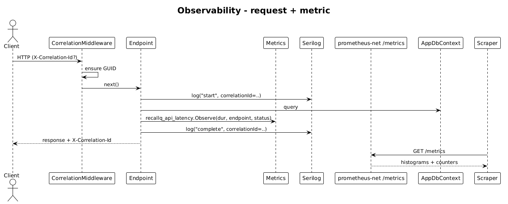

# 23 — Observability — Detailed Design

## 1. Overview

Adds structured logging, correlation IDs, and Prometheus-format metrics. Every log line carries a `correlationId`; every metric has a label for endpoint + status code. Contact text, interaction content, emails, phone numbers, and user queries are never logged — only hashes or lengths.

**L2 traces:** L2-069, L2-070, L2-071.

## 2. Architecture

### 2.1 Workflow



## 3. Component details

### 3.1 Logging
- `Serilog` with `Compact` JSON formatter. Enrichers: `FromLogContext`, `WithMachineName`, `WithEnvironmentName`.
- Middleware adds `X-Correlation-Id` (accepts inbound if valid GUID, otherwise generates) to `HttpContext.Items` and pushes it into `LogContext` so every log line includes it.

### 3.2 Response header
- Every outbound response sets `X-Correlation-Id: {id}` so the client can surface it in error UI (e.g., a support-copy button).

### 3.3 Metrics
- `prometheus-net.AspNetCore` middleware exposes `/metrics`.
- Custom instruments:
  - `recallq_api_latency_seconds{endpoint,status}` (histogram).
  - `recallq_embedding_latency_seconds` (histogram).
  - `recallq_search_latency_seconds` (histogram).
  - `recallq_llm_tokens_total{direction}` (counter).
  - `recallq_llm_cost_usd` (gauge — last observed request cost).
- Instruments are recorded inside endpoint handlers via a thin `Metrics` static class.

### 3.4 Error logging shape
```json
{
  "@t": "2026-04-24T10:12:00Z",
  "@m": "Unhandled exception",
  "correlationId": "f17d-...",
  "endpoint": "POST /api/search",
  "userHash": "8a62-...",
  "exceptionType": "NpgsqlException",
  "status": 500
}
```
`userHash = SHA256(userId + pepper).Substring(0,12)` — enough for grouping per user without being a direct identifier.

### 3.5 PII-scrubbing guard
- A unit test asserts that a small set of forbidden field names (`content`, `displayName`, `email`, `phone`, `q`, `question`, `answer`) never appear as keys in emitted log lines. The test uses a custom `ILoggerFactory` that captures all entries during a run of the API smoke test.

## 4. Test plan (ATDD)

| # | Test | Traces to |
|---|------|-----------|
| 1 | `Every_request_response_includes_correlation_id_header` | L2-069 |
| 2 | `Log_entries_include_correlation_id_field` | L2-069 |
| 3 | `Metrics_endpoint_exposes_latency_histograms_with_status_labels` | L2-070 |
| 4 | `LLM_tokens_counter_increments_on_ask_request` | L2-070 |
| 5 | `Logs_never_contain_search_q_or_interaction_content` (log capture across smoke suite) | L2-071 |

## 5. Open questions

- **Tracing (OpenTelemetry)**: add a tracer with OTLP exporter in a later slice if traces become useful. For v1, correlation IDs are sufficient.
- **Log destination**: stdout only; the deploy environment ships to the aggregator of choice (CloudWatch / Datadog / Loki).
