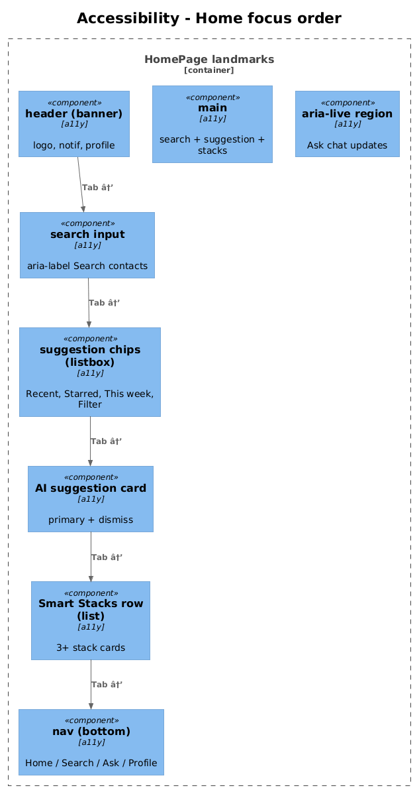

# 24 — Accessibility — Detailed Design

## 1. Overview

Ensures the app meets WCAG 2.2 AA across the slices above. Adds visible focus rings, accessible names, keyboard tab order, color-contrast validation including against gradient surfaces, and screen-reader-friendly streaming of the Ask chat.

**L2 traces:** L2-064 → L2-068.

## 2. Architecture

### 2.1 Focus order and landmarks



## 3. Component details

### 3.1 Focus ring
- Global style:
  ```css
  :focus-visible {
    outline: 2px solid var(--accent-tertiary);
    outline-offset: 2px;
    border-radius: inherit;
  }
  button.primary:focus-visible { outline-offset: 3px; }
  ```
- The accent-tertiary cyan token has ≥3:1 contrast against all surface tokens and against the purple gradient — validated via automated contrast tests in the storybook for the `ButtonPrimary` component.

### 3.2 Tab order
- Home page keyboard order (from L2-064 AC 1): logo → notifications → profile → search input → suggestion chip 1 → … chip 4 → AI suggestion primary → dismiss → stack 1 → 2 → 3 → bottom-nav items.
- Achieved with DOM order matching visual order — no custom `tabindex` beyond `0` or `-1`.

### 3.3 Accessible names
- Every icon-only button (bell, profile, back, star, more, plus, microphone, send) has an explicit `aria-label`.
- Interaction pills (`Call · 2d`) expose an accessible name `Last call, 2 days ago` via a visually hidden span with the long form and `aria-label` on the pill container suppressing the short form:
  ```html
  <span class="pill" [attr.aria-label]="'Last ' + typeLabel + ', ' + longRelative">
    <rq-icon [name]="iconName" aria-hidden="true"></rq-icon>
    <span aria-hidden="true">{{short}}</span>
  </span>
  ```

### 3.4 Color contrast validation
- Component tests use `axe-core` to validate contrast.
- For gradient-filled surfaces, a separate visual test captures screenshots of the AI suggestion card and featured result card, samples white text over the *lightest* gradient stop, and asserts `≥ 4.5:1` using `wcag-contrast`.

### 3.5 Screen reader flow for Ask
- The conversation container has `role="log"` and `aria-live="polite"`.
- Each assistant bubble has `aria-busy="true"` while streaming. When the stream completes, `aria-busy` flips to `false`, which causes screen readers to announce the fully-assembled text once instead of token-by-token (per L2-068).
- Mini-card citations are rendered as `<a role="link">` with accessible name `Contact: {name}, {role}, similarity {score}`.

### 3.6 Reduced motion
- A `@media (prefers-reduced-motion: reduce)` rule disables the pulsing dot in the AI suggestion card and the gradient shimmer, replacing them with static colored states.

## 4. Test plan (ATDD)

| # | Test | Traces to |
|---|------|-----------|
| 1 | `Home_tab_order_matches_visual_order` (Playwright keyboard-only walk) | L2-064 |
| 2 | `All_buttons_have_visible_focus_ring` (Playwright screenshot diff) | L2-065 |
| 3 | `Icon_only_buttons_expose_aria_label` (axe) | L2-066 |
| 4 | `Text_on_surface_primary_contrast_ratio_ge_4_5_1` (axe) | L2-067 |
| 5 | `White_on_purple_gradient_contrast_validated` (screenshot sampling) | L2-067 |
| 6 | `Ask_answer_announced_once_on_stream_complete` (screen reader snapshot test via `@testing-library` + aria-live) | L2-068 |
| 7 | `Mini_card_has_accessible_name_with_contact_and_score` | L2-068 |
| 8 | `Prefers_reduced_motion_disables_pulsing_dot` (Playwright) | L2-065 |

## 5. Open questions

- **Localization**: accessible names are English-only in v1. If i18n is introduced, long-form time strings (`Last call, 2 days ago`) must go through the i18n pipeline — defer until localization is on the roadmap.
