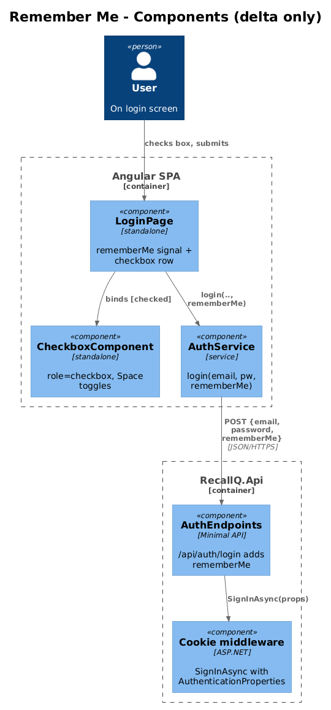
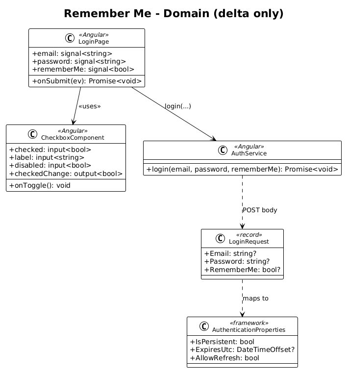
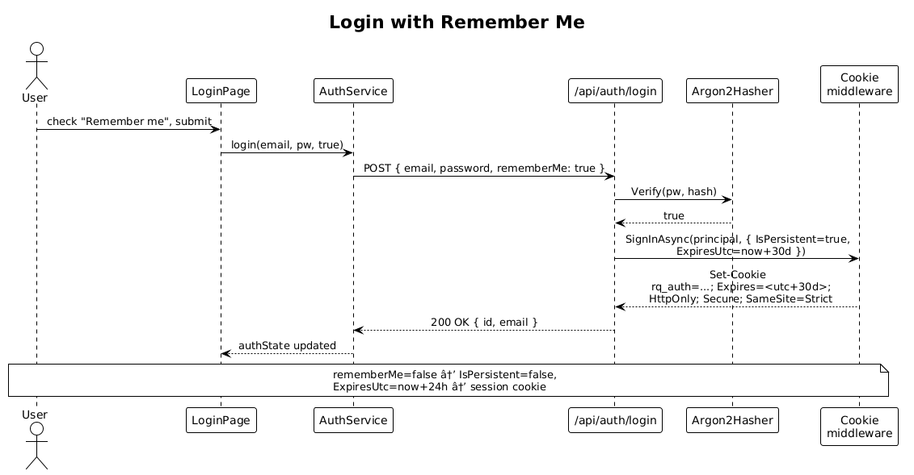

# 25 — Remember Me — Detailed Design

## 1. Overview

Adds a `Remember me` checkbox to the existing login screen. When the user checks it, the auth cookie issued by `/api/auth/login` is **persistent** with a 30-day lifetime; when unchecked, the cookie is a **session cookie** (cleared on browser close) capped server-side at 24 hours.

This is a thin slice on top of the existing cookie-based auth in [02 — User Authentication](../02-user-authentication/README.md). No new tables, no new endpoints, no new services — only:

- one new field on the existing `LoginRequest` record,
- one `AuthenticationProperties` argument on the existing `SignInAsync` call,
- one new reusable Angular `CheckboxComponent` mapped to the `checkbox` element in `ui-design.pen`,
- one new signal on `LoginPage`.

**Actors:** anonymous user on the login screen.

**In scope:** UI checkbox, request shape, cookie-persistence policy, tests.

**Out of scope:** "Forgot password?" link/route (covered by [26](../26-forgot-password-request/README.md)), refresh tokens, server-side session enumeration / "sign out everywhere" (the existing `SessionRevocationStore` already covers single-session revocation).

**L2 traces:** L2-085.

## 2. Architecture

### 2.1 Component diagram



Only two files materially change on the server (`AuthEndpoints.cs`, plus a one-line update to the cookie middleware option `ExpireTimeSpan` is unnecessary because `AuthenticationProperties.ExpiresUtc` overrides it per call). On the client, `LoginPage` gains a row, `AuthService.login` gains a third argument, and a new `CheckboxComponent` lives under `src/app/ui/checkbox/`.

### 2.2 Class diagram



## 3. Component details

### 3.1 `AuthEndpoints.LoginRequest`

```csharp
public record LoginRequest(string? Email, string? Password, bool? RememberMe);
```

`RememberMe` is nullable — a missing field is treated as `false` (the safer default).

### 3.2 `/api/auth/login` handler change

The handler calls `SignInAsync` with explicit properties:

```csharp
var props = new AuthenticationProperties
{
    IsPersistent = req.RememberMe == true,
    ExpiresUtc = req.RememberMe == true
        ? DateTimeOffset.UtcNow.AddDays(30)
        : DateTimeOffset.UtcNow.AddHours(24),
    AllowRefresh = false
};
await http.SignInAsync(CookieAuthenticationDefaults.AuthenticationScheme, principal, props);
```

The cookie middleware already sets `HttpOnly`, `Secure` (in production), and `SameSite=Strict`. The only behavior difference is that **without `IsPersistent=true` the cookie has no `Expires`/`Max-Age` attribute**, so the browser drops it on close. The 24-hour `ExpiresUtc` is enforced server-side by the cookie ticket — even if a browser keeps a session cookie alive across crashes, the ticket's `Expires-At` is honored on the next validation.

### 3.3 `AuthService.login` (frontend)

```typescript
async login(email: string, password: string, rememberMe: boolean): Promise<void>
```

The body sent to `/api/auth/login` becomes `{ email, password, rememberMe }`.

### 3.4 `CheckboxComponent` (new, reusable)

A standalone Angular component under `src/app/ui/checkbox/`. Visual mapping to `ui-design.pen` element `wse0b` (parent: `mJfJ2 / rememberRow`):

| Pen property | CSS / template |
|---|---|
| 20×20 frame, `cornerRadius: $radius-sm`, `fill: $surface-elevated`, `stroke: $border-strong 1.5px` | `.box { width:20px; height:20px; border-radius: var(--radius-sm); background: var(--surface-elevated); border: 1.5px solid var(--border-strong); }` |
| `lucide:check` icon, 14×14, `fill: $foreground-muted`, only visible when checked | `<svg>` icon hidden via `aria-hidden` when `checked()` is false |
| Label "Remember me", Inter 14, `$foreground-secondary`, gap 10 | `.row { gap: 10px; }` |

Inputs:
- `checked: boolean` (default `false`)
- `label: string`
- `disabled: boolean` (default `false`)

Output:
- `checkedChange: EventEmitter<boolean>`

A11y:
- Renders as `<button role="checkbox" [attr.aria-checked]="checked()">` so `Space` toggles natively (per L2-085 AC 6).
- Visible focus ring inherits the global focus style (L2-065).
- `<label>` text is the accessible name; clicking the label or the box toggles.

### 3.5 `LoginPage` row

The existing template gets one new element above the submit button:

```html
<div class="rememberRow">
  <app-checkbox
    label="Remember me"
    [checked]="rememberMe()"
    (checkedChange)="rememberMe.set($event)" />
  <a routerLink="/forgot-password"
     [queryParams]="{ email: email() }"
     class="forgot">Forgot password?</a>
</div>
```

The `rememberMe` signal defaults to `false` and is passed to `auth.login(email(), password(), rememberMe())`. The `Forgot password?` link is part of the next slice's wiring (file already exists in this slice; route stub returns 404 until [26](../26-forgot-password-request/README.md) lands).

### 3.6 CSS (`login.page.css`)

```css
.rememberRow { display: flex; justify-content: space-between; align-items: center; }
.forgot      { color: var(--accent-tertiary); font-weight: 600; font-size: 14px;
               text-decoration: none; }
```

## 4. Workflow

### 4.1 Login with Remember Me



1. User checks the box, types credentials, taps `Sign in`.
2. `LoginPage.onSubmit` calls `auth.login(email, password, true)`.
3. `AuthService` POSTs `{ email, password, rememberMe: true }` to `/api/auth/login`.
4. Handler verifies credentials, builds the principal as today, and calls `SignInAsync` with `IsPersistent=true, ExpiresUtc=now+30d`.
5. The response carries `Set-Cookie: rq_auth=…; Path=/; Expires=<utc+30d>; HttpOnly; Secure; SameSite=Strict`.
6. The browser persists the cookie across restarts; subsequent requests are auth'd until the ticket expires or the user logs out (which already revokes via `SessionRevocationStore`).

For `rememberMe=false`: same flow, but `IsPersistent=false` and `ExpiresUtc=now+24h`. The browser drops the cookie on close; the ticket itself rejects after 24 h.

## 5. API contract

`POST /api/auth/login`

| Field | Type | Required | Notes |
|---|---|---|---|
| `email` | string | yes | lowercased server-side |
| `password` | string | yes | |
| `rememberMe` | bool | no | default `false` |

Response unchanged: `200` + body `{ id, email }` + `Set-Cookie`. Error codes unchanged (`401`, `429`).

## 6. Security considerations

- **Cookie attributes** are the same in both modes (`HttpOnly; Secure; SameSite=Strict`). Only `Expires`/`Max-Age` differ, which is the entire point of the slice.
- **30 days is the cap** — no sliding expiry, no refresh. After 30 days the user must re-authenticate. This keeps the slice radically simple (no refresh-token table).
- **Logout (L2-004) still wins** — the existing `SessionRevocationStore` is keyed on the `sid` claim; revoking on logout invalidates persistent cookies on the next validation tick (`OnValidatePrincipal`). L2-085 AC 4 is satisfied through that existing mechanism, not new code.
- **Account-shared devices**: the user's choice is respected; we don't override `rememberMe=true` based on heuristics.
- **No bearer/refresh tokens**: per L1-017 ("radically simple"), we keep the cookie-only model. The L2-085 wording "(or, for bearer tokens, a refresh token valid for 30 days is issued)" is satisfied by the cookie path.

## 7. Test plan (ATDD)

Backend (`backend/RecallQ.AcceptanceTests/RememberMeTests.cs`):

| # | Test | Traces to |
|---|------|-----------|
| 1 | `Login_with_rememberMe_true_sets_cookie_with_30d_expires` (parses `Set-Cookie`, asserts `Expires` ≥ 29 days from now) | L2-085 AC 1 |
| 2 | `Login_with_rememberMe_false_sets_session_cookie` (asserts no `Expires`/`Max-Age` attribute) | L2-085 AC 2 |
| 3 | `Login_with_rememberMe_omitted_defaults_to_session_cookie` | L2-085 AC 2 |
| 4 | `Persistent_cookie_after_logout_returns_401_on_me` | L2-085 AC 4 |

Frontend (`e2e/remember-me.spec.ts`, Playwright):

| # | Test | Traces to |
|---|------|-----------|
| 5 | `Login form has Remember me checkbox left of Forgot password? link in same row` | L2-085 AC 5 |
| 6 | `Pressing Space on focused checkbox toggles aria-checked` | L2-085 AC 6 |
| 7 | `Checked + login → context.cookies('rq_auth').expires is ~30d` | L2-085 AC 1, AC 3 |
| 8 | `Unchecked + login → context.cookies('rq_auth').expires is -1 (session)` | L2-085 AC 2 |

Every test file carries `// Traces to: L2-085`.

## 8. Open questions

- **Sliding expiry** — should activity within the 30-day window extend the cookie? L2-085 doesn't require it; defer until a UX request surfaces. The current design is a fixed 30-day cap.
- **`Forgot password?` link target** — the link route exists in this slice (so the row is visually complete) but the route is implemented in slice 26. If 26 ships later, the link should render disabled or routed to a placeholder; the simpler path is to land 25 and 26 in the same release.
