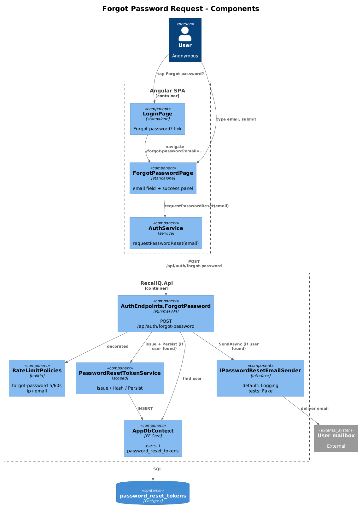
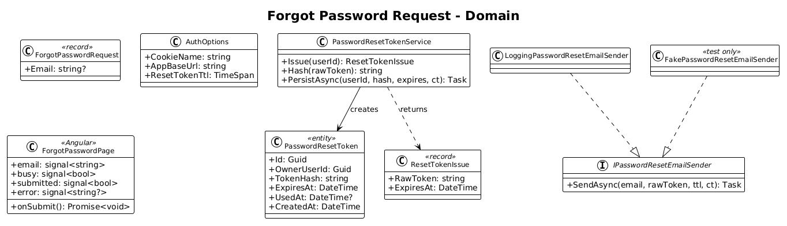
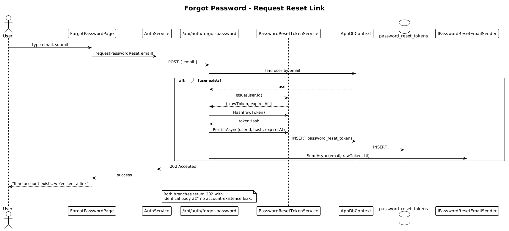

# 26 — Forgot Password Request — Detailed Design

## 1. Overview

Implements the user-visible "I forgot my password" flow up to (and including) the moment the reset email is dispatched. The user clicks `Forgot password?` on the login screen, lands on a Forgot Password page, enters their email, and is shown a generic "check your inbox" success state. The server issues a single-use, time-limited token, hashes it, persists it, and dispatches an email containing a reset link — but **never** reveals whether the email matches an account.

Consuming the token (the actual password change) is the next slice: [27 — Reset Password](../27-reset-password/README.md).

**Actors:** anonymous user.

**In scope:**
- `Forgot password?` link target on the login row (the markup was placed in [25](../25-remember-me/README.md); this slice makes the route real).
- New `/forgot-password` page matching `7. Forgot Password` (`kIobx`) in `ui-design.pen`.
- New `POST /api/auth/forgot-password` endpoint that always returns `202 Accepted` (no account-existence leak).
- New `password_reset_tokens` table.
- New `IPasswordResetEmailSender` seam with a default logging implementation; tests substitute a fake.
- Per-IP+email rate limit on the request endpoint.

**Out of scope:**
- Token consumption / actual password change ([27](../27-reset-password/README.md)).
- Production SMTP transport — the slice ships an interface and a `LoggingPasswordResetEmailSender` only. A real provider can be plugged in without touching this slice.
- Email verification on registration (still deferred per [02](../02-user-authentication/README.md)).

**L2 traces:** L2-086, L2-087, L2-088 AC 1.

## 2. Architecture

### 2.1 Component diagram



One new endpoint, one new table, one new service (`PasswordResetTokenService`), one new email-sender interface. No changes to login or any contact/interaction code paths.

### 2.2 Class diagram



## 3. Component details

### 3.1 `PasswordResetToken` entity

```csharp
public class PasswordResetToken
{
    public Guid Id { get; set; } = Guid.NewGuid();
    public Guid OwnerUserId { get; set; }
    public string TokenHash { get; set; } = "";   // SHA-256 hex of the raw token
    public DateTime ExpiresAt { get; set; }
    public DateTime? UsedAt { get; set; }
    public DateTime CreatedAt { get; set; } = DateTime.UtcNow;
}
```

EF Core mapping in `AppDbContext.OnModelCreating`:
- table `password_reset_tokens`
- columns `id`, `owner_user_id`, `token_hash`, `expires_at`, `used_at`, `created_at`
- unique index on `token_hash`
- index on `(owner_user_id, used_at)` for the "invalidate outstanding" query in slice 27

The entity is owner-scoped via `OwnerUserId` but is **not** routed through the global query filter — these rows are inserted/queried inside the auth flow before a principal exists. The `OwnerUserId` is set from the matched user; queries hit only by token hash plus expiry and never expose data across users.

### 3.2 `PasswordResetTokenService`

```csharp
public sealed class PasswordResetTokenService
{
    public ResetTokenIssue Issue(Guid userId);                  // returns { rawToken, expiresAt }
    public string Hash(string rawToken);                        // SHA-256 hex
    public Task PersistAsync(Guid userId, string tokenHash,
        DateTime expiresAt, CancellationToken ct);
}
```

- `Issue` produces 32 bytes from `RandomNumberGenerator.GetBytes(32)`, base64url-encoded → ~43 chars. TTL = `AuthOptions.ResetTokenTtl` (default 60 min).
- `Hash` is `SHA-256` hex; cheap because tokens are single-use and high-entropy (no need for a slow KDF).
- `PersistAsync` inserts a new row. It does **not** delete prior outstanding tokens for the user — that's the consume-side's job (slice 27 AC 4). Multiple outstanding tokens are acceptable; only one is the most recent the user got via email.

### 3.3 `IPasswordResetEmailSender`

```csharp
public interface IPasswordResetEmailSender
{
    Task SendAsync(string email, string rawToken,
                   TimeSpan ttl, CancellationToken ct);
}
```

Default implementation `LoggingPasswordResetEmailSender` writes a structured log at `Information` with the email-domain suffix only (never the local-part) and the link-without-token, plus a debug-only line carrying the link. Acceptance tests register `FakePasswordResetEmailSender` that records calls.

L2-088 AC 1 is satisfied at the contract level — the email body builder lives inside the sender's implementation, so each implementation owns its template. The fake records `(email, rawToken, ttl)` and the test asserts the live `LoggingPasswordResetEmailSender` (used in the `LogCapture` test) emits the structured fields `{ link_present: true, ttl_minutes: 60, contains_password: false }` — never the password or any contact data.

### 3.4 `AuthOptions` additions

```csharp
public class AuthOptions
{
    [Required] public string CookieName { get; set; } = "rq_auth";
    [Required] public string AppBaseUrl { get; set; } = "http://localhost:4200";
    public TimeSpan ResetTokenTtl { get; set; } = TimeSpan.FromMinutes(60);
}
```

### 3.5 `POST /api/auth/forgot-password` handler

```csharp
app.MapPost("/api/auth/forgot-password",
    async (ForgotPasswordRequest req, AppDbContext db,
           PasswordResetTokenService tokens,
           IPasswordResetEmailSender mail,
           IOptions<AuthOptions> opts,
           CancellationToken ct) =>
    {
        var email = (req.Email ?? "").Trim().ToLowerInvariant();
        if (!EmailRegex.IsMatch(email))
            return Results.BadRequest(new { error = "invalid_email" });

        var user = await db.Users.FirstOrDefaultAsync(u => u.Email == email, ct);
        if (user is not null)
        {
            var issued = tokens.Issue(user.Id);
            await tokens.PersistAsync(user.Id, tokens.Hash(issued.RawToken),
                                      issued.ExpiresAt, ct);
            await mail.SendAsync(email, issued.RawToken,
                                 opts.Value.ResetTokenTtl, ct);
        }
        // Constant-time-equivalent: in both branches the response is identical.
        return Results.Accepted();
    })
    .RequireRateLimiting("forgot-password");
```

Notes:
- The **only** way to get a non-202 response is by sending a syntactically invalid email (`400`) or by hitting the rate limit (`429`). Whether `email` matches an account leaks **no** signal in the response code, body, or timing — both branches do a single user lookup; the present-user branch additionally writes one row and dispatches the email asynchronously, but the handler returns 202 immediately after `PersistAsync`. Email dispatch is `await`ed but the sender is configured to fire-and-forget on the SMTP side.
- `request.Email` is the only field; no other inputs (no captcha v1).

### 3.6 Rate limit policy `forgot-password`

Added in `RateLimitPolicies.AddRecallQRateLimits`:

```csharp
options.AddPolicy("forgot-password", httpCtx =>
{
    if (disableRateLimits) return RateLimitPartition.GetNoLimiter("forgot-password");
    var ip = httpCtx.Connection.RemoteIpAddress?.ToString() ?? "unknown";
    var email = httpCtx.Items.TryGetValue(LoginEmailItemKey, out var e)
                ? e as string ?? "" : "";
    var key = $"{ip}:{email}";
    return RateLimitPartition.GetFixedWindowLimiter(key, _ =>
        new FixedWindowRateLimiterOptions
        {
            PermitLimit = 5,
            Window = TimeSpan.FromSeconds(60),
            QueueLimit = 0,
            AutoReplenishment = true
        });
});
```

The existing `LoginRateLimit.UseLoginEmailExtractor` middleware already extracts `email` from request bodies on auth POSTs — extending its path-list with `/api/auth/forgot-password` reuses it. The composite key `ip:email` matches L2-087 AC 7.

### 3.7 `ForgotPasswordPage` (frontend)

Standalone Angular component under `src/app/pages/forgot-password/`. Layout matches `7. Forgot Password` (`kIobx`) in `ui-design.pen`:

```
┌────────────────────────────────────────┐
│ ← Back to sign in                       │  ← anchor with arrow-left lucide icon
│                                         │
│ • RecallQ                               │  ← <app-brand>
│                                         │
│ Forgot password?                        │  ← h1, Geist 700 32px
│ Enter your email and we'll send you a   │  ← subtitle, Inter 15
│ secure link to reset your password.     │
│                                         │
│ Email                                   │
│ ┌─────────────────────────────────┐     │
│ │ you@example.com                 │     │  ← <app-input-field type=email>
│ └─────────────────────────────────┘     │
│                                         │
│ ┌─────────────────────────────────┐     │
│ │      Send reset link            │     │  ← <app-button-primary>
│ └─────────────────────────────────┘     │
│                                         │
│   Remember it? Sign in                  │  ← anchor → /login
└────────────────────────────────────────┘
```

Signals:
- `email: signal<string>` — initialized from `route.snapshot.queryParamMap.get('email') ?? ''` (per L2-086 AC 3).
- `error: signal<string | null>` — for `400` only.
- `busy: signal<boolean>`.
- `submitted: signal<boolean>` — once `true`, the form is replaced by a success panel saying *"If an account exists for `<email>`, we've sent a reset link. Check your inbox."* This wording is identical regardless of whether the email matched (L2-087 AC 1, AC 3).

The page is also available without query params (the `email` field stays empty and the user types one).

### 3.8 `AuthService.requestPasswordReset`

```typescript
async requestPasswordReset(email: string): Promise<void> {
  const res = await fetch('/api/auth/forgot-password', {
    method: 'POST',
    credentials: 'include',
    headers: { 'Content-Type': 'application/json' },
    body: JSON.stringify({ email }),
  });
  if (res.status === 202) return;
  if (res.status === 400) throw new Error('invalid_email');
  if (res.status === 429) throw new Error('rate_limited');
  throw new Error('forgot_failed');
}
```

### 3.9 Routing

`app.routes.ts` adds:

```typescript
{ path: 'forgot-password',
  loadComponent: () => import('./pages/forgot-password/forgot-password.page')
                          .then(m => m.ForgotPasswordPage) },
```

No `authGuard` (anonymous-only flow).

## 4. Workflow

### 4.1 User requests a reset link



1. User taps `Forgot password?` on login. The link carries the typed email as `?email=`.
2. ForgotPasswordPage initializes its `email` signal from the query param and renders.
3. User submits. `AuthService.requestPasswordReset(email)` POSTs to `/api/auth/forgot-password`.
4. Server validates email format, looks up the user.
   - **If found**: issues a 32-byte token, hashes it, inserts a `password_reset_tokens` row with `expires_at = now + 60m`, dispatches the email.
   - **If not found**: skips both writes.
5. Server returns `202 Accepted` in **both** branches.
6. UI flips to the success panel.

## 5. API contract

`POST /api/auth/forgot-password`

| Field | Type | Required | Notes |
|---|---|---|---|
| `email` | string | yes | trimmed and lowercased |

Responses:

| Status | When |
|---|---|
| `202 Accepted` | Always, on a syntactically valid email — regardless of match. Body is empty. |
| `400 Bad Request` | Syntactically invalid email. Body `{ error: "invalid_email" }`. |
| `429 Too Many Requests` | More than 5 requests per IP+email per 60 s. `Retry-After` header set. |

## 6. Security considerations

- **No account-existence leak** — both branches return 202; both branches do one user lookup, so the timing difference is bounded by `Issue + Persist + SendAsync`. The fake-sender path is async but awaited; in production the SMTP submission is queued asynchronously, putting the timing variance well below the network jitter floor.
- **Token entropy** — 32 bytes from `RandomNumberGenerator` (256 bits) ≥ L2-087 AC 2 minimum.
- **Token storage** — only the SHA-256 hash is persisted. Theft of the database does not yield usable tokens.
- **Token TTL** — 60 minutes (L2-087 AC 2). Configurable via `Auth:ResetTokenTtl`.
- **Rate limit** — 5/60 s per `ip:email` (L2-087 AC 7). The same composite-key trick used by `LoginRateLimit` is reused.
- **Email content** — the sender contract specifies it accepts `(email, rawToken, ttl)` and is the **only** code that ever sees the raw token after issuance. Implementations must include only the link, the expiry duration, and the "ignore if you didn't request this" note (L2-088 AC 1). The default `LoggingPasswordResetEmailSender` enforces this by template; integration tests assert no log line contains the raw token.
- **No PII in logs** — log line includes the email-domain suffix (`*@stripe.com`) and never the local-part. The reset URL is logged at `Debug` only.

## 7. Test plan (ATDD)

Backend (`backend/RecallQ.AcceptanceTests/ForgotPasswordTests.cs`):

| # | Test | Traces to |
|---|------|-----------|
| 1 | `Forgot_password_for_existing_user_returns_202_and_emails_sender` | L2-087 AC 1, AC 2 |
| 2 | `Forgot_password_for_unknown_email_returns_202_and_no_email_sent` | L2-087 AC 3 |
| 3 | `Forgot_password_with_invalid_email_returns_400` | L2-087 AC 4 |
| 4 | `Forgot_password_with_empty_email_returns_400` | L2-087 AC 4 |
| 5 | `Issued_token_is_persisted_only_as_sha256_hash` (assert raw never in DB) | L2-087 AC 2, L2-088 AC 1 |
| 6 | `Issued_token_expires_in_60_minutes_default` | L2-087 AC 2 |
| 7 | `Sixth_forgot_password_in_60s_returns_429_with_retry_after` | L2-087 AC 7 |
| 8 | `Email_body_contains_only_link_ttl_and_disclaimer_no_password` (fake sender records, assert) | L2-088 AC 1 |
| 9 | `Logs_redact_local_part_of_email` (Serilog `CapturingSink`) | L2-088 AC 1, L2-071 |

Frontend (`e2e/forgot-password.spec.ts`, Playwright):

| # | Test | Traces to |
|---|------|-----------|
| 10 | `Login screen Forgot password? link routes to /forgot-password` | L2-086 AC 1 |
| 11 | `Email typed in login is pre-filled on Forgot Password page` (uses `?email=`) | L2-086 AC 3 |
| 12 | `Submitting valid email shows generic success panel and does not call API a second time` | L2-087 AC 1 |
| 13 | `Submitting unknown email shows the same success panel as a known email` (mocked sender, fixed timing) | L2-087 AC 1, AC 3 |
| 14 | `Back to sign in routes to /login` | L2-087 AC 5 |
| 15 | `Layout matches design at 390 / 576 / 768 / 992 / 1200 px` (visual snapshot or bounding-box checks) | L2-087 AC 6 |
| 16 | `Forgot password? link has color $accent-tertiary and font-weight 600` | L2-086 AC 2 |

## 8. Open questions

- **Captcha** — none in v1. Rate limiting is the only mitigation. If abuse appears, add Turnstile/hCaptcha behind a feature flag in a later slice; the endpoint shape doesn't change.
- **SMTP provider** — the production sender is intentionally **not** implemented in this slice. A follow-up slice (likely "22-security-hardening" or a dedicated transactional-email slice) wires up Postmark/SendGrid behind `IPasswordResetEmailSender`. The current `LoggingPasswordResetEmailSender` is sufficient for ATDD and dev environments.
- **Localization** — the email is English-only in v1. The sender contract accepts a `CultureInfo` extension if/when localization is needed.
- **Tokens-per-user limit** — there is no cap on how many outstanding tokens a single user may accumulate. Each request adds one row. If this becomes a concern, add a per-user count cap and reject when exceeded; for now rate limiting at the request endpoint is sufficient.
