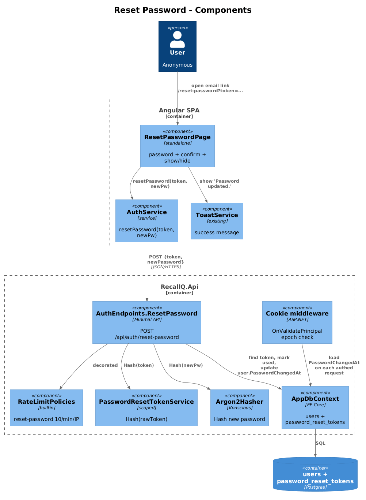
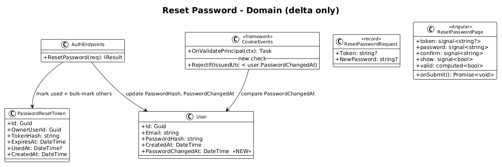
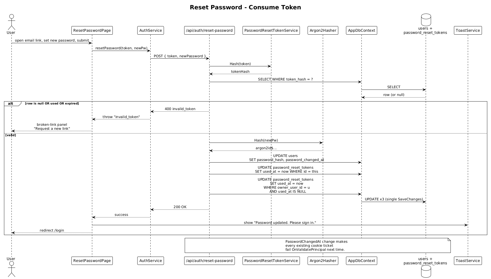

# 27 — Reset Password — Detailed Design

## 1. Overview

Implements the second half of the password-recovery flow: the user follows the link they received in slice [26](../26-forgot-password-request/README.md), lands on `/reset-password?token=…`, sets a new password, and is redirected to login. Behind the scenes, the server validates the token, rehashes the password with Argon2id, marks the token used, marks every other outstanding reset token for that user used, and **invalidates every existing session** for that user.

**Actors:** anonymous user (the one who tapped the email link).

**In scope:**
- New `/reset-password` page — capture password + confirm with show/hide toggle.
- New `POST /api/auth/reset-password` endpoint — validate token, rehash password, invalidate sessions and other outstanding tokens.
- New `PasswordChangedAt` column on `users` — the per-user epoch that lets cookie auth invalidate every session at once.
- One-line extension to `OnValidatePrincipal` to reject cookies issued before `PasswordChangedAt`.
- Per-IP rate limit on the consume endpoint.

**Out of scope:**
- Anything related to obtaining a token — that is slice [26](../26-forgot-password-request/README.md).
- "Sign out everywhere" surfaced in the UI as a user-initiated action — same plumbing, different trigger; can be added in a later slice.
- Password-history / "no reuse of last N passwords" — none in v1.

**L2 traces:** L2-088 AC 2–5, L2-089.

## 2. Architecture

### 2.1 Component diagram



### 2.2 Class diagram



The diagram surfaces only what changes — the `User` entity gains one column, the `OnValidatePrincipal` event gains one check, the auth handler gains one endpoint.

## 3. Component details

### 3.1 `User.PasswordChangedAt`

```csharp
public class User
{
    public Guid Id { get; set; } = Guid.NewGuid();
    public string Email { get; set; } = string.Empty;
    public string PasswordHash { get; set; } = string.Empty;
    public DateTime CreatedAt { get; set; } = DateTime.UtcNow;
    public DateTime PasswordChangedAt { get; set; } = DateTime.UtcNow;  // NEW
}
```

EF Core mapping in `AppDbContext.OnModelCreating` adds `user.Property(u => u.PasswordChangedAt).HasColumnName("password_changed_at");`. The default for backfilling existing rows is `CreatedAt` — the migration sets `password_changed_at = created_at` for each existing user.

`PasswordChangedAt` is the **per-user session epoch**: any cookie ticket whose `IssuedUtc` is older than this value is rejected. There is no need for a separate `session_epoch` integer; a UTC timestamp of when the password last changed is enough.

### 3.2 `OnValidatePrincipal` extension

The existing event already calls `SessionRevocationStore.IsRevoked`. We add one more check after it:

```csharp
options.Events.OnValidatePrincipal = async ctx =>
{
    // existing single-session revocation check
    var sidClaim = ctx.Principal?.FindFirst("sid")?.Value;
    if (Guid.TryParse(sidClaim, out var sid))
    {
        var store = ctx.HttpContext.RequestServices
                       .GetRequiredService<SessionRevocationStore>();
        if (store.IsRevoked(sid))
        {
            ctx.RejectPrincipal();
            await ctx.HttpContext.SignOutAsync(
                CookieAuthenticationDefaults.AuthenticationScheme);
            return;
        }
    }

    // NEW: per-user epoch — rejects every cookie issued before PasswordChangedAt
    var subClaim = ctx.Principal?
                       .FindFirst(System.Security.Claims.ClaimTypes.NameIdentifier)?
                       .Value;
    if (Guid.TryParse(subClaim, out var userId)
        && ctx.Properties.IssuedUtc.HasValue)
    {
        var db = ctx.HttpContext.RequestServices.GetRequiredService<AppDbContext>();
        var changedAt = await db.Users
            .Where(u => u.Id == userId)
            .Select(u => (DateTime?)u.PasswordChangedAt)
            .FirstOrDefaultAsync();
        if (changedAt is not null
            && ctx.Properties.IssuedUtc.Value.UtcDateTime < changedAt)
        {
            ctx.RejectPrincipal();
            await ctx.HttpContext.SignOutAsync(
                CookieAuthenticationDefaults.AuthenticationScheme);
        }
    }
};
```

This adds one indexed lookup-by-PK per authenticated request. That's well below the budget for L1-014. If observability ever flags it, wrap it in `IMemoryCache` keyed by `userId` with a 30-second TTL, invalidated on reset.

### 3.3 `POST /api/auth/reset-password` handler

```csharp
public record ResetPasswordRequest(string? Token, string? NewPassword);

app.MapPost("/api/auth/reset-password",
    async (ResetPasswordRequest req, AppDbContext db,
           PasswordResetTokenService tokens,
           Argon2Hasher hasher, TimeProvider clock,
           CancellationToken ct) =>
    {
        var raw = req.Token ?? "";
        var pw  = req.NewPassword ?? "";
        if (string.IsNullOrWhiteSpace(raw))
            return Results.BadRequest(new { error = "invalid_token" });
        if (pw.Length < 12 || !pw.Any(char.IsLetter) || !pw.Any(char.IsDigit))
            return Results.BadRequest(new { error = "weak_password" });

        var hash = tokens.Hash(raw);
        var now = clock.GetUtcNow().UtcDateTime;
        var token = await db.PasswordResetTokens
            .FirstOrDefaultAsync(t => t.TokenHash == hash, ct);
        if (token is null || token.UsedAt is not null || token.ExpiresAt < now)
            return Results.BadRequest(new { error = "invalid_token" });

        var user = await db.Users.FirstOrDefaultAsync(u => u.Id == token.OwnerUserId, ct);
        if (user is null)
            return Results.BadRequest(new { error = "invalid_token" });

        // Update password
        user.PasswordHash = hasher.Hash(pw);
        user.PasswordChangedAt = now;

        // Mark this token used and invalidate all other outstanding tokens
        token.UsedAt = now;
        await db.PasswordResetTokens
            .Where(t => t.OwnerUserId == user.Id && t.UsedAt == null && t.Id != token.Id)
            .ExecuteUpdateAsync(s => s.SetProperty(t => t.UsedAt, now), ct);

        await db.SaveChangesAsync(ct);
        return Results.Ok();
    })
    .RequireRateLimiting("reset-password");
```

Notes:
- All four "invalid token" branches return the **same** `400` body — never reveal *why* (token unknown vs. expired vs. used). L2-088 AC 2/3.
- Password policy mirrors `/api/auth/register` (≥ 12 chars, mix of letters/digits).
- The `ExecuteUpdateAsync` runs a single `UPDATE password_reset_tokens SET used_at = … WHERE owner_user_id = … AND used_at IS NULL AND id <> …` — no in-memory enumeration.
- Setting `PasswordChangedAt = now` invalidates every existing cookie for the user on its next validation (L2-089 AC 1).
- The endpoint does **not** auto-log-in. The client redirects to `/login` and the user signs in fresh.

### 3.4 Rate limit policy `reset-password`

Added to `RateLimitPolicies.AddRecallQRateLimits`:

```csharp
options.AddPolicy("reset-password", httpCtx =>
{
    if (disableRateLimits) return RateLimitPartition.GetNoLimiter("reset-password");
    var ip = httpCtx.Connection.RemoteIpAddress?.ToString() ?? "unknown";
    return RateLimitPartition.GetFixedWindowLimiter(ip, _ =>
        new FixedWindowRateLimiterOptions
        {
            PermitLimit = 10,
            Window = TimeSpan.FromMinutes(1),
            QueueLimit = 0,
            AutoReplenishment = true
        });
});
```

10/min per IP — L2-088 AC 5. No user identifier available pre-auth, so IP is the only key.

### 3.5 `ResetPasswordPage` (frontend)

Standalone Angular component under `src/app/pages/reset-password/`. Visual style inherits the `7. Forgot Password` (`kIobx`) chrome — same brand, ambient glows, button-primary, surface tokens — replacing the body fields with two password inputs.

Layout:

```
┌────────────────────────────────────────┐
│ ← Back to sign in                       │
│ • RecallQ                               │
│                                         │
│ Set a new password                      │
│ Pick something you'll remember.         │
│                                         │
│ New password           [show/hide]      │
│ ┌─────────────────────────────────┐     │
│ │ ••••••••••••                    │     │
│ └─────────────────────────────────┘     │
│ Confirm password       [show/hide]      │
│ ┌─────────────────────────────────┐     │
│ │ ••••••••••••                    │     │
│ └─────────────────────────────────┘     │
│ <inline error if mismatch or policy>    │
│                                         │
│ ┌─────────────────────────────────┐     │
│ │      Update password            │     │  disabled while invalid
│ └─────────────────────────────────┘     │
└────────────────────────────────────────┘
```

Signals:
- `token: signal<string | null>` — initialized from `route.snapshot.queryParamMap.get('token')`. If missing/empty → page renders the **broken-link state** (see below).
- `password: signal<string>`, `confirm: signal<string>`.
- `show: signal<boolean>` — toggles `type="password"` ↔ `type="text"`.
- `busy: signal<boolean>`, `error: signal<string | null>`.
- `valid = computed(() => password().length >= 12
                 && /[a-zA-Z]/.test(password())
                 && /\d/.test(password())
                 && password() === confirm())` — drives `[disabled]` on submit.

Behavior:
- **Missing/empty token at load**: render the broken-link panel — heading "This link is invalid or expired", body "Request a new link to reset your password.", primary button → `/forgot-password`. No form is shown. (L2-089 AC 4.)
- **Submit success (`200`)**: call `toast.show('Password updated. Please sign in.')`, navigate to `/login`. (L2-089 AC 5.)
- **`400 invalid_token`**: flip the form to the broken-link panel.
- **`400 weak_password`**: inline error "Password must be at least 12 characters with letters and digits."
- **`429`**: inline error "Too many attempts. Try again in a minute."

Inputs use `autocomplete="new-password"`, `aria-label="New password"` / `aria-label="Confirm password"`, and the show/hide toggle is `aria-pressed`. (L2-089 AC 7.)

Uses existing reusable components: `BrandComponent`, `InputFieldComponent` (extended with a `[suffixSlot]` for the show/hide toggle), `ButtonPrimaryComponent`, `ToastService`.

### 3.6 `AuthService.resetPassword`

```typescript
async resetPassword(token: string, newPassword: string): Promise<void> {
  const res = await fetch('/api/auth/reset-password', {
    method: 'POST',
    credentials: 'include',
    headers: { 'Content-Type': 'application/json' },
    body: JSON.stringify({ token, newPassword }),
  });
  if (res.ok) return;
  if (res.status === 400) {
    const body = await res.json().catch(() => ({} as { error?: string }));
    throw new Error(body?.error ?? 'invalid_token');
  }
  if (res.status === 429) throw new Error('rate_limited');
  throw new Error('reset_failed');
}
```

### 3.7 Routing

`app.routes.ts` adds:

```typescript
{ path: 'reset-password',
  loadComponent: () => import('./pages/reset-password/reset-password.page')
                          .then(m => m.ResetPasswordPage) },
```

No `authGuard`; anonymous flow.

## 4. Workflow

### 4.1 Successful reset



1. User opens email, taps the link `{appUrl}/reset-password?token=<raw>`.
2. `ResetPasswordPage` reads `token` from the query string, shows the form.
3. User types matching new passwords, taps `Update password`.
4. `AuthService.resetPassword(token, newPassword)` POSTs to `/api/auth/reset-password`.
5. Server hashes the supplied token, looks up the row, checks `UsedAt is null` and `ExpiresAt > now`. On success:
   1. Rehashes the new password with Argon2id, sets `User.PasswordHash`.
   2. Sets `User.PasswordChangedAt = now`.
   3. Marks the token used and bulk-marks all other outstanding tokens for that user used.
6. Returns `200`.
7. Client toasts and redirects to `/login`.
8. **Any other browser** that still holds a cookie issued *before* the reset hits its first authenticated endpoint, `OnValidatePrincipal` sees `IssuedUtc < PasswordChangedAt`, rejects, and signs out.

### 4.2 Invalid / expired token

The endpoint returns `400 { error: "invalid_token" }` for unknown, used, or expired tokens — identical body for all three. The client renders the broken-link panel.

## 5. API contract

`POST /api/auth/reset-password`

| Field | Type | Required | Notes |
|---|---|---|---|
| `token` | string | yes | the raw value from `?token=` |
| `newPassword` | string | yes | ≥ 12 chars, must contain a letter and a digit |

Responses:

| Status | When |
|---|---|
| `200 OK` | Token valid, password meets policy, user updated, sessions invalidated. |
| `400 Bad Request` `{ error: "invalid_token" }` | Unknown, used, or expired token (no leak about which). |
| `400 Bad Request` `{ error: "weak_password" }` | Policy violation. |
| `429 Too Many Requests` | More than 10 attempts per IP per minute. |

## 6. Security considerations

- **Token reuse and timing** — only the SHA-256 hash is stored, so a one-shot lookup by hash is constant-time-ish. The same generic error covers unknown/used/expired (L2-088 AC 2/3).
- **Single-use** — the row's `used_at` is set inside the same transaction as the password update, before `SaveChangesAsync` returns. Concurrent reuse races are bounded by EF Core's optimistic concurrency: if a second request grabs the same row before the first commits, only one wins and the other sees `used_at != null` on the next read. (Optional: add a `RowVersion` to be airtight; not required by L2 in v1.)
- **All outstanding tokens marked used** — L2-088 AC 4. Done with `ExecuteUpdateAsync`; one statement, no streaming.
- **All sessions invalidated** — `PasswordChangedAt` epoch + `OnValidatePrincipal` check. Requires no extra table; one column on `users` and one event-handler delta. L2-089 AC 1.
- **Rate limit** — 10/min per IP per L2-088 AC 5. Enforced through the existing `RateLimitPolicies` infrastructure.
- **Password policy** — same rules as registration. The slice does not introduce a new validator — it shares the inlined check (`length ≥ 12 && letters && digits`). If/when policy diverges from registration, extract into a shared helper.
- **No auto-login** — the slice intentionally redirects the user to `/login`. This bounds the blast radius of the reset and keeps the slice's surface minimal.
- **No PII in logs** — log lines for `reset-password` carry `userId` (hashed) and outcome; never the token or the password. (L2-071, L2-088 AC 1 echo.)

## 7. Test plan (ATDD)

Backend (`backend/RecallQ.AcceptanceTests/ResetPasswordTests.cs`):

| # | Test | Traces to |
|---|------|-----------|
| 1 | `Reset_with_valid_token_updates_password_hash_and_returns_200` | L2-089 AC 1 |
| 2 | `Reset_with_used_token_returns_400_invalid_token` | L2-088 AC 2 |
| 3 | `Reset_with_expired_token_returns_400_invalid_token` (advance clock past TTL) | L2-088 AC 3 |
| 4 | `Reset_with_unknown_token_returns_400_invalid_token` | L2-088 AC 2 |
| 5 | `Reset_with_missing_token_returns_400_invalid_token` | L2-088 AC 2 |
| 6 | `Reset_with_weak_password_returns_400_weak_password` | L2-089 AC 2 |
| 7 | `Successful_reset_marks_other_outstanding_tokens_used` | L2-088 AC 4 |
| 8 | `Existing_session_cookie_returns_401_after_password_reset` (login → reset → call /me with old cookie) | L2-089 AC 1 |
| 9 | `Eleventh_reset_attempt_in_60s_returns_429` | L2-088 AC 5 |
| 10 | `Reset_does_not_log_token_or_password` (`CapturingSink`) | L2-071 |

Frontend (`e2e/reset-password.spec.ts`, Playwright):

| # | Test | Traces to |
|---|------|-----------|
| 11 | `Page with no token query param shows broken-link panel and Request a new link CTA` | L2-089 AC 4 |
| 12 | `Mismatch between password and confirm disables submit and shows inline error` | L2-089 AC 3 |
| 13 | `Show/hide toggle flips input type` | L2-089 AC 7 |
| 14 | `Submit success redirects to /login and shows confirmation toast` | L2-089 AC 5 |
| 15 | `Form error 400 invalid_token flips to broken-link panel` | L2-089 AC 4 |
| 16 | `Layout uses brand, ambient glows, button-primary as on Forgot Password` (visual snapshot) | L2-089 AC 6 |

## 8. Open questions

- **Concurrency hardening** — should the `password_reset_tokens` row carry a `xmin`/`RowVersion` to make the reuse race fully airtight? L2 doesn't require it; the rate limiter and the `used_at != null` check are sufficient in practice. Add if a real exploit is observed.
- **Self-serve "sign out everywhere"** — the same `PasswordChangedAt` mechanism could back a future "sign out everywhere" button. Out of scope here, but the column shape supports it.
- **Step-up auth** — none in v1. If the user is currently signed in and visits `/reset-password`, the flow still works because the endpoint is anonymous; we may later require the session to be logged out before consuming a token.
- **Provider for production email** — see open question in [26](../26-forgot-password-request/README.md). The reset slice is provider-agnostic; it depends only on `IPasswordResetEmailSender` having delivered the link in the prior slice.
