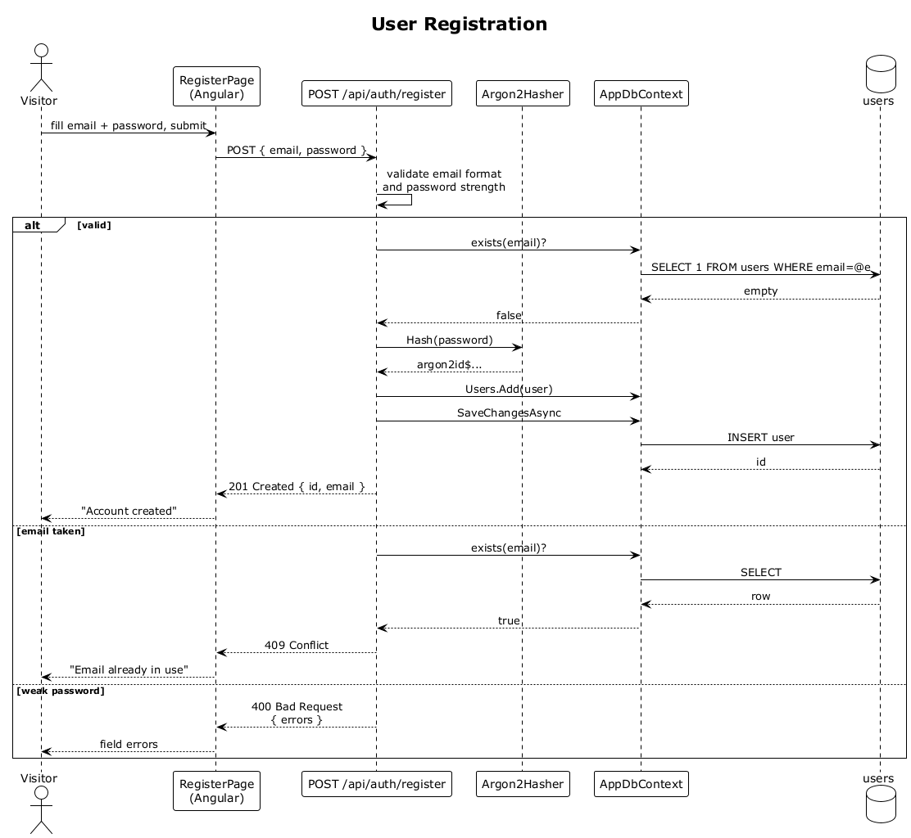

# 01 — User Registration

## Summary

A visitor creates a new RecallQ account by submitting an email and password on the registration form. The server verifies the email is not already taken, hashes the password with Argon2id, writes the `User` row, and returns `201 Created`. No password or hash is ever returned in the response body or written to logs.

**Traces to:** L1-001, L1-013, L2-001, L2-052.

## Actors

- **Visitor** — an unauthenticated user in the browser.
- **Angular SPA** (`RegisterPage`) — reactive form.
- **AuthEndpoints** — `POST /api/auth/register`.
- **Argon2Hasher** — password KDF.
- **AppDbContext / users table** — EF Core against PostgreSQL.

## Trigger

Visitor submits the registration form with `email` and `password`.

## Flow

1. The visitor fills in the form and taps **Create account**.
2. The SPA posts the credentials as JSON to `/api/auth/register`.
3. The endpoint validates the payload server-side (email format, password length ≥ 12, at least one letter and one digit).
4. The endpoint checks whether a user with that email already exists.
5. If the email is free, the password is hashed with Argon2id (or bcrypt cost ≥ 12) and a new `User` row is inserted with the hash and salt.
6. The endpoint returns `201 Created` with the public user record only (never the hash).

## Alternatives and errors

- **Email already in use** → `409 Conflict`, no user created.
- **Weak or missing password** → `400 Bad Request` with a validation error.
- **Any path** → the response body and logs contain zero password material.

## Sequence diagram

