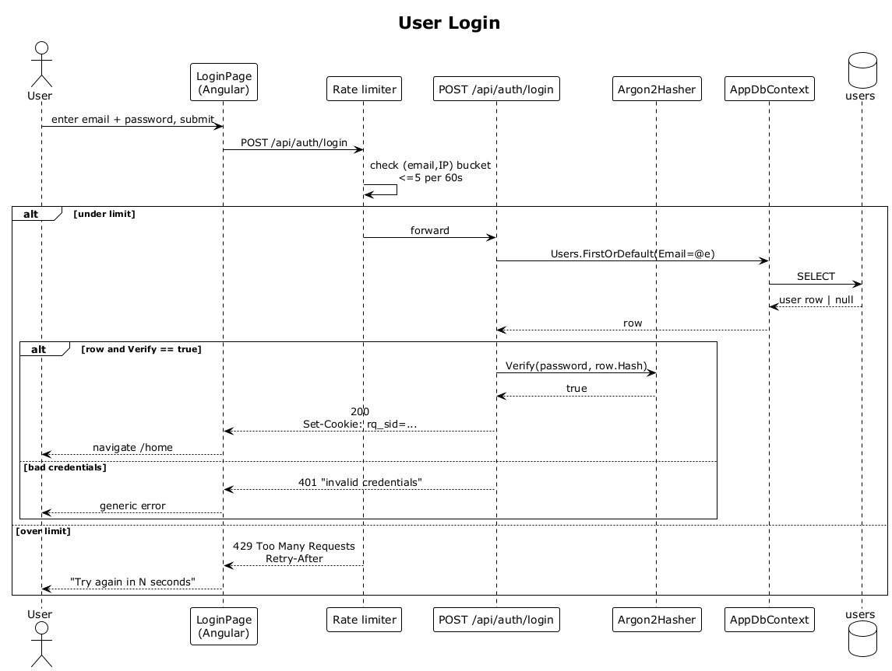

# 02 — User Login

## Summary

A registered user signs in by POSTing email and password to `/api/auth/login`. The server looks up the user, verifies the password hash, and issues a bearer session (either an HttpOnly cookie or a JWT). Failed attempts return a deliberately generic message so email existence cannot be probed.

**Traces to:** L1-001, L1-013, L2-002.

## Actors

- **User** — someone with an existing account.
- **Angular SPA** (`LoginPage`).
- **AuthEndpoints** — `POST /api/auth/login`.
- **Argon2Hasher** — password verifier.
- **AppDbContext / users table**.
- **Rate limiter** — per-IP + per-email login attempt bucket.

## Trigger

User submits the login form with `email` and `password`.

## Flow

1. User enters email and password and taps **Sign in**.
2. The SPA POSTs to `/api/auth/login`.
3. The rate limiter checks the `(email, IP)` bucket for ≤ 5 attempts per minute.
4. The endpoint loads the user row by email.
5. `Argon2Hasher.Verify(password, hash)` runs with constant-time comparison.
6. On success the endpoint issues a bearer session:
   - Either a `Set-Cookie: rq_sid=…; HttpOnly; Secure; SameSite=Strict`, or
   - A JSON body `{ accessToken }` returned and stored in memory by the SPA.
7. The SPA navigates to `/home` and the request cycle for protected resources begins (see flow 04).

## Alternatives and errors

- **Wrong password / unknown email** → `401 Unauthorized` with the same generic body in both cases (no existence leak).
- **> 5 failed attempts in 60 s** → `429 Too Many Requests` with `Retry-After`.
- **Token or cookie lost** → `401` on next protected call forces redirect to login.

## Sequence diagram

