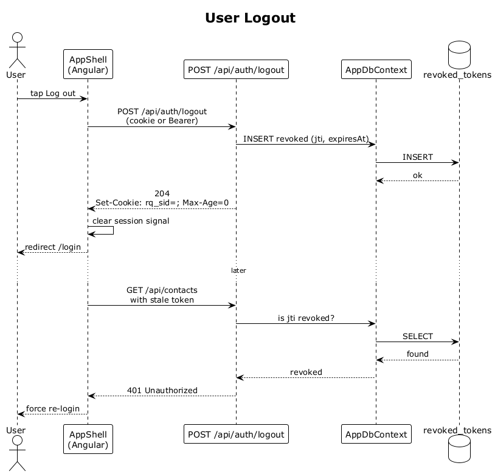

# 03 — User Logout

## Summary

An authenticated user ends their session. The server invalidates the current token (adds it to a revocation set or clears the HttpOnly cookie), the SPA drops in-memory auth state, and any subsequent request with the old token is rejected with `401`.

**Traces to:** L1-001, L1-013, L2-004.

## Actors

- **User** — currently authenticated.
- **Angular SPA** — `AppShell` / header menu.
- **AuthEndpoints** — `POST /api/auth/logout`.
- **AppDbContext / revocation store** — either a `revoked_tokens` table or the cookie layer.

## Trigger

User taps **Log out** in the app shell.

## Flow

1. User taps **Log out**.
2. The SPA POSTs to `/api/auth/logout` carrying the current credential.
3. If using a cookie session, the server responds `204 No Content` with `Set-Cookie: rq_sid=; Max-Age=0`.
4. If using a JWT, the server adds the token's `jti` to the revocation store and responds `204`.
5. The SPA clears its in-memory session signal and navigates to `/login`.
6. Any subsequent call with the old token is short-circuited at the auth middleware to `401 Unauthorized`.

## Alternatives and errors

- **Token already revoked** → still returns `204` (idempotent).
- **No credential sent** → `204` (safe no-op) or `401`, implementation-defined.

## Sequence diagram

