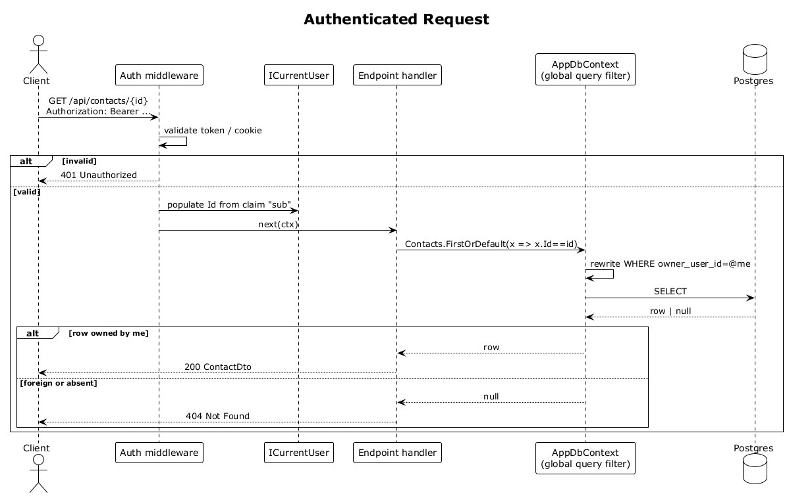

# 04 — Authenticated Request

## Summary

Every call to a protected endpoint (`/api/contacts`, `/api/interactions`, `/api/search`, `/api/ask`, `/api/stacks`, `/api/suggestions`, `/api/contacts/{id}/summary`, …) must pass the auth middleware before the endpoint runs. The middleware resolves the bearer into a `ClaimsPrincipal`, exposes `ICurrentUser.Id`, and the EF Core global query filter uses that id to scope every downstream query. Unauthenticated or foreign-owner access returns `401` or `404` with no data leak.

**Traces to:** L1-001, L1-013, L2-003, L2-006, L2-056.

## Actors

- **Client** — browser holding the session.
- **Auth middleware** — reads `Authorization: Bearer` or the cookie.
- **ICurrentUser** — scoped service, exposes `.Id` and `.IsAuthenticated`.
- **Endpoint handler** — feature code.
- **AppDbContext** — global query filter `OwnerUserId == _currentUser.Id`.

## Trigger

The SPA makes any API call that is not `/api/auth/*` or `/api/ping`.

## Flow

1. The SPA sends the request with its credential attached.
2. The auth middleware validates the token signature / cookie integrity and loads claims.
3. If invalid or expired, the pipeline short-circuits with `401` and no endpoint code runs.
4. If valid, `ICurrentUser.Id` is populated and the request proceeds.
5. The endpoint handler queries `DbContext.Contacts` (or similar).
6. The EF Core global query filter rewrites every query with `WHERE owner_user_id = @userId`.
7. Matching rows are returned. Rows owned by other users are invisible — a lookup by id for a foreign-owned record returns `null`, which the endpoint maps to `404 Not Found` (never `403`, to avoid resource enumeration).

## Alternatives and errors

- **Missing or malformed token** → `401 Unauthorized`.
- **Expired token** → `401`.
- **Valid token, foreign resource id** → `404 Not Found`.
- **Valid token, user deleted** → `401` on next call.

## Sequence diagram

