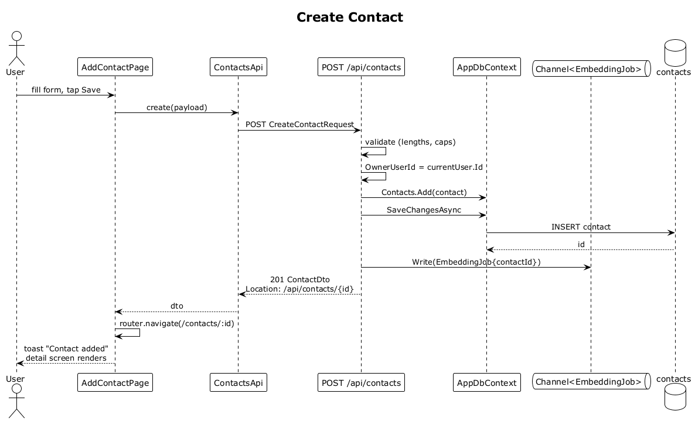

# 05 — Create Contact

## Summary

An authenticated user manually adds a new contact. The SPA submits the form, the server validates the payload, inserts the `Contact` row scoped to the user, enqueues an `EmbeddingJob` so the contact becomes searchable, and redirects the SPA to the new contact's detail screen.

**Traces to:** L1-002, L1-018, L2-005, L2-076, L2-078.

## Actors

- **User** — authenticated.
- **AddContactPage** (`/contacts/new`).
- **ContactsEndpoints** — `POST /api/contacts`.
- **AppDbContext / contacts table**.
- **EmbeddingJob channel** — in-process `Channel<EmbeddingJob>`.

## Trigger

User taps the `+` on the app shell, switches to **Contact**, fills the form, and submits.

## Flow

1. The user fills in `displayName`, `initials`, `role`, `organization`, `tags`, `emails`, `phones`, and submits.
2. The SPA POSTs `CreateContactRequest` to `/api/contacts` via `HttpClient`.
3. The endpoint validates with inline guard clauses (lengths, array caps).
4. Server sets `OwnerUserId = currentUser.Id` (never trusted from the body) and defaults `avatarColorA/B` from the palette when not supplied.
5. `ctx.Contacts.Add(contact)` then `SaveChangesAsync` inserts the row.
6. An `EmbeddingJob { contactId }` is written to the `Channel<EmbeddingJob>` so the embedding worker (flow 32) generates the vector asynchronously.
7. The endpoint returns `201 Created` with the `ContactDto` and a `Location` header.
8. The SPA navigates to `/contacts/:id` and shows the toast **"Contact added"**.

## Alternatives and errors

- **Missing `displayName`** → `400 Bad Request`.
- **`displayName` > 120 chars** → `400 Bad Request`.
- **> 10 emails or phones, or > 20 tags** → `400 Bad Request`.
- **Not authenticated** → `401 Unauthorized`.

## Sequence diagram

