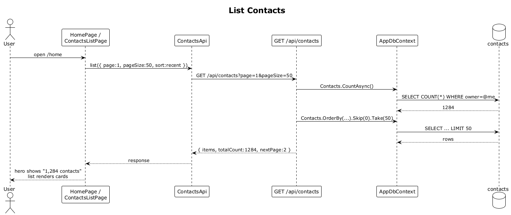

# 06 — List Contacts

## Summary

The home screen's subtitle `Semantic search across N contacts and M interactions.` needs a live contact count, and the "Contacts" pane needs a paginated page of contacts. Both are served by `GET /api/contacts?page=&pageSize=&sort=`, which returns `{ items, totalCount, nextPage }` scoped to the authenticated user.

**Traces to:** L1-002, L2-009.

## Actors

- **User** — authenticated.
- **HomePage / ContactsListPage**.
- **ContactsApi** (Angular service).
- **ContactsEndpoints** — `GET /api/contacts`.
- **AppDbContext / contacts table**.

## Trigger

- On app start, `HomePage` renders and asks for `pageSize=1` to get `totalCount` only.
- On the Contacts tab, `ContactsListPage` asks for `pageSize=50` and renders the list.

## Flow

1. The SPA GETs `/api/contacts?page=1&pageSize=50&sort=recent`.
2. The endpoint runs `ctx.Contacts.CountAsync()` (scoped) and `ctx.Contacts.OrderBy(...).Skip(...).Take(pageSize)`.
3. Default sort is `recent` (most recently interacted). `sort=name` orders case-insensitive by `displayName`.
4. The response is `{ items: ContactDto[], totalCount, nextPage }`.
5. On the home screen the SPA binds `totalCount` into the hero subtitle.
6. On the contacts list the SPA renders one `ContactCardComponent` per item.

## Alternatives and errors

- **No contacts yet** → `200 OK` with `items: []` and `totalCount: 0`. Home shows `0 contacts`.
- **`page` beyond end** → empty `items`, `nextPage: null`.
- **Not authenticated** → `401`.

## Sequence diagram

