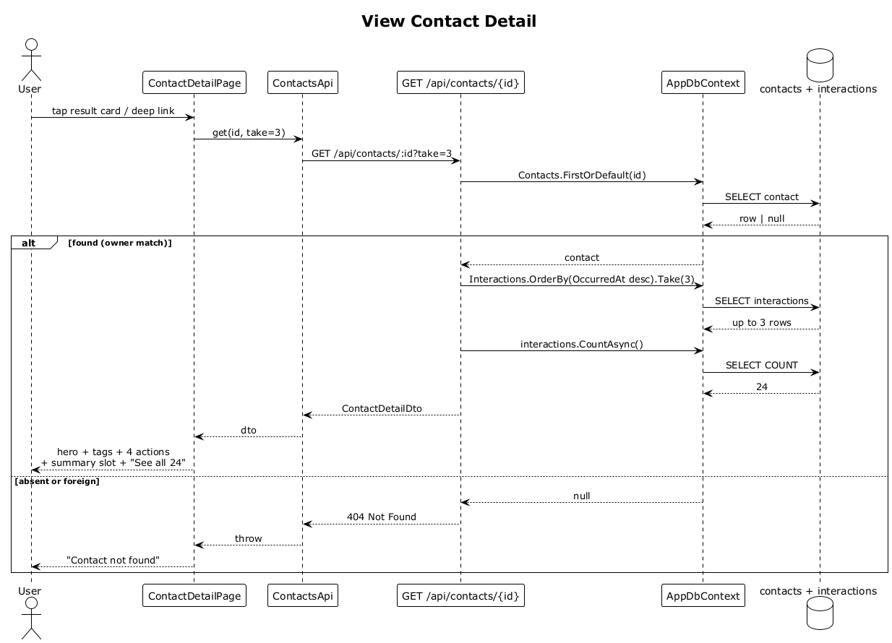

# 07 — View Contact Detail

## Summary

Opening a contact detail page composes three independent reads: the contact profile (hero + tags), the top N interactions (timeline), and the relationship summary. The detail endpoint `GET /api/contacts/{id}` returns the contact plus a `take` recent interactions in a single round trip; the summary is fetched separately (flow 26) because it may be missing or stale.

**Traces to:** L1-009, L2-034, L2-035, L2-036, L2-083.

## Actors

- **User** — authenticated.
- **ContactDetailPage** (`/contacts/:id`).
- **ContactsApi**.
- **ContactsEndpoints** — `GET /api/contacts/{id}?take=3`.
- **AppDbContext**.

## Trigger

- User taps a result card on search results.
- User taps a citation mini-card in Ask mode.
- User deep-links to `/contacts/:id`.

## Flow

1. The SPA navigates to `/contacts/:id` and asks `ContactsApi.get(id, { take: 3 })`.
2. The endpoint runs `Contacts.FirstOrDefault(id)`. If `null` (missing or foreign), responds `404`.
3. The endpoint loads `Interactions.Where(ContactId==id).OrderByDescending(OccurredAt).Take(take)`.
4. Returns `ContactDetailDto { contact, recentInteractions, interactionCount }`.
5. The SPA renders: hero (gradient, avatar, name, role · org, tag chips), action row (Message, Call, Intro, Ask AI), relationship summary card (flow 26), activity timeline with `See all {interactionCount}` affordance.
6. On LG/XL the summary and timeline render side-by-side with the hero.

## Alternatives and errors

- **Foreign or missing id** → `404`, SPA shows "Contact not found".
- **Zero interactions** → timeline shows empty-state copy.
- **Back navigation** — the SPA restores the source list (search results or Ask conversation) with query, scroll position, and history intact.

## Sequence diagram

