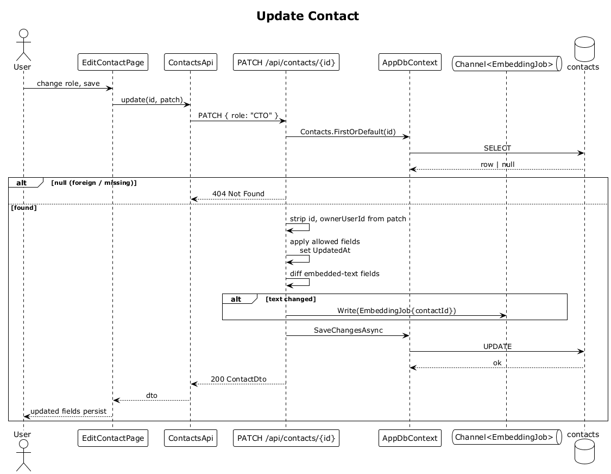

# 08 — Update Contact

## Summary

An owner edits a contact. The PATCH endpoint merges the submitted fields, ignores any attempt to change `id` or `ownerUserId`, persists the row, and, if any embedded text field changed (`displayName`, `role`, `organization`, `tags`, `location`), enqueues an embedding-regeneration job so search stays in sync.

**Traces to:** L1-002, L2-007, L2-078.

## Actors

- **User** — authenticated owner.
- **EditContactPage** (or inline edit controls on detail).
- **ContactsEndpoints** — `PATCH /api/contacts/{id}`.
- **AppDbContext**.
- **EmbeddingJob channel**.

## Trigger

User saves an edit (field change, tag edit, role update, etc.).

## Flow

1. The SPA PATCHes `/api/contacts/:id` with a partial payload.
2. The endpoint loads the contact by id (owner-scoped via global filter). If `null`, responds `404`.
3. Any `id` or `ownerUserId` keys in the body are dropped — they cannot be written.
4. Allowed fields are copied onto the entity. `UpdatedAt` is set.
5. A diff over the embedded text fields is computed. If any changed, an `EmbeddingJob { contactId }` is written to the channel so the worker regenerates the vector (flow 32).
6. `SaveChangesAsync` commits the update.
7. The endpoint responds `200 OK` with the updated `ContactDto`.

## Alternatives and errors

- **Foreign owner** → `404`.
- **Validation error** (e.g., `displayName` > 120) → `400 Bad Request`, no changes persisted.
- **Unchanged text** → no embedding job enqueued (idempotent via content hash, flow 32).

## Sequence diagram

