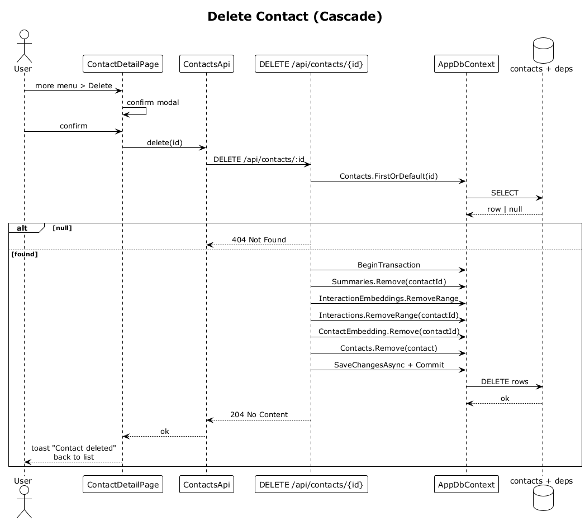

# 09 — Delete Contact (Cascade)

## Summary

An owner deletes a contact. The delete is irreversible in v1 and cascades to the contact's interactions, contact and interaction embeddings, and the cached relationship summary. Non-owners see `404` with zero side effects.

**Traces to:** L1-002, L2-008, L2-056.

## Actors

- **User** — authenticated owner.
- **ContactDetailPage** — invokes via the `more` menu.
- **ContactsEndpoints** — `DELETE /api/contacts/{id}`.
- **AppDbContext / contacts, interactions, embeddings, summaries**.

## Trigger

User taps **Delete contact** and confirms the modal.

## Flow

1. The SPA opens a confirmation modal; on confirm, DELETEs `/api/contacts/:id`.
2. The endpoint loads the contact by id, owner-scoped. `null` → `404`.
3. Inside a single transaction:
   - `RelationshipSummaries.Remove` for the contact.
   - `InteractionEmbeddings.RemoveRange` for the contact's interactions.
   - `Interactions.RemoveRange` for the contact.
   - `ContactEmbedding.Remove` for the contact.
   - `Contacts.Remove` for the contact.
4. `SaveChangesAsync` commits the cascade.
5. The endpoint responds `204 No Content`.
6. The SPA shows a toast **"Contact deleted"** and navigates back to the prior list.

## Alternatives and errors

- **Foreign contact** → `404`, no rows change.
- **Database error mid-cascade** → transaction rolls back; endpoint responds `500` and nothing is partially deleted.
- **User GETs the deleted id** → `404`.

## Sequence diagram

