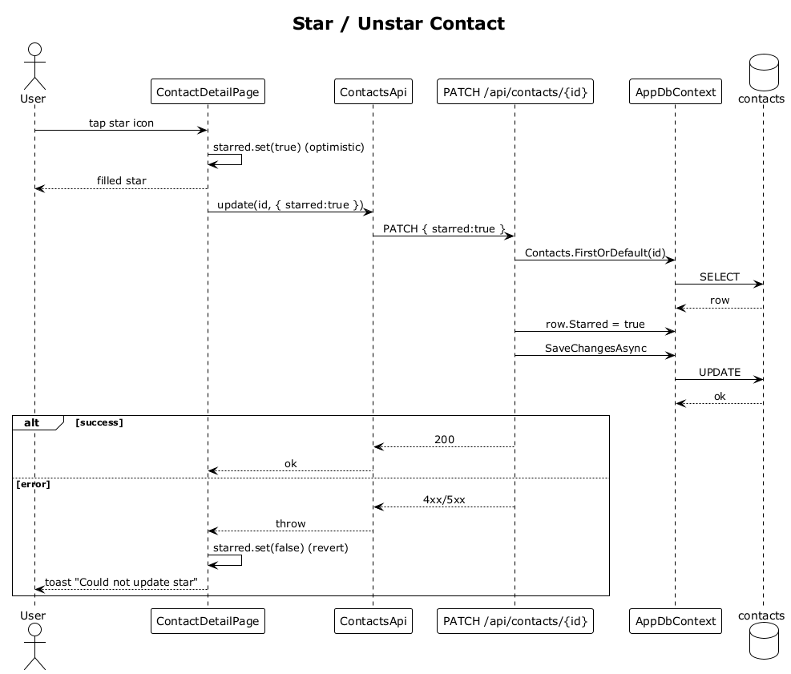

# 10 — Star / Unstar Contact

## Summary

The star button on the contact detail hero toggles the contact's `Starred` flag. The SPA optimistically fills or clears the star icon and PATCHes `/api/contacts/:id`. On error the SPA reverts the icon.

**Traces to:** L1-002, L2-083.

## Actors

- **User** — authenticated owner.
- **ContactDetailPage** — the hero star button.
- **ContactsEndpoints** — `PATCH /api/contacts/{id}`.
- **AppDbContext**.

## Trigger

User taps the star icon on the contact detail hero.

## Flow

1. The SPA flips the local `starred` signal immediately (optimistic UI).
2. The SPA sends `PATCH /api/contacts/:id` with `{ starred: true }` (or `false`).
3. The endpoint loads the contact owner-scoped and sets `Starred`.
4. `SaveChangesAsync` commits.
5. `200 OK` comes back; the SPA leaves its optimistic icon as-is.

## Alternatives and errors

- **`4xx/5xx` response** → SPA reverts the icon and surfaces a toast `"Could not update star"`.
- **Starred contacts** are filterable in the contacts list and may feed the `Close friends` Smart Stack.

## Sequence diagram

