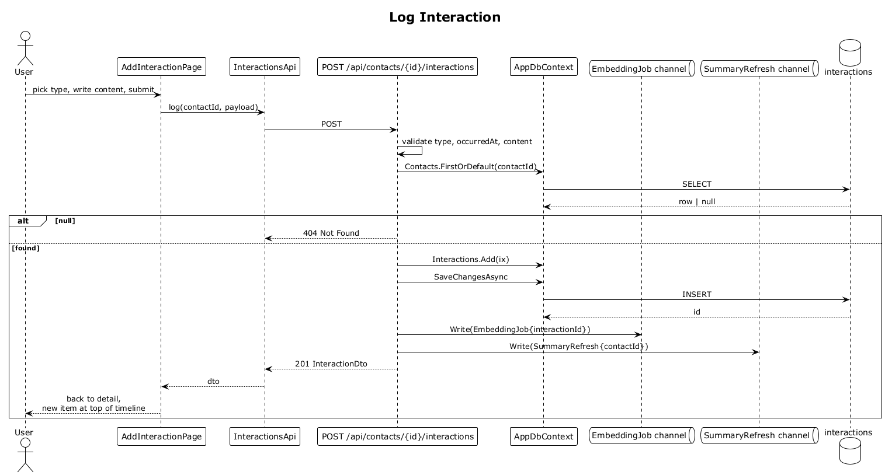

# 11 — Log Interaction

## Summary

Against an existing contact the owner logs a new interaction (email, call, meeting, note). The server persists the row, enqueues an embedding job so the interaction text becomes searchable, and enqueues a summary-refresh job so the relationship summary is regenerated in the background. On return, the SPA pushes the new item to the top of the activity timeline.

**Traces to:** L1-003, L2-010, L2-012, L2-076, L2-078, L2-033.

## Actors

- **User** — authenticated owner.
- **AddInteractionPage** (or bottom sheet from contact detail).
- **InteractionsEndpoints** — `POST /api/contacts/{contactId}/interactions`.
- **AppDbContext / interactions table**.
- **EmbeddingJob channel**, **SummaryRefresh channel**.

## Trigger

User taps **Log interaction** on a contact detail screen, picks a type, writes content, and submits.

## Flow

1. The SPA posts `CreateInteractionRequest { type, occurredAt, content, subject? }` to `/api/contacts/:id/interactions`.
2. The endpoint validates: `type ∈ {email, call, meeting, note}`, `occurredAt` is ISO-8601, `content` ≤ 8000 chars.
3. The endpoint confirms the contact belongs to the current user (via global filter + `FirstOrDefault`). If not, `404`.
4. `Interactions.Add(ix)` then `SaveChangesAsync`.
5. `EmbeddingJob { interactionId }` and `SummaryRefresh { contactId }` are written to their channels.
6. Returns `201 Created` with `InteractionDto`.
7. The SPA navigates back to the contact detail; the new item appears at the top of the timeline rendered with the matching `Ix Email/Call/Meeting/Note` design-system component.

## Alternatives and errors

- **Invalid `type`** → `400`.
- **`content` > 8000 chars** → `400`.
- **Foreign contact** → `404`.
- **Unauthenticated** → `401`.

## Sequence diagram

