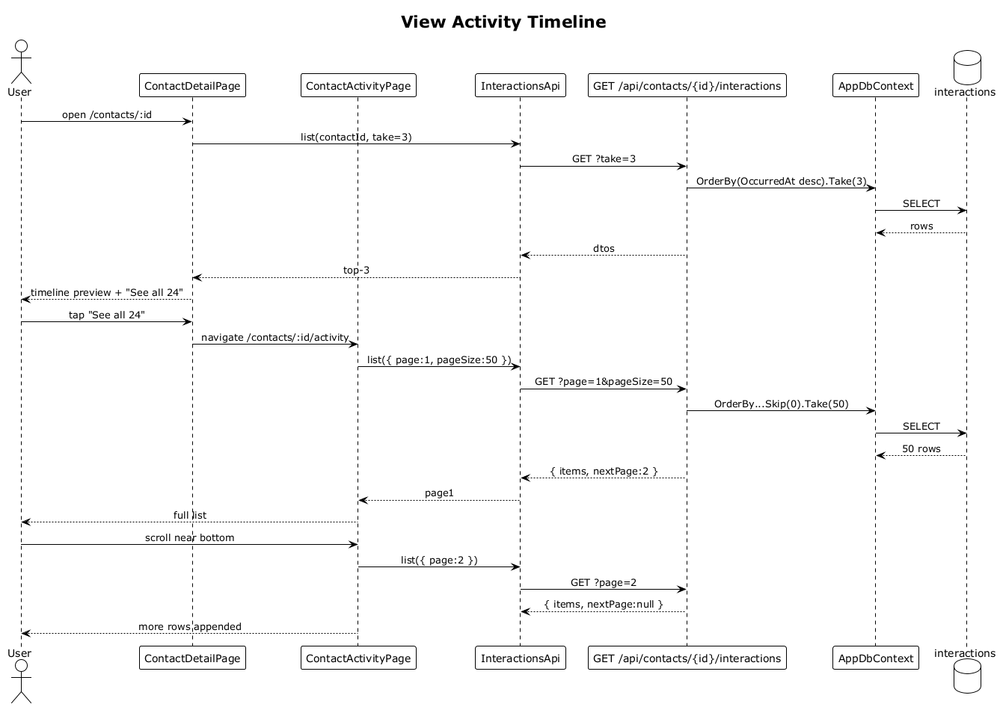

# 12 — View Activity Timeline

## Summary

The contact detail screen shows up to 3 recent interactions inline at XS (≥ 6 at LG/XL). Tapping **See all N** opens a full activity screen that lists every interaction reverse-chronologically with infinite scroll.

**Traces to:** L1-003, L1-009, L2-011, L2-012, L2-035, L2-044.

## Actors

- **User** — authenticated owner.
- **ContactDetailPage** — inline preview (top 3).
- **ContactActivityPage** — full scroll view.
- **InteractionsEndpoints** — `GET /api/contacts/{id}/interactions?page=&pageSize=`.
- **AppDbContext / interactions table**.

## Trigger

- User opens contact detail → inline top 3 render via flow 07.
- User taps `See all 24` → navigates to `/contacts/:id/activity`.

## Flow

1. On navigation to `/contacts/:id/activity`, the SPA requests page 1 with `pageSize=50`.
2. The endpoint runs `Interactions.Where(ContactId==id).OrderByDescending(OccurredAt).Skip(...).Take(...)` scoped to owner.
3. Returns `{ items: InteractionDto[], nextPage }`.
4. Each item renders with its matching `Ix Email/Call/Meeting/Note` component.
5. When the user scrolls within 200 px of the bottom the SPA requests `page=2` and appends rows.

## Alternatives and errors

- **Zero interactions** → empty-state `No activity yet`.
- **Foreign contact** → `404` on the parent route.
- **Resize from XS → LG** → state is preserved (flow 40) and the detail two-pane layout inlines more items without re-fetch.

## Sequence diagram

