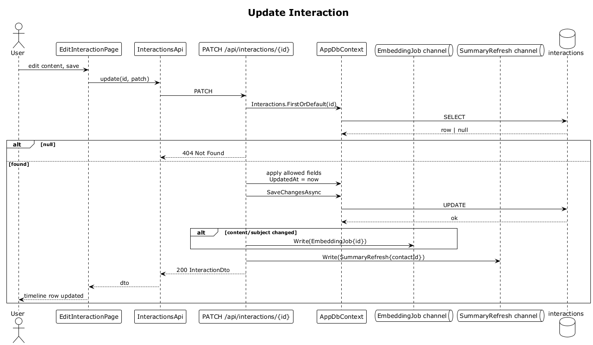

# 13 — Update Interaction

## Summary

The owner edits an existing interaction's content or subject. The server persists the change and, because the embedded text changed, enqueues a re-embed for the interaction and a summary-refresh for the parent contact.

**Traces to:** L1-003, L2-013, L2-078, L2-033.

## Actors

- **User** — authenticated owner.
- **EditInteractionPage** (or inline edit).
- **InteractionsEndpoints** — `PATCH /api/interactions/{id}`.
- **AppDbContext**.
- **EmbeddingJob channel**, **SummaryRefresh channel**.

## Trigger

User taps an interaction in the timeline, opens edit, changes fields, and saves.

## Flow

1. SPA sends `PATCH /api/interactions/:id` with the diffed fields.
2. The endpoint loads the interaction by id, owner-scoped via global filter. `null` → `404`.
3. Allowed fields are updated (`content`, `subject`, `type`, `occurredAt`). `UpdatedAt` is set.
4. If `content` or `subject` changed, an `EmbeddingJob { interactionId }` is enqueued. A `SummaryRefresh { contactId }` is always enqueued because the aggregate changed.
5. `SaveChangesAsync` commits.
6. `200 OK` with `InteractionDto`. The SPA updates the timeline row in place.

## Alternatives and errors

- **Foreign interaction** → `404`.
- **Invalid `type`** → `400`.
- **`content` > 8000 chars** → `400`.
- **No fields changed** → `200` returned; no embedding job is enqueued (hash-based idempotency, flow 32).

## Sequence diagram

