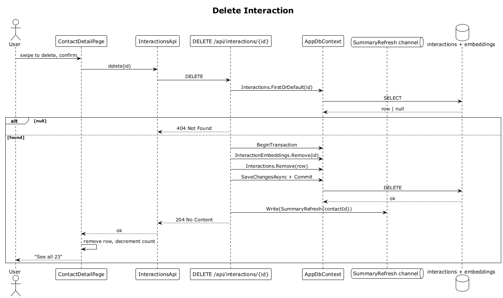

# 14 — Delete Interaction

## Summary

The owner removes an interaction. The server deletes the row and its embedding, then enqueues a summary refresh for the parent contact so the relationship summary no longer references the deleted event.

**Traces to:** L1-003, L2-013, L2-033.

## Actors

- **User** — authenticated owner.
- **ContactDetailPage** — timeline row swipe or more-menu.
- **InteractionsEndpoints** — `DELETE /api/interactions/{id}`.
- **AppDbContext / interactions + interaction_embeddings**.
- **SummaryRefresh channel**.

## Trigger

User confirms deletion on a timeline row.

## Flow

1. SPA DELETEs `/api/interactions/:id`.
2. The endpoint loads the interaction owner-scoped. `null` → `404`.
3. In a transaction: remove the `InteractionEmbedding` row, remove the `Interaction` row.
4. `SaveChangesAsync` commits.
5. `SummaryRefresh { contactId }` is enqueued.
6. Endpoint responds `204 No Content`.
7. SPA removes the row from the timeline and decrements the `See all N` count.

## Alternatives and errors

- **Foreign interaction** → `404`, no changes.
- **Transaction failure** → `500`, rollback, timeline unchanged.

## Sequence diagram

