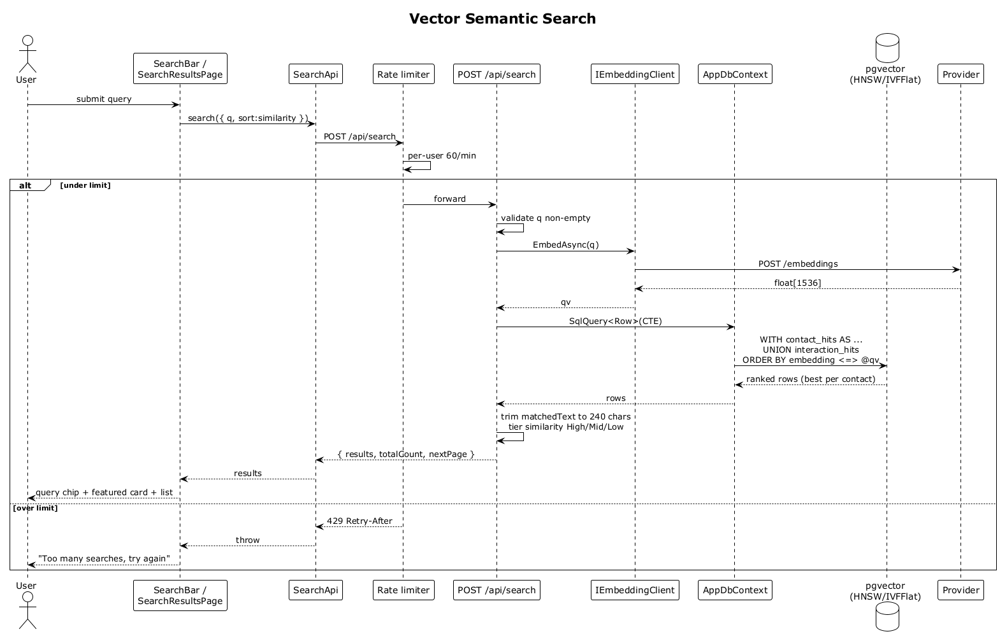

# 15 — Vector Semantic Search

## Summary

The user types a natural-language query. The server embeds the query with the same model used for indexing, runs a single CTE against `contact_embeddings` and `interaction_embeddings` in `pgvector` (cosine distance via the `<=>` operator), collapses each contact's hits to its best-matching source, trims the `matchedText` snippet to 240 chars on a word boundary, tiers the similarity into High/Mid/Low, and returns the ranked results. The SPA renders the featured card and standard result cards.

**Traces to:** L1-004, L1-014, L2-014, L2-015, L2-016, L2-017, L2-059, L2-082.

## Actors

- **User** — authenticated.
- **SearchBar** (home) / **SearchResultsPage**.
- **SearchEndpoints** — `POST /api/search`.
- **IEmbeddingClient** — embeds the query.
- **AppDbContext** — raw SQL against `pgvector` HNSW / IVFFlat indexes.
- **Rate limiter** — 60 req/min per user.

## Trigger

User submits the query from the search bar (home or results screen).

## Flow

1. User types the query, presses Enter or taps Search.
2. The SPA POSTs `/api/search` with `{ q, sort:'similarity', page:1 }`.
3. The rate limiter checks the per-user bucket. Over limit → `429 Too Many Requests`.
4. The endpoint validates `q` is non-empty. Empty → `400 Bad Request`.
5. `IEmbeddingClient.EmbedAsync(q)` returns a `float[1536]` (or model-matching dim).
6. The endpoint runs a raw SQL CTE in `AppDbContext` that:
   - Selects the top-K contact-embedding hits ordered by `embedding <=> @qv`.
   - Selects the top-K interaction-embedding hits.
   - Joins to `contacts`, groups by `contact_id`, keeps the best similarity and its source text.
7. For each result the endpoint trims `matchedText` ≤ 240 chars at a token boundary, tiers `similarity` into High (≥ 0.90) / Mid (0.70–0.89) / Low (< 0.70), and maps to a `SearchResultDto`.
8. Returns `200 OK` with `{ results: SearchResultDto[], totalCount, nextPage, sort:'similarity' }`.
9. The SPA renders the query chip, meta band (`N contacts matched`), featured card for the top result, and standard cards for the rest.

## Alternatives and errors

- **Empty query** → `400`.
- **Over rate limit** → `429` with `Retry-After`.
- **Model mismatch** → `503 Service Unavailable` and a backfill starts (flow 33).
- **Zero matches** → flow 18.

## Sequence diagram

