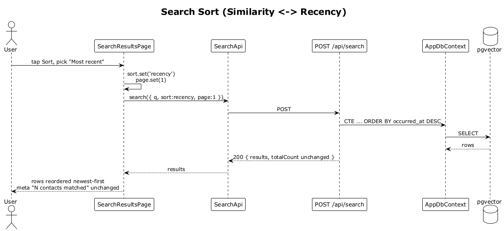

# 16 — Search Sort (Similarity ↔ Recency)

## Summary

The sort control on the results screen toggles between **Similarity** (default) and **Most recent interaction**. Changing sort resets pagination to page 1 and re-issues the search; the total matched count is unchanged.

**Traces to:** L1-004, L2-018.

## Actors

- **User** — authenticated.
- **SearchResultsPage** — the sort control.
- **SearchApi** / **POST /api/search**.

## Trigger

User taps the sort control and picks a mode.

## Flow

1. User taps the sort button.
2. The SPA opens the sort menu and the user picks `Most recent` (or `Similarity`).
3. The SPA sets the `sort` signal and resets `page` to `1`.
4. A new POST to `/api/search` fires with the same query but `sort: 'recency'`.
5. The server re-runs the CTE with `ORDER BY occurred_at DESC` on the matched-interaction instead of `ORDER BY similarity DESC`, keeping owner-scope and the same matching set.
6. Results render in the new order; the `N contacts matched` count does not change.

## Alternatives and errors

- **No query set yet** → sort control is disabled.
- **Over rate limit** → `429` bubbles up with a toast.
- **Resize / back nav** → the current sort mode is preserved.

## Sequence diagram

