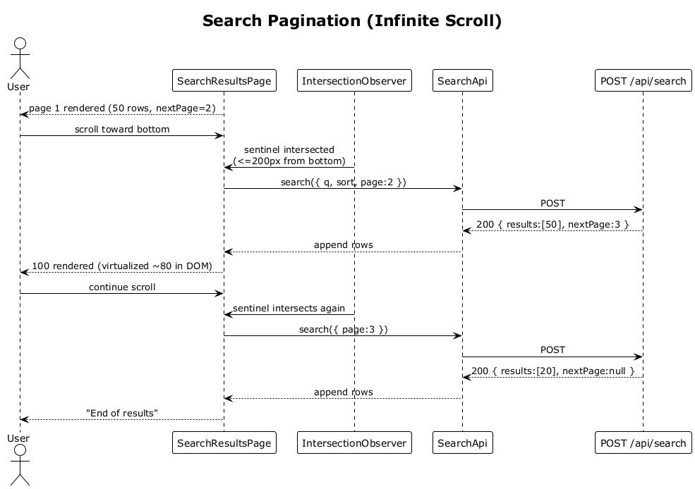

# 17 — Search Pagination (Infinite Scroll)

## Summary

Each search page returns at most 50 results. The SPA virtualizes the list — only visible rows plus a small buffer live in the DOM. When the user scrolls within 200 px of the bottom of the loaded set the SPA automatically fetches the next page and appends it.

**Traces to:** L1-004, L1-014, L2-019, L2-062.

## Actors

- **User** — authenticated.
- **SearchResultsPage** — virtual scroll viewport.
- **SearchApi** / **POST /api/search**.

## Trigger

User scrolls the results list near the bottom.

## Flow

1. Results render page 1 with 50 rows and `nextPage=2`.
2. The virtual-scroll component keeps only ~80 rendered DOM subtrees regardless of total.
3. The `IntersectionObserver` on the loader sentinel fires when within 200 px of the bottom.
4. The SPA calls `searchApi.search({ q, sort, page: nextPage })`.
5. The server returns page 2 with the next 50 rows and the new `nextPage` cursor (or `null`).
6. The SPA appends the new rows to the list signal.
7. When `nextPage` is `null` the loader sentinel is removed and an end-of-results marker renders.

## Alternatives and errors

- **Network failure** → show a retry chip, do not clear existing rows.
- **Sort changes mid-scroll** → reset to page 1 (flow 16).
- **Over rate limit** → `429`, SPA delays the next fetch by the `Retry-After` header.

## Sequence diagram

