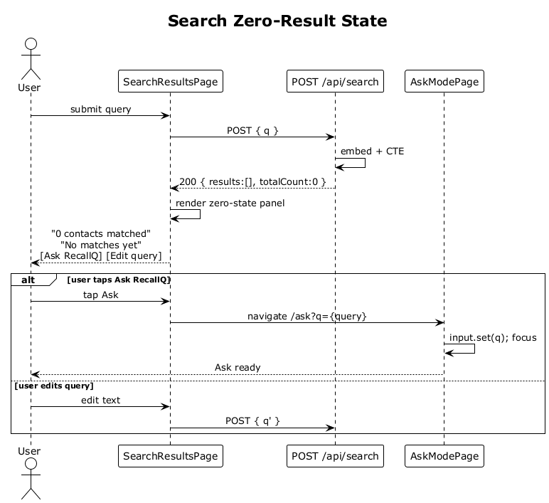

# 18 — Search Zero-Result State

## Summary

When a query produces no matches the server still returns `200 OK` with an empty `results` array and `totalCount=0`. The SPA replaces the featured card with a zero-state panel that explains the situation, offers a one-tap handoff to Ask mode seeded with the same query, and reads `0 contacts matched` in the meta band.

**Traces to:** L1-004, L1-005, L2-014, L2-020, L2-082.

## Actors

- **User** — authenticated.
- **SearchResultsPage**.
- **SearchEndpoints** — `POST /api/search`.
- **AskModePage** — seeded entry point.

## Trigger

User submits a query that matches nothing above threshold (or no indexed data exists yet).

## Flow

1. User submits a query.
2. Search endpoint executes the pgvector CTE (flow 15) and returns `{ results: [], totalCount: 0 }`.
3. The SPA renders:
   - Query chip with the submitted text.
   - Meta band reads `0 contacts matched`.
   - Zero-state panel with heading `No matches yet`, body explaining the query did not match indexed contacts or interactions, and two actions: `Ask RecallQ` (primary) and `Edit query` (ghost).
4. If the user taps `Ask RecallQ` the SPA navigates to `/ask?q={query}` where the input is pre-seeded and auto-focused.

## Alternatives and errors

- **No contacts indexed yet** (cold start) → same zero state but copy says "Add contacts to start searching".
- **Matches below displayed threshold** — the server may still return rows; zero state applies only when the filtered set is empty.

## Sequence diagram

