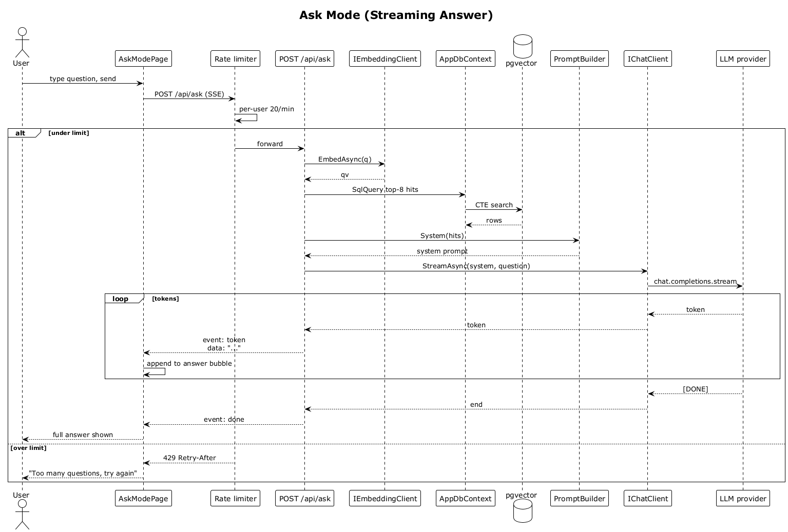

# 19 — Ask Mode (Streaming Answer)

## Summary

The user asks a free-form question about their network. The server embeds the question, retrieves the top-K grounded contacts and interactions from `pgvector`, builds a system prompt with those hits, opens a streaming chat completion with the LLM provider, and proxies each token to the client as SSE. The SPA progressively renders tokens into the assistant answer bubble.

**Traces to:** L1-005, L1-014, L2-021, L2-022, L2-061.

## Actors

- **User** — authenticated.
- **AskModePage** — chat UI.
- **AskEndpoints** — `POST /api/ask` (SSE).
- **IEmbeddingClient** — embeds the question.
- **AppDbContext** / **pgvector** — top-K retrieval.
- **PromptBuilder** — assembles the system prompt.
- **IChatClient** → **LLM provider** — streaming completion.
- **Rate limiter** — 20 req/min per user on Ask.

## Trigger

User types a question in the Ask input bar and taps Send (or presses Enter).

## Flow

1. User types `"who should I talk to about a Series B?"` and sends.
2. The SPA appends a user bubble and opens an `EventSource` on `POST /api/ask` with `{ question, sessionId }`.
3. Rate limiter gates at 20/min. Over → `429`.
4. `IEmbeddingClient.EmbedAsync(q)` returns the query vector.
5. The endpoint fetches the top-8 contact/interaction hits (same CTE shape as flow 15).
6. `PromptBuilder` composes the system prompt with a compact hits block.
7. `IChatClient.StreamAsync(system, user)` opens a streaming chat completion.
8. As tokens arrive, the endpoint emits `event: token\ndata: "..."` SSE frames to the client.
9. The SPA progressively renders tokens into the answer bubble.
10. On stream end the endpoint sends `event: done` and closes the connection.

## Alternatives and errors

- **Empty question** → `400`.
- **Over rate limit** → `429` with `Retry-After`.
- **LLM provider error mid-stream** → `event: error`, the SPA keeps partial answer and shows a retry chip.
- **Client disconnect** → server aborts the upstream stream promptly to avoid token waste.

## Sequence diagram

