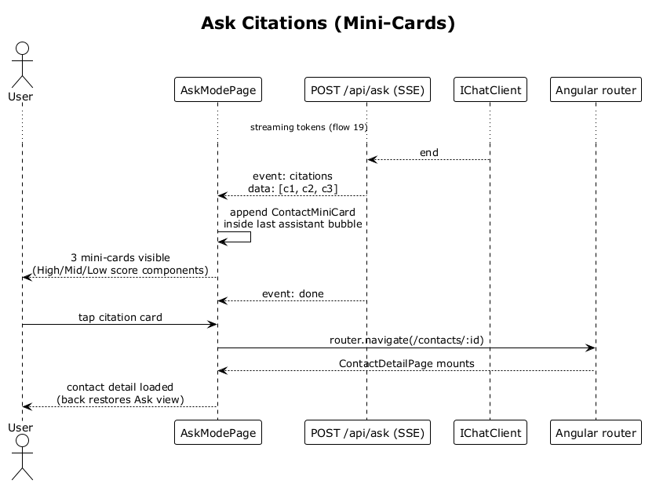

# 20 — Ask Citations (Mini-Cards)

## Summary

After the answer stream completes, the server sends a `citations` SSE event containing the contacts that grounded the response. The SPA appends one mini-card per citation inside the assistant bubble, using avatar, name, role, and the similarity score tier (High/Mid/Low). Tapping a mini-card routes to the contact detail screen.

**Traces to:** L1-005, L2-023.

## Actors

- **User** — authenticated.
- **AskModePage** — rendered answer bubble.
- **AskEndpoints** — streaming response.
- **IChatClient** — the completed stream.
- **Angular router** — detail navigation.

## Trigger

Answer stream completes (from flow 19).

## Flow

1. With the answer stream finished, the endpoint has the ranked top-K retrieval hits already in hand (reused from the retrieval step in flow 19).
2. The endpoint emits `event: citations\ndata: [{ contactId, name, role, avatarColors, similarity }, ...]` (up to 3 entries).
3. The SPA parses the event and appends `ContactMiniCard` components inside the last assistant bubble, in order.
4. Each card uses the `Score High` / `Mid` / `Low` component for its similarity tier.
5. Next, `event: done` closes the stream.
6. Tapping a mini-card calls `router.navigate('/contacts/:id')` and flow 07 takes over. The Ask conversation is retained so `back` returns to it.

## Alternatives and errors

- **No grounding hits** → the server omits the citations event; the SPA shows the answer without mini-cards.
- **Mini-card tapped while stream still active** → mini-cards are only rendered after citations event, so cards are only interactive once the stream has produced them (see L2-022 §3).

## Sequence diagram

