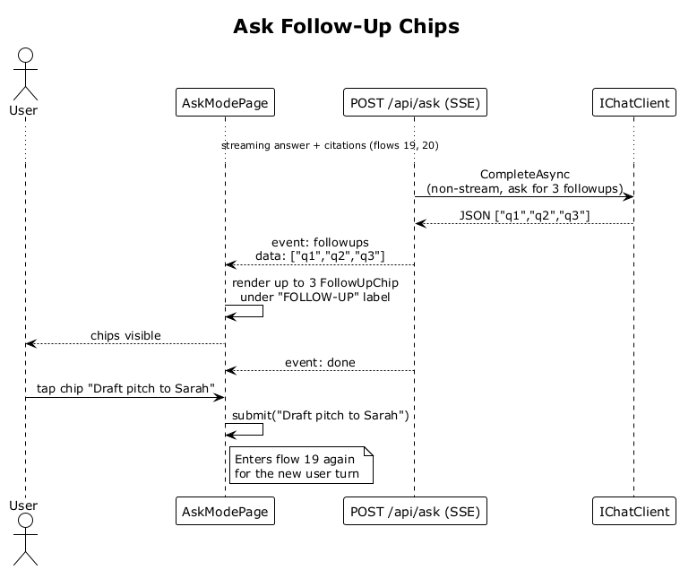

# 21 — Ask Follow-Up Chips

## Summary

After streaming the answer and citations the server issues a non-streaming completion that asks the LLM for up to 3 short follow-up questions (JSON array). The endpoint emits those as a `followups` SSE event, the SPA renders up to 3 `FollowUpChip` components under a `FOLLOW-UP` label. Tapping a chip submits that text as the next question.

**Traces to:** L1-005, L2-024.

## Actors

- **User** — authenticated.
- **AskModePage**.
- **AskEndpoints** — `POST /api/ask` (same SSE stream).
- **IChatClient** — a separate short non-stream completion.

## Trigger

Streaming answer + citations have both completed for the last user turn.

## Flow

1. After the answer stream and citations event (flows 19, 20) the endpoint issues a non-stream `IChatClient.CompleteAsync(system, user)` asking for a JSON array of 3 suggested follow-up questions.
2. The LLM returns JSON `["q1","q2","q3"]` (up to 3 items).
3. The endpoint emits `event: followups\ndata: ["q1","q2","q3"]` on the same SSE stream.
4. The SPA renders up to 3 `FollowUpChip` components under a `FOLLOW-UP` label.
5. `event: done` closes the stream.
6. When the user taps a chip the SPA calls `submit(chipText)` which becomes the next user bubble and fires flow 19 again for the new turn.

## Alternatives and errors

- **Fewer than 3 returned** → only that many chips render (no placeholders).
- **Invalid JSON returned** → the endpoint swallows the error and emits an empty `followups` array.
- **Chip tapped while stream still active** — chips only appear after `followups` event fires, so they are not interactive before then.

## Sequence diagram

