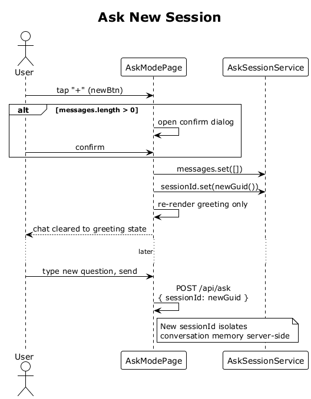

# 22 — Ask New Session

## Summary

The `+` button on the Ask screen starts a fresh conversation. The SPA clears the messages signal, mints a new `sessionId`, and returns the chat to the greeting state. The prior exchanges are not posted anywhere — if the user navigates away and back via the bottom nav within the app session, the history is preserved until they explicitly tap `+` (or the browser tab reloads).

**Traces to:** L1-005, L2-025.

## Actors

- **User** — authenticated.
- **AskModePage** — top bar `+` button (`newBtn`).
- **AskSessionService** — in-memory conversation state.

## Trigger

User taps `+` on the Ask top bar.

## Flow

1. User taps `+`.
2. The SPA prompts a small confirmation if `messages.length > 0` (avoiding accidental resets).
3. On confirm:
   - `AskSessionService.messages.set([])`.
   - `AskSessionService.sessionId.set(crypto.randomUUID())`.
4. The SPA re-renders the greeting bubble only (no user/assistant history visible).
5. The next question POSTs to `/api/ask` with the new `sessionId`, isolating conversation memory on the server.

## Alternatives and errors

- **Empty session** → no confirm dialog needed; immediate no-op.
- **Navigating away and back** — messages persist in the service's signal across the nav; they are only cleared by this flow.
- **Full page reload** — messages are lost (not persisted to disk in v1).

## Sequence diagram

